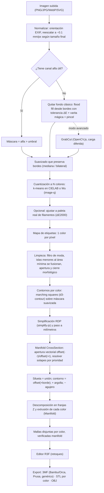
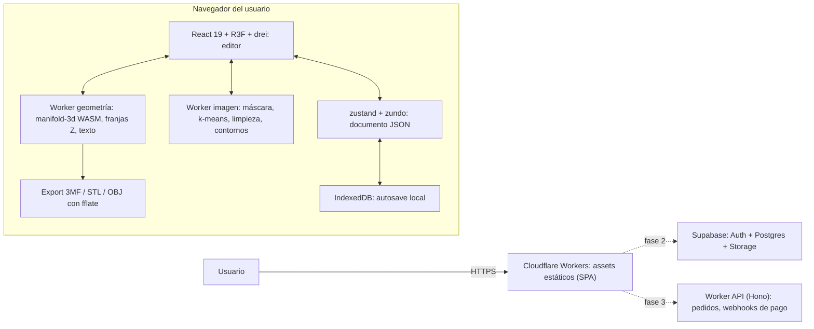

# 01 · Stack tecnológico: 3D Llaveros

> **Agente 1, investigación de stack tecnológico** · Fecha: 2026-09-10
> Alcance: pipeline foto → llavero 2.5D multicolor **sin IA**, formatos de exportación, editor estilo Tinkercad, arquitectura, despliegue y riesgos.
> Los precios en detalle los cubre el **Agente 2**. Acá solo se indica si algo es gratis, pago o qué licencia tiene.
> Versiones y fechas consultadas en el registro de npm y en la API de GitHub el 2026-09-10. Lo que no se pudo confirmar está marcado **(no verificado)**.

---

## Índice

0. [Resumen ejecutivo](#0-resumen-ejecutivo)
1. [Pipeline de conversión sin IA](#1-pipeline-de-conversión-sin-ia)
2. [Tabla de librerías](#2-tabla-de-librerías)
3. [Formatos de exportación y reglas de impresión](#3-formatos-de-exportación-y-reglas-de-impresión)
4. [Editor estilo Tinkercad](#4-editor-estilo-tinkercad)
5. [Arquitectura y stack recomendado](#5-arquitectura-y-stack-recomendado)
6. [Despliegue](#6-despliegue)
7. [Riesgos técnicos](#7-riesgos-técnicos)
8. [Proyectos y productos de referencia](#8-proyectos-y-productos-de-referencia)
9. [Fuentes](#9-fuentes)

---

## 0. Resumen ejecutivo

**Recomendación principal: todo el procesamiento corre en el navegador del usuario y el sitio se sirve como hosting estático.**

| Decisión | Elección | Por qué |
|---|---|---|
| Dónde se procesa | **Cliente** (Web Workers + WASM) | Costo de servidor casi cero. Escala gratis porque cada usuario pone su CPU. Las fotos no salen del dispositivo (privacidad). |
| Frontend | **Vite 8 + React 19 + TypeScript** (+ Tailwind 4) | Es una app de cliente pesada y no necesita SSR. Build simple y el ecosistema 3D más grande. |
| Motor 3D / editor | **three.js r186 + React Three Fiber 9 + drei 10** | TransformControls, Grid, GizmoViewcube y CameraControls vienen listos. Tiene millones de descargas por semana. |
| Geometría 2D/3D | **manifold-3d 3.5.3 (Apache-2.0)** | Un solo WASM (~200 KB gzip) para offset 2D, booleanas 2D, extrusión y booleanas 3D con **salida manifold garantizada**. Lo usan OpenSCAD y Blender. |
| Imagen → capas | **Código TS propio** + `image-q` / `ml-kmeans` + `culori` + `d3-contour` + `simplify-js` | Todo con licencias permisivas (MIT/ISC/BSD). Sin IA ni GPL. |
| Texto | **opentype.js 2.0 (MIT)** | Convierte TTF/OTF/WOFF en contornos que se pueden extruir. |
| Estado + deshacer | **zustand 5 + zundo 2** (+ immer opcional) | Historial liviano de un documento JSON serializable. |
| Exportación | **Escritor 3MF propio con `fflate`** (perfiles Bambu/Orca, Prusa y genérico) + STL por color + OBJ | Ninguna librería JS cubre bien el 3MF multicolor para los 3 slicers. Son unas cientos de líneas. |
| Hosting | **Cloudflare Workers (static assets)** con deploy automático desde GitHub | Cloudflare hoy recomienda Workers para proyectos nuevos. Tiene capa gratuita, `_headers` y URLs de preview. |
| Backend (fase 2+) | **Supabase** (Auth + Postgres + Storage) y un Worker con **Hono** para pagos y webhooks | Se agrega sin reescribir el frontend. |
| **Alternativa** | **Laravel 13 + Inertia v3 + React** (MySQL, aprovecha Laragon) | El editor React/R3F es el mismo. Conviene si se prioriza el backend PHP (tienda, admin, pagos). |

**Riesgos de licencia principales (evitar en un producto comercial de código cerrado):**
- `@imgly/background-removal` (**AGPL-3.0**).
- `potrace` y `esm-potrace-wasm` (**GPL-2.0**).
- `marchingsquares` en npm (**AGPL-3.0**; usar `d3-contour`, que es ISC).
- `openscad-wasm` y OpenSCAD Playground (**GPL**).
- Kromacut y Chili3D (**AGPL**): sirven como inspiración, no para copiar código.
- El modelo RMBG-1.4 (**no comercial**).
- El repo AutoForge no declara licencia.

---

## 1. Pipeline de conversión sin IA

### 1.1 Diagrama



### 1.2 Paso a paso

Todo corre en un **Web Worker** para no congelar la UI. Los parámetros por defecto son sugeridos y se ajustan con pruebas.

| # | Paso | Cómo (clásico, sin IA) | Librería | Parámetros por defecto |
|---|---|---|---|---|
| 1 | **Carga y normalización** | `createImageBitmap` + `OffscreenCanvas` en el worker. Se reescala a una resolución de trabajo según el tamaño final: 50 mm a 0.1 mm/px dan 500 px. Esto limita el costo y ya filtra detalles que la boquilla no puede imprimir. Un SVG se puede importar directo como vectores con `SVGLoader` de three. | APIs nativas del navegador, `three/addons/loaders/SVGLoader.js` | 0.08–0.12 mm/px |
| 2 | **Quitar fondo** | **a)** PNG con transparencia: se usa el alfa. **b)** Flood fill desde los 4 bordes: se toman muestras del color del borde y se "inunda" todo lo conectado con distancia ΔE menor a la tolerancia. Así se conservan zonas internas del mismo color, como el blanco de los ojos. **c)** Chroma key para fondos de color uniforme. **d)** Varita mágica y pincel "conservar/borrar" para corregir a mano. **e)** Opcional: **GrabCut** de OpenCV.js a partir del rectángulo del usuario. OpenCV.js pesa ~13 MB, así que se carga solo si se pide. | TS propio (flood fill con cola, ~100 líneas); `@techstark/opencv-js` solo para GrabCut | Tolerancia ΔE 10–20; umbral alfa 128 |
| 3 | **Pre-filtro** | Filtro de mediana 3×3 o bilateral o Kuwahara. Reduce artefactos JPEG y degradados antes de cuantizar. Es clave para fotos de mascotas. | TS propio (o `cv.bilateralFilter` si OpenCV ya está cargado) | Mediana radio 1–2 px |
| 4 | **Cuantización a N colores** | **k-means++ en CIELAB u OKLab** sobre una muestra de ~50k píxeles y luego se asigna cada píxel. Alternativa: **Wu quantizer** con distancia CIEDE2000 (`image-q`). N lo elige el usuario (2–6). El fondo se excluye. | `ml-kmeans` o `image-q` + `culori` (conversión Lab y `differenceCiede2000`) | N = 4 (un AMS) |
| 5 | **Paleta de filamentos** (opcional) | Cada centroide se reemplaza por el filamento más cercano (ΔE2000) de una paleta real (JSON con marca, nombre y hex). El usuario puede fusionar colores, cambiarlos o fijarlos. | `culori` | Paleta base: PLA Basic de 10–20 colores |
| 6 | **Limpieza de ruido** | **Filtro de moda** (la etiqueta mayoritaria en una ventana de 3×3). **Componentes conexos**: las islas con área menor a A_min se fusionan con el vecino dominante. **Apertura y cierre morfológico** por color con radio = ancho mínimo / 2 en px: elimina "pelos" y rellena huecos finos. | TS propio (union-find o BFS) | A_min ≈ 1 mm²; ancho mín. 0.8 mm |
| 7 | **Contornos (vectorización)** | Para cada color se arma una máscara binaria. Se aplica un blur gaussiano leve (σ ≈ 1 px) para obtener bordes suaves con precisión sub-píxel. Después, **marching squares** con umbral 0.5 genera un MultiPolygon con agujeros. | `d3-contour` (ISC) | umbral 0.5, `smooth(true)` |
| 8 | **Simplificación** | Ramer-Douglas-Peucker con tolerancia en mm, y opcionalmente suavizado de Chaikin. Después se convierte px → mm y se centra. | `simplify-js` (BSD-2) | tol 0.03–0.05 mm |
| 9 | **Operaciones 2D** | `CrossSection.ofPolygons(contornos, 'EvenOdd')`. **Apertura vectorial** `offset(-r,'Round').offset(+r,'Round')`: borra detalles menores a 2r. **Sin solapes**: se ordena por prioridad y `region_i = region_i − ∪ region_j (j>i)`. **Silueta** = unión de todos los colores. **Contorno** = `silueta.offset(+borde)`. **Argolla** = círculo o pestaña unida al contorno. **Agujero** = círculo restado de todo. | `manifold-3d` (CrossSection); fallback `clipper2-ts` | borde 2 mm; agujero Ø4.2 mm |
| 10 | **Extrusión** | Por **franjas Z** (ver §4.6): cada color es `CrossSection.extrude(h).translate([0,0,z])`. Queda un sólido manifold por color, sin solapes. Para el preview rápido también sirve `THREE.ExtrudeGeometry` (earcut interno). | `manifold-3d`, `three` | base 2.4 mm; color 0.6 mm |
| 11 | **Salida** | `Manifold.getMesh()` → `BufferGeometry` (preview) y datos crudos para 3MF y STL. `originalID()` permite rastrear el color de cada triángulo. | `manifold-3d`, `three`, `fflate` | n/a |

**Snippet ilustrativo** (API de `manifold-3d` 3.5.3 revisada en su `.d.ts`):

```ts
import Module from 'manifold-3d';
const wasm = await Module(); wasm.setup();
const { CrossSection } = wasm;

const silueta  = CrossSection.union(regiones);                  // regiones: CrossSection[] en mm
const contorno = silueta.offset(2, 'Round').simplify(0.02);     // borde de 2 mm
const pestana  = CrossSection.circle(5, 64).translate(cx, cy);  // argolla
const agujero  = CrossSection.circle(2.1, 64).translate(cx, cy);
const base2D   = CrossSection.union([contorno, pestana]).subtract(agujero);

const base = base2D.extrude(2.4);                                           // Manifold (color base)
const rojo = regionRoja.subtract(agujero).extrude(0.6).translate(0, 0, 2.4); // capa de color arriba
const meshRojo = rojo.getMesh();                                            // → BufferGeometry / 3MF
[silueta, contorno, pestana, agujero, base2D].forEach(o => o.delete());     // ¡WASM no tiene GC!
```

### 1.3 Dos "topologías" de color (el editor debe ofrecer ambas)

| Modo | Para quién | Geometría | En el slicer |
|---|---|---|---|
| **A ras / AMS** | Bambu AMS, Prusa MMU3, CFS, ACE, toolchangers | Base (silueta + borde) de un color. Los demás colores son **incrustaciones de 2–3 capas** (0.4–0.6 mm) arriba, o **abajo** si se imprime boca abajo. Varios colores comparten las mismas capas. | Cada color es una "parte" con su extrusor asignado. |
| **Apilado / cambio manual** | Impresoras de un solo extrusor (cambio de filamento por capa) | Cada color ocupa **su propia franja Z**. La franja k imprime el área de todos los colores de rango ≥ k (queda tapada por los de arriba). Visto desde arriba, cada zona muestra su color. El resultado es un relieve en terrazas. | Pausa o cambio de filamento (M600) en cada límite de franja. Se exporta además una **lista "cambiar a color X en Z = … mm / capa N"**, como hace Kromacut. |

Validación obligatoria en modo apilado: ningún color puede quedar "flotando" sin soporte debajo.

### 1.4 Qué evitar y por qué

- **Potrace** (y sus puertos WASM): gran calidad de curvas Bézier, pero es **GPL-2.0**. Si se sirve en el navegador, se está *distribuyendo* código GPL y todo el bundle combinado quedaría bajo GPL. Ojo: `bekuto3d` es MIT pero depende de `potrace` (GPL). No copiar ese enfoque.
- **`marchingsquares` (npm)**: es **AGPL-3.0**. `d3-contour` hace lo mismo con licencia ISC.
- **OpenCV.js como dependencia base**: 13.3 MB sin comprimir (~3.8 MB gzip) medidos. Solo conviene con carga diferida para GrabCut. Lo básico (flood fill, morfología, componentes conexos) es fácil de escribir en TS.
- **Trazado "todo en uno"** (`imagetracerjs`, VTracer): útil para prototipar, pero da poco control sobre ancho mínimo, islas y prioridad de colores. `imagetracerjs` (Unlicense) no se actualiza desde 2020. **VTracer 1.0** (MIT/Apache) es muy interesante porque soporta `palette`, `maxColors` y el modo `cutout` sin solapes. Pero está en **alfa** y su paquete npm se compila para Node (`wasm-pack --target nodejs`). Usarlo en el navegador exige compilarlo con Rust **(no verificado en navegador)**.

### 1.5 IA opcional (solo si en el futuro se decide, opt-in)

Para fotos reales (mascotas, personas) los métodos clásicos dan resultados tipo póster y la máscara puede fallar. Si se quisiera un botón "recorte mágico" **opcional y descargable a demanda**:
- **Evitar** `@imgly/background-removal`: AGPL-3.0, modelos de ~40–80 MB servidos por IMG.LY por defecto.
- **Evitar** RMBG-1.4 de BRIA (licencia no comercial).
- **Permisivas:** `onnxruntime-web` (MIT) con **U²-Net / u2netp** (Apache-2.0, ~4.7 MB), **ISNet/DIS** (Apache-2.0) o **BiRefNet** (MIT, modelos más grandes). Implica cabeceras COOP/COEP si se usan hilos WASM.

---

## 2. Tabla de librerías

Leyenda de veredicto: ✅ recomendada · 🟡 útil con reservas · ❌ evitar (licencia o estado) · 🔮 para fases futuras.
"Tamaño" = tamaño **desempaquetado en npm** (no es lo que baja el usuario). Donde dice **gz** es el peso real medido del archivo principal comprimido con gzip.
Descargas por semana (dl/sem) según `api.npmjs.org`.

### 2.1 Imagen, segmentación y color

| Librería | Para qué | Licencia | Corre en | Última versión (fecha) | Tamaño | Veredicto |
|---|---|---|---|---|---|---|
| *(código propio TS)* | Flood fill, varita mágica, mediana, morfología, componentes conexos, filtro de moda | Propia | Navegador (Worker) | n/a | ~KB | ✅ |
| [`@techstark/opencv-js`](https://github.com/TechStark/opencv-js) | GrabCut, bilateral, morfología avanzada (OpenCV 5.0) | Apache-2.0 | Navegador (WASM) y Node | 5.0.0-release.1 (2026-06-24) | opencv.js 13.3 MB · **~3.8 MB gz** | 🟡 carga diferida |
| [`@imgly/background-removal`](https://github.com/imgly/background-removal-js) | Quitar fondo con ML (ONNX) | **AGPL-3.0** | Navegador | 1.7.0 (2025-07-18) | modelos ~40–80 MB | ❌ comercial cerrado |
| [`onnxruntime-web`](https://github.com/Microsoft/onnxruntime) | Motor ML en navegador (si algún día se usa IA opcional) | MIT | Navegador (WASM/WebGPU) | 1.29.0 (2026-08-24) | grande | 🔮 |
| [`@mediapipe/tasks-vision`](https://www.npmjs.com/package/@mediapipe/tasks-vision) | Segmentación ML (orientada a personas/selfie; poco apta para objetos genéricos, **no verificado**) | Apache-2.0 | Navegador | 1.0.1 (2026-07-31) | 36 MB | 🔮 |
| [`image-q`](https://github.com/ibezkrovnyi/image-quantization) | Cuantización Wu/NeuQuant/RGBQuant, distancia CIEDE2000, dithering | MIT | Navegador y Node | 4.0.0 (2022-01-08) · ~1.9M dl/sem | 826 KB | ✅ estable, sin releases nuevas |
| [`ml-kmeans`](https://github.com/mljs/kmeans) | k-means++ (en Lab/OKLab) | MIT | Navegador y Node | 7.0.1 (2026-06-06) | 65 KB | ✅ |
| [`culori`](https://github.com/Evercoder/culori) | Conversión Lab/OKLab, ΔE2000, paletas | MIT | Navegador y Node | 4.0.2 (2025-06-27) | 1.1 MB (tree-shakeable) | ✅ |
| [`quantize`](https://github.com/olivierlesnicki/quantize) | Median cut mínimo | MIT | Navegador y Node | 1.0.2 (2016) | pequeño | 🟡 viejo |

### 2.2 Contornos y vectorización

| Librería | Para qué | Licencia | Corre en | Última versión (fecha) | Tamaño | Veredicto |
|---|---|---|---|---|---|---|
| [`d3-contour`](https://github.com/d3/d3-contour) | Marching squares → MultiPolygon con agujeros | ISC | Navegador y Node | 4.0.2 (2023-01-11) · ~11M dl/sem | 48 KB | ✅ |
| [`simplify-js`](https://github.com/mourner/simplify-js) | Simplificación RDP de polilíneas | BSD-2-Clause | Navegador y Node | 1.2.4 (2020) | 7 KB | ✅ estable |
| [`imagetracerjs`](https://github.com/jankovicsandras/imagetracerjs) | Trazado raster → SVG a color | Unlicense (dominio público) | Navegador y Node | 1.2.6 (2020-05; último push 2023-11) | 3.1 MB | 🟡 prototipos |
| [`@visioncortex/vtracer`](https://github.com/visioncortex/vtracer) | Vectorización a color con paleta, `cutout` y `maxColors` | MIT OR Apache-2.0 | **Node** (WASM); navegador requiere build propio | 1.0.0-alpha.4 (2026-08-29) | 676 KB | 🟡 alfa, seguir de cerca |
| [`esm-potrace-wasm`](https://github.com/tomayac/esm-potrace-wasm) | Potrace en WASM | **GPL-2.0** | Navegador | 0.5.1 (2026-08-14) | 96 KB | ❌ licencia |
| [`potrace`](https://github.com/tooolbox/node-potrace) | Potrace JS | **GPL-2.0** | Node y navegador | 2.1.8 (2020-07) | 95 KB | ❌ licencia |
| [`marchingsquares`](https://github.com/RaumZeit/MarchingSquares.js) | Isolíneas | **AGPL-3.0** | Navegador y Node | 1.3.3 (2019) | 1.7 MB | ❌ trampa de licencia |

### 2.3 Polígonos 2D (offset, booleanas)

| Librería | Para qué | Licencia | Corre en | Última versión (fecha) | Tamaño | Veredicto |
|---|---|---|---|---|---|---|
| [`manifold-3d`](https://github.com/elalish/manifold) → `CrossSection` | `offset` (Round/Miter/Square), `union`/`difference`/`intersect`, `simplify`, `decompose`, `hull`, `extrude` | Apache-2.0 | Navegador (WASM) y Node | 3.5.3 (2026-09-07) | ver §2.4 | ✅ **núcleo** |
| [`clipper2-ts`](https://github.com/countertype/clipper2-ts) | Puerto TS de Clipper2: booleanas, offset, triangulación | BSL-1.0 (Boost, permisiva) | Navegador y Node (TS puro) | 2.0.1-18 (2026-07-04) · ~26k dl/sem | 2 MB | ✅ fallback en hilo principal |
| [`clipper2-wasm`](https://github.com/ErikSom/Clipper2-WASM) | Clipper2 en WASM | BSL-1.0 | Navegador | 0.4.0 (2026-05-18) | 1.2 MB | 🟡 |
| [`clipper2-js`](https://github.com/IRobot1/clipper2-ts) | Puerto de Clipper2 (C#) | Boost | Navegador | 1.2.4 (2024-01-01) | 1.8 MB | 🟡 sin updates |
| [`clipper-lib`](https://github.com/junmer/clipper-lib) / [`js-angusj-clipper`](https://github.com/xaviergonz/js-angusj-clipper) | Clipper 1 (legacy) | Boost / MIT | Navegador | 6.4.2 (2019) / 1.3.1 (2023) | n/a | ❌ legacy |
| [`polygon-clipping`](https://github.com/mfogel/polygon-clipping) / [`martinez-polygon-clipping`](https://github.com/w8r/martinez) | Booleanas (sin offset) | MIT | Navegador y Node | 0.15.7 (2023) / 0.8.1 (2025-12) | pequeño | 🟡 |

### 2.4 Geometría 3D, triangulación y booleanas

| Librería | Para qué | Licencia | Corre en | Última versión (fecha) | Tamaño | Veredicto |
|---|---|---|---|---|---|---|
| [`manifold-3d`](https://github.com/elalish/manifold) | Booleanas 3D robustas (**salida manifold garantizada**), extrusión, `originalID`, `getMesh`; exporta GLB/3MF en ManifoldCAD | Apache-2.0 | Navegador (WASM, **no requiere SharedArrayBuffer**) y Node | 3.5.3 (2026-09-07) · ~45k dl/sem | `manifold.wasm` 541 KB · **~200 KB gz** | ✅ **núcleo** |
| [`three`](https://github.com/mrdoob/three.js) | Render, `ShapeGeometry`/`ExtrudeGeometry` (earcut interno), `STLExporter`, `OBJExporter`, `3MFLoader`, `SVGLoader`, `TransformControls` | MIT | Navegador | 0.186.0 (2026-09-08) · ~9M dl/sem | build completo **~195 KB gz** (tree-shakeable) | ✅ |
| [`earcut`](https://github.com/mapbox/earcut) | Triangulación de polígonos con agujeros | ISC | Navegador y Node | 3.2.3 (2026-07-02) | 105 KB | ✅ (ya viene en three) |
| [`three-bvh-csg`](https://github.com/gkjohnson/three-bvh-csg) | CSG muy rápido para **preview** interactivo; soporta grupos de materiales | MIT | Navegador (sin soporte de Worker) | 0.0.18 (2026-02-17) | 1.4 MB | 🟡 "experimental" según su README |
| [`three-mesh-bvh`](https://github.com/gkjohnson/three-mesh-bvh) | Raycast y selección rápidos | MIT | Navegador | 0.9.15 (2026-09-09) | 2.3 MB | ✅ |
| [`@jscad/modeling`](https://github.com/jscad/OpenJSCAD.org) | CAD por código JS puro (2D/3D, booleanas) | MIT | Navegador y Node | 2.13.0 (2026-02-22) | 1.6 MB | 🟡 alternativa |
| [`replicad`](https://github.com/sgenoud/replicad) | B-rep sobre OpenCascade.js (biseles, filetes reales) | MIT (OCCT: LGPL-2.1) | Navegador (WASM grande) | 1.1.0 (2026-09-04) | 5.7 MB + OCCT | 🔮 si algún día se necesitan filetes |
| [`openscad-wasm`](https://github.com/openscad/openscad-wasm) | OpenSCAD en navegador | **GPL-2.0** | Navegador | 0.0.4 (2025-07) | 13.6 MB | ❌ licencia y peso |

### 2.5 Texto

| Librería | Para qué | Licencia | Corre en | Última versión (fecha) | Veredicto |
|---|---|---|---|---|---|
| [`opentype.js`](https://github.com/opentypejs/opentype.js) | Parsear TTF/OTF/WOFF → glifos como paths Bézier → polígonos → `CrossSection` | MIT | Navegador y Node | 2.0.0 (2026-05-06) | ✅ |
| `three/addons` `TTFLoader` + `TextGeometry` + `FontLoader` | Texto 3D nativo de three (usa opentype.js o fuentes typeface.json) | MIT | Navegador | r186 | 🟡 menos control que opentype + Manifold |
| [`troika-three-text`](https://github.com/protectwise/troika) | Texto SDF nítido para **UI y etiquetas 3D** (no genera geometría imprimible) | MIT | Navegador | 0.52.5 (2026-07-24) | 🟡 solo UI |

### 2.6 Exportación

| Librería | Para qué | Licencia | Corre en | Última versión (fecha) | Veredicto |
|---|---|---|---|---|---|
| [`fflate`](https://github.com/101arrowz/fflate) | ZIP y deflate rápido y liviano, para armar el 3MF | MIT | Navegador y Node | 0.8.3 (2026-05-16) · ~42M dl/sem | ✅ |
| [`jszip`](https://github.com/Stuk/jszip) | ZIP (más pesado) | MIT OR GPL-3.0 (dual, elegir MIT) | Navegador y Node | 3.10.2 (2026-09-08) | 🟡 |
| [`@jscadui/3mf-export`](https://www.npmjs.com/package/@jscadui/3mf-export) | Genera XML 3MF core. **MVP sin colores ni materiales** (revisado en su código). Lo usa `manifold-3d` internamente. | MIT | Navegador y Node | 0.5.0 (2023-11-22) | 🟡 base o referencia |
| [`three-3mf-exporter`](https://github.com/LittleSound/bekuto3d) | Exporta escenas three a 3MF **con `model_settings.config`, extrusor por parte y `filament_colour`** (orientado a Bambu Studio) | MIT | Navegador | 45.2.0 (2026-03-16) · ~544 dl/sem | 🟡 **referencia** para el escritor propio |
| [`@jscad/3mf-serializer`](https://github.com/jscad/OpenJSCAD.org) / [`@jscad/stl-serializer`](https://github.com/jscad/OpenJSCAD.org) | Serializadores de JSCAD | MIT | Navegador y Node | 2.1.x (2026-02-22) | 🟡 |
| [lib3mf](https://github.com/3MFConsortium/lib3mf) ([bindings emscripten](https://github.com/3MFConsortium/lib3mf_emscripten)) | Implementación de referencia del consorcio 3MF; útil para **validar** archivos en CI | BSD-2-Clause | WASM y Node | 2.5.x (nombre exacto del paquete npm **no verificado**) | 🟡 validación |

### 2.7 Editor, UI, estado y workers

| Librería | Para qué | Licencia | Última versión (fecha) | Veredicto |
|---|---|---|---|---|
| [`@react-three/fiber`](https://github.com/pmndrs/react-three-fiber) | three.js declarativo en React 19 | MIT | 9.7.0 (2026-07-31) · ~3M dl/sem | ✅ |
| [`@react-three/drei`](https://github.com/pmndrs/drei) | `TransformControls`, `PivotControls`, `Grid`, `GizmoHelper`/`GizmoViewcube`, `CameraControls`, `Html`, `Edges`, `Outlines` | MIT | 10.7.8 (2026-08-05) · ~2.3M dl/sem | ✅ |
| [`camera-controls`](https://github.com/yomotsu/camera-controls) | Órbita, pan, zoom y transiciones de cámara suaves | MIT | 3.1.2 (2025-11-17) | ✅ |
| [`@babylonjs/core`](https://github.com/BabylonJS/Babylon.js) | Motor alternativo: `GizmoManager`, **CSG2 basado en Manifold** | Apache-2.0 | 9.26.0 (2026-09-10) | 🟡 alternativa |
| [`zustand`](https://github.com/pmndrs/zustand) | Store global | MIT | 5.0.15 (2026-08-13) | ✅ |
| [`zundo`](https://github.com/charkour/zundo) | Middleware undo/redo (`partialize`, `limit`, `handleSet` para throttle, `pause`/`resume`), <700 B, compatible con zustand v5 | MIT | 2.3.0 (2024-11-17; repo activo 2026-01) | ✅ |
| [`immer`](https://github.com/immerjs/immer) | Actualizaciones inmutables y patches | MIT | 11.1.18 (2026-08-19) | ✅ opcional |
| [`mutative`](https://github.com/unadlib/mutative) + [`travels`](https://github.com/mutativejs/travels) | Alternativa a immer con historial basado en patches | MIT | 1.3.0 (2025-09) / 2.2.0 (2026-07) | 🟡 |
| [`comlink`](https://github.com/GoogleChromeLabs/comlink) | RPC transparente con Web Workers | Apache-2.0 | 4.4.2 (2024-11-07) · ~1.4M dl/sem | ✅ |
| [`leva`](https://github.com/pmndrs/leva) | Panel de parámetros para debug y prototipos | MIT | 0.10.1 (2025-10-31) | 🟡 dev |
| [`konva`](https://github.com/konvajs/konva) | Canvas 2D (si se quisiera un editor 2D separado) | MIT | 10.5.0 (2026-09-08) | 🟡 no necesario |
| [`yjs`](https://github.com/yjs/yjs) | CRDT y UndoManager (colaboración futura) | MIT | 13.6.32 (2026-08-04) | 🔮 |

### 2.8 Framework e infraestructura

| Paquete | Rol | Licencia | Última versión (fecha) | Veredicto |
|---|---|---|---|---|
| [`vite`](https://github.com/vitejs/vite) | Bundler y dev server | MIT | 8.3.0 (2026-09-10) | ✅ |
| [`react`](https://github.com/react/react) | UI | MIT | 19.3.0 (2026-09-09) | ✅ |
| [`react-router`](https://github.com/remix-run/react-router) / [`@tanstack/react-router`](https://github.com/TanStack/router) | Rutas | MIT | 8.3.1 (2026-08-28) / 1.170.35 (2026-09-10) | ✅ (cualquiera) |
| [`tailwindcss`](https://github.com/tailwindlabs/tailwindcss) (+ shadcn/ui) | Estilos y componentes | MIT | 4.3.3 (2026-07-16) | ✅ |
| [`next`](https://github.com/vercel/next.js) | Framework SSR | MIT | 16.3.4 (2026-08-31) | 🟡 innecesario para el MVP |
| [`@sveltejs/kit`](https://github.com/sveltejs/kit) + [`@threlte/core`](https://github.com/threlte/threlte) | Svelte + three | MIT | 2.70.3 / 8.6.0 | 🟡 ecosistema 3D más chico |
| [`@inertiajs/react`](https://github.com/inertiajs/inertia) + [`laravel-vite-plugin`](https://github.com/laravel/vite-plugin) | Alternativa Laravel | MIT | 3.7.0 (2026-08-18) / 3.2.0 (2026-08-11) | 🟡 alternativa |
| [`wrangler`](https://github.com/cloudflare/workers-sdk) | CLI de Cloudflare Workers | MIT OR Apache-2.0 | 4.131.0 (2026-09-10) | ✅ |
| [`hono`](https://github.com/honojs/hono) | API en Workers (fase 2+) | MIT | 4.13.7 (2026-09-04) | 🔮 |
| [`@supabase/supabase-js`](https://github.com/supabase/supabase-js) | Auth, DB y Storage (fase 2+) | MIT | 2.116.0 (2026-09-07) | 🔮 |
| [`better-auth`](https://github.com/better-auth/better-auth) + [`drizzle-orm`](https://github.com/drizzle-team/drizzle-orm) | Auth y ORM si se va "todo Cloudflare" (D1) | MIT / Apache-2.0 | 1.7.4 / 0.45.2 | 🔮 alternativa |

---

## 3. Formatos de exportación y reglas de impresión

### 3.1 Formatos

| Formato | Colores | Compatibilidad | Uso recomendado |
|---|---|---|---|
| **3MF** (ZIP + XML) | Sí: por objeto o parte (`basematerials`/`displaycolor`, `colorgroup`) y metadatos del slicer para asignar extrusores | Bambu Studio, OrcaSlicer, PrusaSlicer, Cura | **Formato principal** |
| **STL por color** (ZIP con `llavero_rojo.stl`, `llavero_blanco.stl`…) | No (1 archivo por color) | Universal | Fallback. El usuario importa todo y el slicer pregunta si cargarlo como **un objeto con varias partes** (comportamiento conocido de Bambu y Prusa, **verificar**). |
| **OBJ + MTL** | Materiales por grupo | Parcial en slicers (Bambu Studio 2.5 muestra diálogo de importación de color) | Secundario |
| **GLB** | Sí | Visores web y 3D | Compartir y preview; no para imprimir |

### 3.2 Estructura 3MF multicolor

Archivos internos verificados en el código fuente de Bambu Studio (`bbs_3mf.cpp`) y PrusaSlicer (`3mf_legacy.cpp`):

| Archivo | Quién lo lee | Contenido |
|---|---|---|
| `[Content_Types].xml`, `_rels/.rels` | Todos | Estándar OPC |
| `3D/3dmodel.model` | Todos | Mallas, `basematerials`, objetos, `components`, `build` |
| `Metadata/model_settings.config` | **Bambu Studio / OrcaSlicer** | `<object>` → `<part subtype="normal_part">` → `<metadata key="extruder" value="N"/>` (N empieza en 1) |
| `Metadata/project_settings.config` | Bambu / Orca | JSON con ajustes, incluido `filament_colour` (array con índice desde 0) |
| `Metadata/custom_gcode_per_layer.xml` | Bambu / Orca | Cambios de herramienta y pausas por capa (sirve para el modo apilado) |
| `Metadata/Slic3r_PE_model.config` | **PrusaSlicer** (formato *legacy*, aún soportado) | `<volume firstid lastid>` (rango de triángulos) con metadato `extruder` |
| `Metadata/Prusa_Slicer_custom_gcode_per_print_z.xml` | PrusaSlicer | Cambios de color por altura |

**Hallazgos importantes:**
- **Bambu Studio 2.5+** muestra un diálogo *"Standard 3MF Import Color"*. Asigna los grupos de color a los slots del AMS **por orden, no por valor hex** (grupo 0 → slot 1). Además convierte los colores a *pintura por triángulo* en lugar de conservar objetos separados (hay un [issue #9666](https://github.com/bambulab/BambuStudio/issues/9666) abierto por asignaciones incorrectas). Conclusión: **ordenar los colores igual que los slots** y, para Bambu, preferir `model_settings.config` con extrusor por parte.
- **PrusaSlicer está reestructurando su código 3MF en 2026** (nuevos módulos `PrusaFile`, `BuildTicket`). El lector *legacy* de `Slic3r_PE_model.config` sigue presente en `master`. Hay que **probar con cada versión** que se quiera soportar.
- **Volúmenes solapados o caras coplanares** generan ambigüedad en el slicer. Por eso las booleanas se hacen antes de exportar, para que las piezas por color sean disjuntas (Manifold lo garantiza).
- Los metadatos propios de Bambu pueden romper el parseo en PrusaSlicer. Por eso conviene **exportar por perfil** (ver abajo), como hace HueForge.

**Perfiles de exportación propuestos:**

1. **"Bambu Studio / OrcaSlicer"**: un objeto ensamblado con `components` (una parte por color) + `model_settings.config` (extrusor por parte) + `project_settings.config` (colores).
2. **"PrusaSlicer"**: un único objeto malla con triángulos concatenados por color + `Slic3r_PE_model.config` con `volume firstid/lastid` y extrusor.
3. **"3MF genérico"**: objetos separados con `basematerials` y `displaycolor`, solo spec core (Cura y otros).
4. **"STL por color (ZIP)"**.

**Snippet ilustrativo, perfil Bambu/Orca** (estructura tomada del código de `three-3mf-exporter`; **validar importando en Bambu Studio y Orca reales**):

```xml
<!-- 3D/3dmodel.model -->
<model unit="millimeter" xmlns="http://schemas.microsoft.com/3dmanufacturing/core/2015/02">
  <resources>
    <basematerials id="1">
      <base name="Blanco" displaycolor="#FFFFFF"/>
      <base name="Rojo"   displaycolor="#E53935"/>
    </basematerials>
    <object id="2" type="model" name="Base" pid="1" pindex="0"><mesh>…</mesh></object>
    <object id="3" type="model" name="Rojo" pid="1" pindex="1"><mesh>…</mesh></object>
    <object id="4" type="model" name="Llavero">
      <components><component objectid="2"/><component objectid="3"/></components>
    </object>
  </resources>
  <build><item objectid="4"/></build>
</model>

<!-- Metadata/model_settings.config -->
<config>
  <object id="4">
    <metadata key="name" value="Llavero"/>
    <metadata key="extruder" value="1"/>
    <part id="2" subtype="normal_part"><metadata key="extruder" value="1"/></part>
    <part id="3" subtype="normal_part"><metadata key="extruder" value="2"/></part>
  </object>
</config>
```

**Cómo generarlo en JS:** con un **escritor propio** (~200–400 líneas) que arma los strings XML con `Array.join('')` (recomendación de `@jscadui/3mf-export` para mallas grandes) y los comprime con `fflate.zipSync`. Se toman como referencia `@jscadui/3mf-export` (core) y `three-3mf-exporter` (metadatos Bambu). En CI se **re-importa** con `three/addons/loaders/3MFLoader.js` y opcionalmente se valida con lib3mf.

### 3.3 Reglas de impresión típicas para llaveros

Boquilla 0.4 mm, altura de capa 0.2 mm.

| Parámetro | Valor sugerido | Nota / fuente |
|---|---|---|
| Tamaño total | 35–70 mm en el lado mayor (típico ~50 mm) | Límite configurable en el editor |
| Espesor de base | 2.0–3.0 mm | Rigidez; guías FDM de JLC3DP |
| Altura de capa de color (modo a ras) | 0.4–0.6 mm (2–3 capas) | Menos capas multicolor = menos purga (Sovol) |
| Franja por color (modo apilado) | 0.4–1.0 mm | Múltiplo exacto de la altura de capa |
| Espesor total | 3.0–4.5 mm | n/a |
| Borde / contorno (offset de silueta) | 1.5–3.0 mm | Da un contorno limpio al estilo MakerLab |
| **Ancho mínimo de detalle** | **≥ 0.8 mm** recomendado (2 líneas); mínimo absoluto ~0.45 mm | Boquilla 0.4 → línea ~0.42 mm. JLC3DP pide ≥1.0 mm para relieve o grabado. |
| Separación mínima entre zonas del mismo color | ≥ 0.5 mm | n/a |
| Área mínima de isla | ~1 mm² | Islas más chicas no se imprimen bien o generan purgas inútiles |
| **Agujero de argolla** | **Ø4 mm** para argolla estándar (alambre 1.0–1.2 mm), **Ø5 mm** para argolla gruesa, **Ø3.5 mm** para cadena de bolitas. Sumar **+0.2 mm** de compensación. | QIDI |
| Material alrededor del agujero | ≥ 2 mm, ideal **3 mm** | QIDI, Siraya |
| Perímetros / relleno | ≥ 3–4 paredes; relleno 100% o ≥ 30–50% | QIDI, Siraya |
| Nº de colores | 2–4 (1 AMS); más con AMS extra o cambio manual | MakerLab recomienda ≤ 4 colores |
| Material | PLA para exhibición; PETG/ASA si va a estar al sol o en el auto | QIDI, Siraya |
| **Impresión boca abajo** | Colores en las primeras capas contra la cama texturizada: colores nítidos y cara plana | Práctica común en la comunidad **(no verificado con fuente oficial)** |
| Combinaciones difíciles | Negro sobre blanco "ensucia"; poner blanco antes que negro o aumentar la purga | Sovol |

### 3.4 Validaciones automáticas antes de exportar

- Detalles menores al ancho mínimo (se detectan con apertura vectorial: el área que desaparece con `offset(-r).offset(+r)` se resalta en rojo).
- Islas menores al área mínima; piezas desconectadas de la base.
- Distancia del agujero al borde menor a 2 mm; agujero fuera de la silueta.
- Modo apilado: color "flotante" sin soporte debajo; alturas que no son múltiplo de la altura de capa.
- Nº de colores mayor que los slots configurados → sugerir fusionar colores o usar cambio manual.
- Malla no manifold o volumen cero (con `Manifold.status()` e `isEmpty()`).

---

## 4. Editor estilo Tinkercad

### 4.1 Motor: comparación

| Opción | A favor | En contra | Veredicto |
|---|---|---|---|
| **three.js + React Three Fiber + drei** | Ecosistema enorme (three ~9M dl/sem, R3F ~3M, drei ~2.3M). Gizmos listos (`TransformControls` con `translationSnap`/`rotationSnap`/`scaleSnap`, `PivotControls`), `Grid`, `GizmoViewcube` (cubo de vistas estilo Tinkercad), `CameraControls`. La UI React (paneles, listas de capas) convive con la escena. Todo MIT. | Hay que cuidar re-renders (usar refs y `useFrame` en lugar de estado React en drags) | ✅ **Elegido** |
| three.js "puro" | Control total, sin capa React | Más código para sincronizar UI ↔ escena | 🟡 |
| **Babylon.js 9** | Todo integrado: `GizmoManager`, inspector, **CSG2 sobre Manifold**. Apache-2.0. | Menos ejemplos y comunidad en React; paquete grande (tree-shakeable) | 🟡 buena alternativa |
| Svelte + Threlte | Liviano | Ecosistema 3D mucho más chico (~40k dl/sem) | 🟡 |

### 4.2 Modelo de documento 2.5D (clave para simplicidad y escalabilidad)

Un llavero es **una unión de prismas verticales**. El documento guarda **formas 2D en mm con propiedades de capa**. Lo 3D siempre se **deriva** del documento y nunca se guarda. Así el JSON queda chico, el deshacer es barato y se puede persistir en DB tal cual.

```ts
type Pieza = {
  id: string;
  tipo: 'region' | 'texto' | 'forma' | 'agujero' | 'argolla';
  nombre: string;
  filamentoId: string;          // referencia a la paleta
  z: number;                    // mm, elevación de la base de la pieza
  altura: number;               // mm
  transform: { x: number; y: number; rotZ: number; sx: number; sy: number };
  geometria:
    | { kind: 'poligonos'; contornos: [number, number][][] }  // mm, EvenOdd
    | { kind: 'texto'; texto: string; fuente: string; tamano: number; negrita: number }
    | { kind: 'primitiva'; forma: 'rect' | 'circulo' | 'estrella' | 'corazon'; params: Record<string, number> };
  esAgujero: boolean;           // concepto "Hole" de Tinkercad
  visible: boolean; bloqueada: boolean; grupoId?: string;
};
type Diseno = {
  version: 1; unidades: 'mm';
  impresion: { alturaCapa: number; boquilla: number; modoColor: 'a_ras' | 'apilado'; slots: number };
  contorno: { activo: boolean; offset: number; filamentoId: string; altura: number };
  filamentos: { id: string; nombre: string; hex: string; slot?: number }[];
  piezas: Pieza[];
  imagenOrigen?: { assetId: string; parametros: Record<string, unknown> }; // la imagen NO va al historial
};
```

### 4.3 Funciones Tinkercad y cómo se implementan

| Función | Implementación |
|---|---|
| Plano de trabajo con grilla y snap | drei `<Grid>` + snap propio (0.5 / 1 / 5 mm) aplicado en `onObjectChange` |
| Mover / rotar / escalar | drei `<TransformControls mode=… translationSnap rotationSnap={π/12} scaleSnap>`. En 2.5D se **restringe**: traslación XY, rotación solo Z, escala XY. La altura y la Z se editan con un handle vertical o numéricamente. |
| Vista superior 2D / órbita 3D | Toggle entre cámara ortográfica cenital y perspectiva (`CameraControls`) + `<GizmoHelper><GizmoViewcube/></GizmoHelper>` |
| Selección, multi-selección, agrupar, alinear, duplicar | Raycast acelerado (`three-mesh-bvh`), resaltado con `<Outlines>`/`<Edges>`, atajos de teclado |
| Formas básicas | Generadores `CrossSection` (círculo, rectángulo redondeado vía offset, estrella, corazón) |
| Texto | `opentype.js` → contornos → `CrossSection.ofPolygons(…,'NonZero')` → `offset` para negrita o borde → extrusión. Fuentes **OFL** (Google Fonts) incluidas, más la opción de subir una propia. |
| Agujero y argolla | Pieza `esAgujero` (se ve translúcida, se resta en el cálculo) + asistente "argolla" con Ø, espesor de pestaña y posición |
| Color y altura por pieza | Panel lateral con paleta de filamentos, `z` y `altura` (múltiplos de la altura de capa) |
| Deshacer / rehacer | Ver §4.5 |
| Medidas | Etiquetas `<Html>` con dimensiones en mm del bounding box |
| Exportar | Botón → Worker → 3MF / STL / OBJ → descarga |

### 4.4 Texto 3D

Se recomienda `opentype.js` + Manifold en lugar de `TextGeometry`. Así el texto entra al mismo pipeline 2D (offset, uniones, restas, validación de ancho mínimo) y funciona con cualquier TTF/OTF/WOFF (WOFF2 necesita descompresión aparte). `troika-three-text` queda solo para etiquetas de la interfaz. **Licencias de fuentes**: usar fuentes OFL o Apache; algunas fuentes comerciales no permiten "embedding" ni conversión a contornos.

### 4.5 Estado y undo/redo

- `zustand` con dos stores: **documento** (con `temporal` de **zundo**) y **UI** (selección, cámara, herramienta), que no entra al historial.
- Durante un arrastre: `temporal.pause()` al hacer *pointerdown* y `resume()` más un commit al hacer *pointerup*. Así un drag cuenta como **un solo paso** de deshacer. Alternativa: `handleSet` con throttle.
- `limit: 100` pasos. La imagen original se guarda como referencia a un asset (IndexedDB o Storage), nunca en el historial.
- Alternativa más formal: patrón *Command* con patches de immer o mutative (útil si más adelante hay colaboración con Yjs).

### 4.6 Booleanas "en tiempo real"

1. **Truco 2.5D (recomendado):** como todo son prismas, las booleanas 3D equivalen a **booleanas 2D por franjas de Z**. Se juntan todos los `z` y `z+altura` de las piezas y se ordenan. En cada franja, la región de cada color es la unión de sus piezas activas menos los agujeros activos menos los colores de mayor prioridad. Después se extruye la franja. Con `CrossSection` esto es mucho más rápido y robusto que una CSG de mallas.
2. Cálculo en un **Web Worker** con Manifold y *debounce* de ~100–200 ms. Durante el drag se muestra la pieza movida "en crudo" (translúcida) y al soltar llega la malla recalculada.
3. **Caché por pieza**: hash de (geometría + transform) → `CrossSection` ya calculada. Solo se recalculan las piezas que cambiaron.
4. `three-bvh-csg` queda como opción para preview de mallas no prismáticas (por ejemplo, un STL importado en el futuro).
5. **Memoria WASM**: Manifold no tiene recolector de basura, así que todo objeto temporal lleva `.delete()`. Conviene un helper `using`/`scope()` y un test de fugas.

---

## 5. Arquitectura y stack recomendado

### 5.1 Cliente vs servidor

| Criterio | **Procesamiento en cliente** (Workers + WASM) | Procesamiento en servidor (Python OpenCV + trimesh / Node) |
|---|---|---|
| Costo de infraestructura | Hosting estático (capa gratuita) | CPU por conversión; crece con usuarios (ver Agente 2) |
| Escalabilidad | Automática (cada usuario procesa en su equipo) | Requiere colas, autoscaling y límites |
| Latencia de edición | Inmediata (sin ida y vuelta) | Red por cada cambio → editor lento |
| Privacidad | Las fotos no salen del dispositivo (argumento de venta) | Hay que subir, almacenar y borrar imágenes (política de privacidad y retención) |
| Equipos lentos o móviles | Puede tardar; hay que limitar la resolución | Uniforme |
| Librerías disponibles | Suficientes (Manifold, d3-contour, opentype…) | Más maduras (OpenCV completo, scikit-image, shapely, trimesh, manifold3d, lib3mf) |
| Protección del "know-how" | El código JS es visible (minificado) | Código oculto |
| **Veredicto** | ✅ **MVP y producto principal** | 🔮 Solo para tareas batch futuras (thumbnails, verificación de pedidos, render para la tienda) |

### 5.2 Framework frontend

| Opción | A favor | En contra | Veredicto |
|---|---|---|---|
| **Vite + React + TS (SPA)** | Lo más simple; build estático; HMR; workers y WASM nativos en Vite | SEO de la landing: se resuelve con prerender de rutas públicas o una landing aparte más adelante | ✅ **Principal** |
| Next.js 16 | SSR/SEO, API routes | El editor igual es 100% cliente (`'use client'`); más complejidad; tiende a atar el deploy a su plataforma | 🟡 |
| SvelteKit + Threlte | Bundle chico | Menos ejemplos y librerías 3D | 🟡 |
| **Laravel 13 + Inertia v3 + React** | Aprovecha Laragon (PHP 8.3 y MySQL 8.4 ya instalados; Laravel 13 exige PHP ≥ 8.3). Auth, colas, admin y pagos maduros; starter kit oficial con React 19 + TS + Tailwind + shadcn. | Requiere servidor PHP siempre encendido (VPS o Laravel Cloud) para todo, incluso el editor; más operación | 🟡 **Alternativa** |

### 5.3 Backend para escalar (fase 2+)

| Opción | Qué da | Encaje | Notas |
|---|---|---|---|
| **Supabase** | Postgres + Auth (email, Google) + Storage + RLS + Edge Functions | ✅ Principal: la SPA habla directo con RLS | Capa gratuita (proyectos inactivos se pausan tras 7 días, **ver Agente 2**) |
| **Cloudflare Workers + D1 + R2 + Hono + Better Auth** | Todo en el mismo proveedor que el hosting | 🟡 Muy barato; más armado manual (auth, migraciones) | n/a |
| **Laravel** (Laragon → VPS / Forge / Laravel Cloud) | Backend clásico completo, Cashier, Filament admin, SDK PHP de Mercado Pago | 🟡 Si el foco pasa a ser la tienda | n/a |
| PocketBase / Firebase | BaaS | 🟡 | No evaluado en profundidad **(no verificado)** |

### 5.4 Stack principal recomendado



**Stack:**
- **Lenguaje y build:** TypeScript estricto · Vite 8 · pnpm (ya instalado) · ESLint + Prettier.
- **UI:** React 19 · React Router 8 (o TanStack Router) · Tailwind 4 · shadcn/ui.
- **3D:** three r186 · @react-three/fiber 9 · @react-three/drei 10 · three-mesh-bvh.
- **Geometría:** manifold-3d 3.5 (núcleo 2D/3D) · clipper2-ts (fallback síncrono) · earcut (vía three) · opentype.js.
- **Imagen:** código propio (flood fill, morfología, componentes) · ml-kmeans o image-q · culori · d3-contour · simplify-js · (opcional, carga diferida) OpenCV.js para GrabCut.
- **Estado:** zustand 5 + zundo 2 (+ immer).
- **Concurrencia:** Web Workers de módulo (`new Worker(new URL('./x.worker.ts', import.meta.url), { type: 'module' })`) + Comlink.
- **Export:** escritor 3MF propio (fflate) · `STLExporter`/`OBJExporter` de three/addons.
- **Tests:** Vitest (pipeline con imágenes "golden": nº de colores, áreas, bounding box, manifoldness) · Playwright (humo e2e: subir imagen → exportar).
- **Hosting:** Cloudflare Workers (static assets) + Workers Builds conectado a GitHub.
- **Fase 2:** Supabase (cuentas, diseños guardados como JSON + thumbnail en Storage).
- **Fase 3:** Worker con Hono para pedidos y webhooks (Mercado Pago / Stripe; precios con Agente 2).

**Justificación:** es la opción de **menor costo operativo** (sin servidor en el MVP) y **escala sin cambios** (el cómputo lo pone el cliente). Usa **una sola tecnología de geometría** (Manifold) para 2D, 3D y validación. Todas las dependencias del núcleo tienen **licencias permisivas** (MIT, ISC, BSD, Apache-2.0, Boost). Y el **documento JSON 2.5D** es la base natural para cuentas y diseños guardados.

**Entorno local detectado** (2026-09-10): Node 24.16 · npm 11.13 · pnpm · Git 2.46 · PHP 8.3.30 · Composer · MySQL 8.4.3 · Python 3.13 (Laragon). Para el stack principal **no hace falta Laragon**: alcanza con `pnpm dev`. Laragon queda útil para la alternativa Laravel.

**Estructura sugerida** (una sola app al inicio, sin monorepo):

```
3dllaveros/
├─ docs/
├─ public/fonts/            (fuentes OFL)
├─ src/
│  ├─ app/                  (rutas, layout, landing)
│  ├─ editor/               (Canvas R3F, gizmos, paneles, atajos)
│  ├─ pipeline/             (imagen → piezas; TS puro, testeable, sin DOM)
│  ├─ geometry/             (wrapper Manifold, franjas Z, texto, validaciones)
│  ├─ export/               (3mf/{bambu,prusa,generico}.ts, stl.ts, obj.ts)
│  ├─ store/                (documento + temporal, UI)
│  └─ workers/              (image.worker.ts, geometry.worker.ts)
├─ tests/golden/            (imágenes de prueba + resultados esperados)
├─ wrangler.jsonc
└─ .github/workflows/ci.yml
```

**Fases técnicas:**
1. **MVP:** subir imagen → llavero → editor básico (mover, rotar, escalar, texto, argolla, color, altura, deshacer) → 3MF y STL. Sin cuentas; autosave en IndexedDB.
2. **Cuentas:** Supabase Auth; "Mis diseños" (JSON + thumbnail); compartir por link.
3. **Tienda:** pedidos de llaveros impresos, pagos, panel de admin (cola de impresión con el 3MF adjunto).

### 5.5 Alternativa: Laravel 13 + Inertia v3 + React

- Se crea con el **starter kit oficial React** (React 19 + TS + Tailwind + shadcn) y corre en Laragon (PHP 8.3, MySQL 8.4).
- **El editor y el pipeline son exactamente los mismos módulos TS**: se montan en una página Inertia y el cómputo sigue en el cliente.
- Laravel aporta desde el día 1: auth, base de datos MySQL, colas (thumbnails y emails), Cashier o SDK de pagos, panel admin (Filament).
- **Cuándo elegirla:** si la prioridad inmediata es la tienda o las cuentas, o si el equipo es fuerte en PHP.
- **Costo:** necesita hosting PHP siempre encendido (VPS, Forge o Laravel Cloud; **ver Agente 2**).
- **Migración:** si se arranca con la SPA, mantener `pipeline/`, `geometry/`, `export/` y `editor/` **desacoplados del router y del backend** permite pasarlos a Laravel más adelante sin reescribirlos.

---

## 6. Despliegue

### 6.1 Flujo recomendado (GitHub → Cloudflare Workers)

1. Crear repo en GitHub (privado) y hacer push de `main`.
2. En el dashboard de Cloudflare: **Workers & Pages → Create → Import a repository**. Build command: `pnpm install --frozen-lockfile && pnpm build`. Deploy command: `npx wrangler deploy` (es el valor por defecto de Workers Builds).
3. Cada push a `main` despliega a **producción**. Cada rama o PR hace un build de preview (`npx wrangler versions upload` por defecto) con **URL de preview**.
4. **Dominio propio:** agregar la zona DNS a Cloudflare y asociar un *Custom Domain* al Worker. Para `.com`, el registrador de Cloudflare u otro. Para `.com.ar`, se registra en NIC Argentina y se delegan los nameservers a Cloudflare **(no verificado)**. Costos: Agente 2.
5. Cloudflare indica en su documentación de Pages: *"Start new projects with Workers."* Pages sigue soportado, pero ya no es la opción recomendada para proyectos nuevos.

`wrangler.jsonc` mínimo (SPA):

```jsonc
{
  "name": "3dllaveros",
  "compatibility_date": "2026-09-01",
  "assets": { "directory": "./dist", "not_found_handling": "single-page-application" }
}
```

`public/_headers` (soportado nativamente en Workers static assets). **Solo hace falta** si se habilitan hilos WASM (SharedArrayBuffer). `manifold-3d` **no** lo necesita (verificado en su build):

```
/*
  Cross-Origin-Opener-Policy: same-origin
  Cross-Origin-Embedder-Policy: require-corp
```

### 6.2 CI básico (GitHub Actions)

```yaml
# .github/workflows/ci.yml
name: ci
on: [push, pull_request]
jobs:
  test:
    runs-on: ubuntu-latest
    steps:
      - uses: actions/checkout@v4
      - uses: pnpm/action-setup@v4
      - uses: actions/setup-node@v4
        with: { node-version: 24, cache: pnpm }
      - run: pnpm install --frozen-lockfile
      - run: pnpm typecheck && pnpm lint
      - run: pnpm test          # Vitest: pipeline con imágenes golden + validación 3MF re-importado
      - run: pnpm build
```

El deploy lo hace Workers Builds. Playwright e2e se suma cuando el editor esté estable.

### 6.3 Alternativas de hosting estático

| Opción | Nota |
|---|---|
| Vercel / Netlify | Deploy desde GitHub igual de simple; permiten cabeceras personalizadas |
| GitHub Pages | Gratis y simple, pero **no permite cabeceras HTTP personalizadas** (COOP/COEP solo con el hack `coi-serviceworker`) |
| VPS + Nginx (o la alternativa Laravel) | Más control; más mantenimiento |

---

## 7. Riesgos técnicos

| # | Riesgo | Impacto | Mitigación |
|---|---|---|---|
| 1 | **Licencias copyleft** (AGPL: imgly, Kromacut, Chili3D, `marchingsquares`; GPL: potrace, openscad-wasm, three.cad; modelo RMBG-1.4 no comercial; AutoForge sin licencia) | Alto: obligaría a liberar el código o a dejar de usar la pieza | Lista blanca de licencias en CI (p. ej. `license-checker`), revisar dependencias transitivas, no copiar código de proyectos AGPL/GPL. Consultar a un abogado antes de vender. |
| 2 | **Calidad del método clásico con fotos** (mascotas, degradados, fondos complejos) | Alto en satisfacción | Dos presets ("Logo/Dibujo" vs "Foto"); pincel y varita para la máscara; fusionar colores; preview en vivo; guía "qué imágenes funcionan mejor" (alto contraste, pocos colores, sin líneas finas); IA opcional a futuro (§1.5) |
| 3 | **Compatibilidad 3MF con slicers** (Bambu 2.5 cambió la importación de color; PrusaSlicer reestructura su 3MF en 2026) | Alto | Perfiles por slicer; **matriz de pruebas manual** por versión (Bambu Studio, Orca, PrusaSlicer); archivos golden; fallback STL por color |
| 4 | **Imprimibilidad** (detalles finos, islas, colores flotantes, solapes) | Medio-alto | DRC automático (§3.4); booleanas Manifold para piezas disjuntas; apertura vectorial |
| 5 | **Rendimiento en equipos lentos o móviles**; fugas de memoria WASM | Medio | Resolución de trabajo limitada; workers; caché por pieza; `.delete()` sistemático y test de fugas; límite de nº de piezas y vértices |
| 6 | **Peso de dependencias** (OpenCV.js 13 MB; modelos ML 40–80 MB) | Medio | Carga diferida solo si el usuario lo pide; núcleo < ~1 MB gz |
| 7 | **Librerías poco mantenidas o en alfa** (image-q 2022, imagetracerjs 2020, three-bvh-csg 0.0.x "experimental", VTracer alfa, @jscadui/3mf-export 2023) | Bajo-medio | Envolver cada una detrás de una interfaz propia (`Quantizer`, `Tracer`); código propio donde es simple |
| 8 | **Alcance del editor** (Tinkercad completo es enorme) | Alto en plazos | MVP acotado (§5.4 fase 1); modelo 2.5D en vez de CAD 3D libre |
| 9 | **Diferencias entre navegadores** (OffscreenCanvas en workers, WebGL, HEIC de iPhone en Chrome) | Medio | Feature detection; fallback al hilo principal; convertir HEIC o pedir JPG/PNG **(soporte exacto por navegador no verificado)** |
| 10 | **Propiedad intelectual** (usuarios suben personajes o logos con copyright y luego se venden impresos) | Alto en fase tienda | Términos de uso, moderación de pedidos, no vender diseños de marcas ajenas |
| 11 | **Fuentes tipográficas** | Bajo-medio | Incluir solo OFL o Apache; advertir al subir fuentes propias |

---

## 8. Proyectos y productos de referencia

### 8.1 Productos (qué hacen)

| Producto | Qué hace | Modelo | Notas útiles |
|---|---|---|---|
| [MakerWorld MakerLab: Image to Keychain](https://makerworld.com/makerlab/imageToKeychain) (Bambu Lab) | Imagen o SVG → llavero multicolor 3MF; ajusta espesor, respaldo y posición del gancho o agujero | Gratis con cuenta | Recomienda imágenes de alto contraste, ≤ 4 colores, sin líneas finas. Es el **benchmark de UX**. |
| [MakerTools3D: Image to 3MF](https://makertools3d.com/image-to-3mf) | PNG/JPG → 3MF multicolor por cuantización; ancho, espesor, "skin" de color 0.4 mm, mm/px, modo plano o relieve; soporta AMS, CFS, ACE, IFS, Prusa XL | Gratis, sin cuenta, en navegador | **Competidor directo sin IA** |
| [Mesh Minter](https://meshminter.com/) | "Keychain Studio", clickers, carteles, cortantes; 3MF con cada color en su slot | Gratis en navegador; plan pago para descargas premium y sin marca | Modelo freemium a estudiar |
| [ImageToStl](https://imagetostl.com/) | Imagen → STL/3MF/OBJ por heightmap o extrusión con color; extra "Keyring Loop" | Gratis, **procesa en servidor** | Límite 1200×1200 px |
| [3dkeychain.net](https://3dkeychain.net/) | Llaveros de texto, SVG, QR, Spotify Code, flexi; Google Fonts; STL y 3MF | Beta pública (precio no indicado) | Referencia de editor paramétrico |
| [HueForge](https://shop.thehueforge.com/) | "Filament painting" por capas; exporta 3MF con cambios de filamento por capa | **Pago** (escritorio) | Su [doc de 3MF](https://shop.thehueforge.com/pages/3mf-export-how-it-works) es muy útil |
| [Kromacut](https://kromacut.com/) | Alternativa open source a HueForge en navegador (React + Vite + three.js + Tauri) | Gratis | **AGPL-3.0**: solo inspiración |
| [Tinkercad](https://www.tinkercad.com/) | Referencia de UX: plano de trabajo, "Hole", agrupar, alinear | Gratis (Autodesk) | Inspiración de interacción |

### 8.2 Repos open source

| Repo | Qué es | Licencia | Actividad | Uso para nosotros |
|---|---|---|---|---|
| [pgp00/beadrelief](https://github.com/pgp00/beadrelief) | Imagen → 3MF multicolor ("bead relief") 100% en navegador, listo para Bambu | **MIT** | push 2026-08-30 · 188★ | ✅ Referencia de 3MF Bambu con asignación de partes y colores |
| [LittleSound/bekuto3d](https://github.com/LittleSound/bekuto3d) | SVG → 3D (STL/OBJ/GLTF/3MF); Vue + TresJS; incluye `three-3mf-exporter` | MIT (**pero depende de `potrace` GPL**) | push 2026-03-16 · 364★ | ✅ Referencia del exportador 3MF (no del trazado) |
| [czM1K3/keychain-generator](https://github.com/czM1K3/keychain-generator) | Generador simple de llaveros (Next.js) | MIT | push 2025-09 · 11★ | 🟡 Ejemplo mínimo |
| [SamiSalah221/3mf-to-glb](https://github.com/SamiSalah221/3mf-to-glb) | Recolorea 3MF multicolor (Bambu/Orca) en navegador | MIT | push 2026-07-26 | 🟡 Lectura de 3MF con colores |
| [vycdev/Kromacut](https://github.com/vycdev/Kromacut) | Filament painting en navegador | **AGPL-3.0** | push 2026-09-10 · 270★ | ❌ No copiar; ✅ ideas de UX (lista de cambios de filamento) |
| [hvoss-tech/AutoForge](https://github.com/hvoss-tech/AutoForge) | Imagen → STL por capas estilo HueForge (Python) | **Sin licencia detectada** | push 2026-09-10 · 246★ | ❌ No reutilizar |
| [elalish/manifold](https://github.com/elalish/manifold) + [ManifoldCAD.org](https://manifoldcad.org/) | Kernel de booleanas; editor web de CAD por código | Apache-2.0 | push 2026-09-10 · 2.3k★ | ✅ Núcleo |
| [openscad/openscad-playground](https://github.com/openscad/openscad-playground) | OpenSCAD en WASM con Manifold | **GPL** | push 2026-07-16 | ❌ Solo inspiración |
| [jscad/OpenJSCAD.org](https://github.com/jscad/OpenJSCAD.org) | CAD por código en JS | MIT | push 2026-09-10 · 3.2k★ | 🟡 |
| [zalo/CascadeStudio](https://github.com/zalo/CascadeStudio) | CAD por código con OpenCascade WASM | MIT | push 2026-09-03 · 1.5k★ | 🟡 |
| [sgenoud/replicad](https://github.com/sgenoud/replicad) | Librería B-rep sobre OpenCascade | MIT | push 2026-09-04 | 🔮 |
| [xiangechen/chili3d](https://github.com/xiangechen/chili3d) | CAD 3D completo en navegador (OCCT + three) | **AGPL-3.0** | push 2026-09-08 · 4.8k★ | ❌ Solo inspiración de UI |
| [twpride/three.cad](https://github.com/twpride/three.cad) | CAD paramétrico con three + React | **GPL-3.0** | push 2024-12 | ❌ Solo inspiración |
| [three.js editor](https://threejs.org/editor/) | Editor de escenas oficial | MIT | activo | 🟡 Patrones de selección y gizmos |
| [visioncortex/vtracer](https://github.com/visioncortex/vtracer) | Vectorizador color (Rust/WASM) + [web app](https://www.visioncortex.org/vtracer/) | MIT | push 2026-09-10 · 7k★ | 🟡 Seguir la versión 1.0 |
| [monomyth/mmu-remapper](https://github.com/monomyth/mmu-remapper) | Remapea extrusores en 3MF (Prusa, Bambu, Orca, incl. `paint_color`) | (no verificado) | n/a | 🟡 Referencia de formato |

---

## 9. Fuentes

**Registros y repos (consultados el 2026-09-10):** registro npm (`registry.npmjs.org`) y `api.npmjs.org` (descargas) para todas las versiones, fechas y licencias de §2. API de GitHub para estrellas, licencias y última actividad de §8. jsDelivr para inspeccionar paquetes (`manifold-3d`, `@jscadui/3mf-export`, `three-3mf-exporter`, `@techstark/opencv-js`, `@imgly/background-removal`, `three`).

**Pipeline, imagen y licencias**
- [imgly/background-removal-js (AGPL)](https://github.com/imgly/background-removal-js) · [npm](https://www.npmjs.com/package/@imgly/background-removal)
- [image-q / image-quantization](https://github.com/ibezkrovnyi/image-quantization)
- [esm-potrace-wasm (GPL-2.0)](https://github.com/tomayac/esm-potrace-wasm) · [Potrace (Wikipedia)](https://en.wikipedia.org/wiki/Potrace)
- [VTracer](https://github.com/visioncortex/vtracer) · [vectortracer (bindings WASM)](https://github.com/AlansCodeLog/vectortracer)
- [OpenCV.js GrabCut tutorial](https://docs.opencv.org/4.13.0/dd/dfc/tutorial_js_grabcut.html) · [OpenCV 5](https://opencv.org/opencv-5/) · [TechStark/opencv-js releases](https://github.com/TechStark/opencv-js/releases)
- [U-2-Net (Apache-2.0)](https://github.com/xuebinqin/U-2-Net) · [DIS/ISNet](https://github.com/xuebinqin/DIS) · [BiRefNet (MIT)](https://github.com/ZhengPeng7/BiRefNet) · [Artículo sobre licencias de modelos ONNX en navegador](https://dev.to/androve2k/removing-a-photos-background-in-the-browser-with-no-upload-ai-licenses-onnx-models-and-a-1cc0)
- [briaai/RMBG-1.4 (licencia no comercial)](https://huggingface.co/briaai/RMBG-1.4)

**Geometría**
- [elalish/manifold](https://github.com/elalish/manifold) · [ManifoldCAD docs](https://manifoldcad.org/docs/html/) · [ManifoldCAD user guide](https://manifoldcad.org/docs/jsuser/) · [npm manifold-3d](https://www.npmjs.com/package/manifold-3d)
- [three-bvh-csg](https://github.com/gkjohnson/three-bvh-csg)
- [clipper2-ts](https://github.com/countertype/clipper2-ts) · [Clipper2 docs](https://www.angusj.com/clipper2/Docs/Overview.htm) · [clipper2-wasm](https://www.npmjs.com/package/clipper2-wasm)
- [Babylon.js CSG2 (sobre Manifold)](https://forum.babylonjs.com/t/introducing-csg2/54274) · [Babylon Gizmos](https://doc.babylonjs.com/features/featuresDeepDive/mesh/gizmo)

**3MF y slicers**
- [3MF Core Specification](https://github.com/3MFConsortium/spec_core/blob/master/3MF%20Core%20Specification.md) · [3MF Materials Extension](https://github.com/3MFConsortium/spec_materials/blob/master/3MF%20Materials%20Extension.md)
- [lib3mf](https://github.com/3MFConsortium/lib3mf/) · [lib3mf_emscripten](https://github.com/3MFConsortium/lib3mf_emscripten) · [3mfViewer](https://github.com/3MFConsortium/3mfViewer)
- Código fuente Bambu Studio: [`bbs_3mf.cpp`](https://github.com/bambulab/BambuStudio/blob/master/src/libslic3r/Format/bbs_3mf.cpp)
- Código fuente PrusaSlicer: [`3mf_legacy.cpp`](https://github.com/prusa3d/PrusaSlicer/blob/master/src/slic3r-shared/src/Slic3r/Biz/Config/Legacy/3mf_legacy.cpp) · [`Biz/Format/3mf.cpp`](https://github.com/prusa3d/PrusaSlicer/blob/master/src/slic3r-shared/src/Slic3r/Biz/Format/3mf.cpp)
- [Printago: 3MF File Format (Bambu/Orca)](https://printago.io/blog/3mf-file-format)
- [HueForge: 3MF Export How It Works](https://shop.thehueforge.com/pages/3mf-export-how-it-works)
- [ModelRift: How we added multicolor 3MF export](https://modelrift.com/blog/multicolor-3mf-export/)
- [Layerpaint: Bambu Studio Standard 3MF color parsing](https://layerpaint.app/blog/bambu-studio-standard-3mf-color-parsing-fix) · [BambuStudio issue #9666](https://github.com/bambulab/BambuStudio/issues/9666)
- [OrcaSlicer wiki: import/export](https://github.com/OrcaSlicer/OrcaSlicer/wiki/import_export)
- [three-3mf-exporter (npm)](https://www.npmjs.com/package/three-3mf-exporter) · [@jscadui/3mf-export (npm)](https://www.npmjs.com/package/@jscadui/3mf-export)

**Reglas de impresión**
- [QIDI: agujero de llavero](https://qidi3d.com/blogs/guides/add-hole-to-3d-model-keychain)
- [Siraya Tech: llaveros impresos](https://siraya.tech/blogs/news/3d-printed-keychain)
- [JLC3DP: guía de diseño 3D printing](https://jlc3dp.com/help/article/3d-printing-design-guideline)
- [Sovol: reducir desperdicio multicolor](https://www.sovol3d.com/blogs/news/reduce-filament-waste-multi-color-3d-printing-9-practical-moves)
- [Bambu Lab Wiki: reducir desperdicio en cambio de filamento](https://wiki.bambulab.com/en/software/bambu-studio/reduce-wasting-during-filament-change)
- [Guía MakerLab Image to Keychain (Busy Momma's Nook)](https://www.busymommasnook.com/post/how-to-make-a-3d-printed-keychain-from-an-image-using-makerworld-s-makerlab) · [Foro Bambu: método offline](https://forum.bambulab.com/t/offline-method-to-recreate-the-image-to-keychain-makers-results/89827)

**Editor y estado**
- [drei TransformControls](https://drei.docs.pmnd.rs/gizmos/transform-controls) · [react-three-fiber](https://github.com/pmndrs/react-three-fiber) · [zundo](https://github.com/charkour/zundo)

**Arquitectura y despliegue**
- [Cloudflare Pages docs ("Start new projects with Workers")](https://developers.cloudflare.com/pages/) · [Migrar de Pages a Workers (Workers Builds, `_headers`)](https://developers.cloudflare.com/workers/static-assets/migration-guides/migrate-from-pages/) · [Workers Builds: configuración](https://developers.cloudflare.com/workers/ci-cd/builds/configuration/) · [SPA en static assets (`not_found_handling`)](https://developers.cloudflare.com/workers/static-assets/routing/single-page-application/)
- [COOP/COEP en Cloudflare Workers](https://aboutweb.dev/blog/cross-origin-isolation-requirements-sharedarraybuffer-cloudflare-worker/) · [MDN COEP](https://developer.mozilla.org/en-US/docs/Web/HTTP/Headers/Cross-Origin-Embedder-Policy)
- [Laravel 13 release notes](https://laravel.com/docs/13.x/releases) · [Laravel starter kits](https://laravel.com/docs/13.x/starter-kits)
- [Supabase free tier 2026 (resumen de terceros)](https://agentdeals.dev/vendor/supabase)

**Productos y proyectos de referencia**: ver enlaces en §8.
