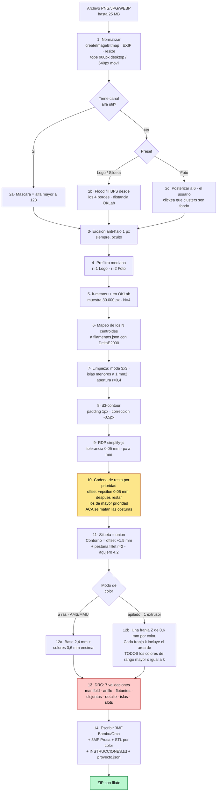

# 03 · Plan de desarrollo definitivo — 3dllaveros

> **Qué es este documento.** El plan único que se sigue para construir la web. Sintetiza `docs/01-stack-tecnologico.md`, `docs/02-costos-servicios.md`, las tres auditorías y los tres planes del equipo (A/MVP, B/riesgo, C/usuario). Donde había contradicción, acá hay una decisión tomada. Donde había un número inventado, acá hay un spike que lo mide.
> **Fecha:** 2026-09-12 · **Estado:** aprobado para ejecutar.
> **Cómo se lee:** de corrido para entender el proyecto (secciones 1 a 5), o abierto al lado del editor para trabajar (secciones 6 a 16).

---

## Índice

1. [Resumen ejecutivo](#1-resumen-ejecutivo)
2. [Decisiones tomadas](#2-decisiones-tomadas)
2-bis. [Enmiendas del usuario (2026-09-12)](#2-bis-enmiendas-del-usuario-2026-09-12)
3. [Cómo funciona la conversión de foto a llavero](#3-cómo-funciona-la-conversión-de-foto-a-llavero)
4. [Flujo de usuario, pantalla por pantalla](#4-flujo-de-usuario-pantalla-por-pantalla)
5. [Arquitectura y stack definitivo](#5-arquitectura-y-stack-definitivo)
6. [Estructura de carpetas y módulos](#6-estructura-de-carpetas-y-módulos)
7. [Parámetros del pipeline](#7-parámetros-del-pipeline)
8. [El editor estilo Tinkercad](#8-el-editor-estilo-tinkercad)
9. [Exportación e impresión](#9-exportación-e-impresión)
10. [Hoja de ruta por fases](#10-hoja-de-ruta-por-fases)
11. [Costos reales por etapa](#11-costos-reales-por-etapa)
12. [Escalamiento: costuras y no-construcciones](#12-escalamiento-costuras-y-no-construcciones)
13. [Riesgos y mitigaciones](#13-riesgos-y-mitigaciones)
14. [Pruebas y validación](#14-pruebas-y-validación)
15. [Qué NO vamos a hacer](#15-qué-no-vamos-a-hacer)
16. [Próximos pasos inmediatos](#16-próximos-pasos-inmediatos)

---

## 1. Resumen ejecutivo

### Qué construimos

Una web donde alguien suelta un PNG de su logo, su dibujo o su mascota y, **sin tocar nada**, baja un ZIP con un llavero 3D multicolor listo para imprimir: un `.3mf` que abre en Bambu Studio u OrcaSlicer con los colores ya asignados a los slots, otro para PrusaSlicer, los STL por color como red de seguridad, un `INSTRUCCIONES.txt` y el `proyecto.json` para volver a editarlo.

**El diferenciador número uno no es convertir** — hay once competidores que convierten. Es que **funciona igual si tu impresora tiene un solo extrusor**: el modo apilado genera la geometría en franjas de altura con las pausas de cambio de filamento ya escritas en el archivo, más la lista legible de "en la capa 12 poné rojo". Ninguno de los once lo hace bien.

**El diferenciador número dos es la honestidad**: mostramos los gramos de purga antes de descargar, pintamos de naranja lo que mide menos de 0,8 mm y va a salir frágil, y tenemos un modo de vista previa que dibuja las terrazas reales en vez de un render bonito que miente.

**El diferenciador número tres, que llega después del MVP**, es un editor 2.5D estilo Tinkercad para retocar sin volver a empezar.

Todo corre **en el navegador del usuario**. No hay servidor. La imagen no se sube a ningún lado, y eso es literalmente cierto, incluido el reporte de errores.

### Con qué

TypeScript + Vite + React 19 + Tailwind 4 en la interfaz; `manifold-3d` (WASM) para toda la geometría; `d3-contour` + `simplify-js` para vectorizar; `ml-kmeans` + `culori` para el color; escritor propio de 3MF sobre `fflate`; `three` puro para la vista previa. Dos Web Workers con Comlink. Hosting en **Vercel** (salida estática, portable a Cloudflare — ver §2-bis). **Sin IA en ninguna fase.**

### Cuánto cuesta

**US$0/mes** durante todo el MVP, y US$0,93/mes si se compra el dominio `.com`. El primer costo real aparece recién con cuentas de usuario (US$0–7/mes) y con el agente DMCA (US$6). Los únicos gastos de bolsillo del MVP son **US$5–15 de filamento** y **US$2 de argollas** para las tres piezas patrón.

### Cuánto tarda

**43,5 días laborables** de una persona a ~5 h efectivas por día: unas **9 semanas**. (10,5 + 8 + 13 + 7 + 5; el desglose tarea por tarea está en §10 y cada número de fase es la suma de sus tareas, no una estimación redonda.)

| Fase | Qué termina | Días | Costo |
|---|---|---|---|
| **0 · Spikes y compuertas** | El 3MF abre bien en los 3 slicers **y hay tres piezas impresas y medidas**. El pipeline está medido, no estimado. | **10,5** | US$5–17 (filamento + argollas) |
| **1 · El motor** | De una imagen sale un ZIP correcto, sin interfaz. Ya es útil. | **8** | US$0 |
| **2 · El producto usable** | Las tres solapas, la máscara interactiva, los avisos con arreglo de un click, la descarga. | **13** | US$0 |
| **3 · Honestidad y apilado** | Vista previa honesta, modo cambio manual de filamento, los seis casos feos. | **7** | US$0 |
| **4 · Legal, métrica y lanzamiento** | Cuatro páginas legales, analítica, Playwright, dominio, online. | **5** | US$0–11 (dominio) |

**La apuesta central, en una línea: se construye al revés — primero el archivo y la pieza física, después la imagen, y último la interfaz.** Los dos riesgos que pueden hundir el proyecto (que el 3MF no abra bien, y que los números de impresión estén mal) se matan en la **primera semana y media**, no en la semana siete. Si el día 3 el 3MF hecho a mano no abre limpio en Bambu Studio, el producto se convierte en "STL por color con instrucciones claras" y el calendario se recorta — esa decisión se toma el día 3, no el día 50.

---

## 2. Decisiones tomadas

Tabla cerrada. No se vuelven a discutir salvo que un spike las contradiga con un número.

| # | Decisión | Alternativa descartada | Por qué |
|---|---|---|---|
| 1 | **Todo en el navegador, cero servidor** | Laravel/Laragon, Node en VPS, procesamiento en la nube | US$0/mes a cualquier escala (doc 02 §4 y §6) y la promesa "tu foto no se sube" es verdad, no marketing. Laragon queda para el día que haya tienda y admin. |
| 2 | **Hosting: Vercel (Hobby)** — decisión del usuario, 2026-09-12 | Cloudflare Workers, Netlify, GitHub Pages | El usuario lo prefiere y **no va a monetizar por ahora**, así que la prohibición de uso comercial del plan Hobby no aplica hoy. Se compensa con la **regla de portabilidad** de §2-bis: salida estática pura, sin nada propietario de Vercel. |
| 3 | **Geometría: `manifold-3d` 3.5.x y nada más** | `clipper2-ts`, `three-bvh-csg`, doble motor 2D | audit-01 §5 lo llama el núcleo "sin discusión". Mantener un segundo motor 2D sin gatillo definido es generalidad especulativa. El fallback real está en la decisión 21, no en el contrato de una interfaz. |
| 4 | **Vectorización: `d3-contour` + `simplify-js`** | VTracer (alfa), `potrace` (GPL), `marchingsquares` (GPL) | Estables, chicas, licencia limpia. Detrás de la interfaz `Trazador`, así que cambiar cuesta un archivo. |
| 5 | **Cuantización: k-means++ en OKLab + ΔE2000 solo sobre los N centroides** | `image-q` (sin releases desde 2022), ΔE2000 por píxel | audit-01 §2.3. ΔE2000 por píxel es ~100× más caro y no mejora nada. |
| 6 | **Dithering: nunca, ni como opción oculta** | Floyd-Steinberg | audit-01 §2.2: en un objeto físico de 4 colores el dithering produce ruido imprimible, no degradado. |
| 7 | **3MF: escritor propio con `fflate`, dos perfiles (Bambu/Orca y Prusa)** | `three-3mf-exporter`, `@jscadui/3mf-export` | audit-02 §3: el primero declara `requiredextensions="p"` de forma inválida; el segundo es de 2023. Ninguno escribe `model_settings.config`, que es donde vive el color. |
| 8 | **Sin `<basematerials>`, sin `displaycolor`, sin pintado por caras** | El 3MF "estándar" de colores | audit-02 §1.1, verificado en código fuente: **ningún** slicer objetivo los lee. Escribirlos es trabajo para nadie. |
| 9 | **Sin cabeceras COOP/COEP** | Ponerlas "por las dudas" | audit-01 §4.3: ni Manifold ni OpenCV usan `SharedArrayBuffer`, y ponerlas rompe recursos cross-origin gratis. |
| 10 | **Resolución de trabajo: 0,20 mm/px como punto de partida, marcada PROVISORIA y calibrada por medición en la Fase 0** | 0,10 (audit-01 §6.1) o 0,15 (plan A) fijos | El argumento de audit-02 §6.1 es físico: con boquilla 0,4 nada por debajo de 0,45 mm imprime, y el costo de CPU crece al **cuadrado** — que es lo que decide en celular. El margen de antialias que pide audit-01 lo da el prefiltro de mediana. **Se mide en F0.8** (ver §10). |
| 11 | **Tres solapas en una ruta, con el 3D siempre visible** | Wizard lineal de 5 pantallas (planes A y B) | El preview permanente convierte recortar el fondo (tarea aburrida) en una tarea con recompensa inmediata. **Va como compuerta, no como apuesta:** si al cerrar la Fase 1 el preview no responde en ≤ 400 ms con las 20 imágenes del banco en la máquina de desarrollo, se cae al wizard lineal sin tocar una línea de lógica (es el mismo estado, otro layout). |
| 12 | **La pregunta de la impresora va en la solapa Colores, no en la landing** | Selector arriba de todo en la landing (plan B) | Preguntarle "¿Bambu/AMS o Prusa/MMU?" a alguien que recién llegó y todavía no ganó nada es la primera puerta de salida. El costo de equivocarse está acotado porque el ZIP trae los dos perfiles igual. **Regla de decisión:** se mide `descarga.modo` en las primeras 200 descargas; si "un solo filamento" supera el 40%, el selector sube a la landing. Deja de ser una opinión. |
| 13 | **Router: ninguna librería. Hash + History API sobre el estado `paso`, ~20 líneas** | React Router 8 (plan B), wouter (plan C), switch pelado (plan A) | El switch pelado no da botón atrás ni pasos linkeables, que el flujo de solapas necesita. Una librería de router para tres solapas es peso muerto. |
| 14 | **El editor estilo Tinkercad queda FUERA del MVP** | Meterlo adentro (plan B §4.1) | Tres fuentes independientes lo marcan como el riesgo de plazo #1 (doc 01 §7 riesgo 8, audit-03 §3.2, y el propio plan B §2 R8 — que se contradice al incluirlo). El MVP ya escribe el documento `Diseno` completo: el editor es **aditivo**, no una reescritura. |
| 15 | **Vista previa honesta: entra, recortada a la mitad** | No existe (planes A y B) · completa, 3 días (plan C) | Entran: líneas de capa por shader, naranja en zonas < 0,8 mm (las coordenadas ya las devuelve la apertura morfológica: sale gratis) y el comparador de divisor arrastrable. Salen: el normal map de líneas de extrusión y el render de la compensación del agujero. **~1,5 días** y es lo que hace legibles los avisos de la DRC. |
| 16 | **Modo apilado (cambio manual de filamento) SÍ entra al MVP** | Dejarlo para después | Es el diferenciador #1 (audit-03 §3.2) y reusa el 90% de lo que ya existe. Es la diferencia entre "no lo puedo imprimir" y una descarga usable para la mayoría de las impresoras del mercado. |
| 17 | **SVG como entrada: fuera del MVP** | Aceptarlo (plan B §8.1 paso 1) · publicitarlo sin implementarlo (plan C, wireframe de la landing) | Es un segundo camino completo por el pipeline, sin máscara ni cuantización, con su propio set de bugs. **Consecuencia obligatoria:** el copy de la landing dice **"PNG · JPG · WEBP"**. Si el texto dice SVG y el sistema lo rechaza, es el peor primer contacto posible. |
| 18 | **GrabCut / OpenCV.js: costura abierta, implementación condicionada** | Cerrarlo del todo (plan A §1.2) · darlo por hecho (planes B y C) | Queda un `import()` diferido detrás del puerto `Recortador`, botón secundario con el costo declarado ("descarga 3,5 MB"), que **nunca** se carga solo. **Se implementa solo si** la medición del preset Foto por clasificación de clusters no alcanza en el subconjunto de fotos del banco (F0.8). |
| 19 | **HEIC, AVIF, TIFF: no soportar** | `heic2any` / `libheif-js` | Son LGPL-3.0, se incluyen estáticamente en el JS del navegador y obligan a permitir el relinkeo (audit-01 §4.4). Se detecta el fallo y se muestra el texto nº 4 de §4.7. |
| 20 | **Español solamente, todos los textos en un archivo** | i18n desde el día 1 (plan B) | El copy cambia todos los días en un MVP. `src/i18n/es.ts` como objeto plano; agregar inglés es copiar el archivo. |
| 21 | **Plan B de cada spike, escrito ANTES de empezarlo** | Improvisar cuando falle | Si falla el perfil Prusa → se degrada a STL por color + instrucciones **solo para Prusa**, y no bloquea el lanzamiento. Si falla Manifold por memoria → `clipper2-ts` para el 2D + `THREE.ExtrudeGeometry` para la extrusión, perdiendo la garantía de manifoldness y validando con `lib3mf` en CI. Con la degradación escrita, un spike que falla no paraliza. |
| 22 | **Regla de ESLint `no-restricted-imports` por carpeta** | Confiar en respetar las interfaces (plan A) | Nada fuera de `src/pipeline/`, `src/geometria/` y `src/export/` puede importar `manifold-3d`, `d3-contour`, `culori`, `ml-kmeans`, `opencv-js` ni `fflate`. Se hace cumplir con lint, no con buena voluntad. |
| 23 | **Analítica: 8 eventos cerrados con 6 metas numéricas. El procesador se decide con un spike de 30 minutos** | Dar por hecho que Cloudflare Web Analytics soporta eventos personalizados (plan A) · meter Umami sin verificar (plan C) | Ni doc 02 §7/§8 ni audit-03 §5.3 confirman que CF Web Analytics acepte eventos arbitrarios: lo describen como analítica **de páginas**. La métrica #1 del producto (abandono en Fondo) no puede descansar sobre una capacidad no verificada. Ver §10 F0.1 y §14.6. |
| 24 | **Banco golden: material propio, CC0 o con licencia explícita, con `LICENCIAS-BANCO.md`** | Bajar 20 imágenes de Google | El banco se versiona en el repo y corre en CI: o sea, **se distribuye**. audit-03 §4 es taxativo con personajes, escudos y logos de terceros. Media jornada, presupuestada en F0.7. |
| 25 | **El ZIP trae la geometría del modo elegido; la otra variante se genera bajo demanda con un click** | Generar siempre las dos geometrías (plan C §3.6) · no decirlo (plan A §7.1 vs §7.4) | A ras y apilado son **geometrías distintas** (audit-02 §4 paso 3). Generarlas siempre significa correr booleanas y extrusión dos veces en cada descarga, un costo que ningún presupuesto de latencia contemplaba. Ver §4.6. |

---

## 2-bis. Enmiendas del usuario (2026-09-12)

> Estas dos decisiones las tomó el usuario **después** de que se escribiera el resto del documento y **pisan** lo que digan las demás secciones.

### E1 · El hosting es Vercel, no Cloudflare

**Qué cambia:** la fila 2 de §2, la fila "Servir la SPA" de §5, la fila de hosting de §11.1 y el paso 1 de §16.

**Por qué:** es la preferencia del usuario y hoy es perfectamente válida, porque **no va a cobrar por la app**. El plan Hobby de Vercel prohíbe el uso comercial (doc 02 §2), así que esa condición se activa recién el día que haya monetización.

**La regla de portabilidad, que es lo que hace segura esta decisión:**

| Se usa | No se usa nunca |
|---|---|
| Build estático de Vite (`dist/`) servido tal cual | Vercel Functions / API Routes |
| `vercel.json` solo con el rewrite de SPA | Vercel Edge Middleware |
| Deploy automático desde GitHub | `next/image` u optimización de imágenes de Vercel |
| Variables de entorno estándar de Vite (`VITE_*`) | Vercel KV, Postgres, Blob, Analytics de pago |

Cumpliendo eso, mudarse a Cloudflare Workers static (o a cualquier otro) es **cambiar a dónde apunta el deploy, sin tocar una línea de código**. Se agrega al CI un chequeo que falla si aparece `@vercel/` en `package.json`.

**Disparador para revisar esta decisión:** el día que se cobre cualquier cosa (suscripción, packs, venta de impresiones) hay que elegir entre pagar Vercel Pro (US$20/mes) o mudarse a Cloudflare (US$0 y permite uso comercial). Queda anotado en §12 como costura, no como deuda.

### E2 · El STL es un entregable de primera clase, no solo una red de seguridad

**Qué cambia:** §9.1 y §14.

El usuario pidió explícitamente poder **descargar en .STL además del 3MF**. El STL **no guarda color** (es geometría pelada), así que "descargar STL" se resuelve como **dos archivos distintos**, los dos dentro del ZIP:

| Archivo | Qué es | Para qué sirve |
|---|---|---|
| `stl/1_blanco.stl`, `2_rojo.stl`, … | **Un STL por color**, todos en el mismo sistema de coordenadas | Se cargan en el slicer con *"importar como objeto único con varias partes"* y se le asigna un filamento a cada una. Funciona en Bambu Studio, OrcaSlicer y PrusaSlicer (audit-02 §5 B1) |
| `stl/pieza-entera.stl` | **La pieza completa fusionada**, sin separación de colores | Imprimir en un solo color, pintarla a mano, o abrirla en cualquier programa 3D (Tinkercad, Fusion, Blender) |

Esto ya estaba casi todo en el plan como plan B; la enmienda lo asciende a **funcionalidad prometida**: el STL se testea en los tres slicers en cada release (§14, condición 6) y **no se degrada nunca**, porque es lo que sigue funcionando si un slicer rompe el formato propietario del 3MF.

### E3 · El perfil de PrusaSlicer se pospone

**Qué cambia:** la tarea F0.4 sale de la Fase 0 (−1,5 días) y va a la lista de "después del lanzamiento".

**Por qué:** el usuario tiene una Bambu, así que no puede probar el perfil de Prusa con su propia impresora, y la Fase 0 es justamente para despejar riesgos con pruebas reales. Los usuarios de PrusaSlicer igual imprimen desde el día 1 con el **ZIP de un STL por color** (E2), que carga en tres clics. El perfil se agrega cuando aparezcan usuarios de Prusa que lo pidan.

### E4 · Edición mínima en el MVP: confirmada, ya estaba en el plan (+0,5 días)

**Qué pidió el usuario:** que el MVP salga con una versión mínima del editor (mover y escalar la imagen, agregar texto, ubicar la argolla) y no esperar a la Fase 5.

**Qué había en el plan (y cómo se leyó mal al principio):** la síntesis resumió "editor fuera", pero se refería al **editor completo** de la Fase 5 (§8.2: formas, capas, agrupar, alinear, deshacer de 100 pasos). La edición mínima **ya estaba en el MVP**:

| Pedido | Dónde ya estaba |
|---|---|
| Mover, escalar y rotar la imagen | F2.5 · manipulación directa en el lienzo de la solapa Llavero (§4.5) |
| Ubicar la argolla | F2.5 · arrastrar el agujero con validación en vivo, más 4 tipos de argolla |
| Agregar texto | F1.2 (`texto.ts` con `opentype.js` y 3 fuentes OFL) + F2.5 (`+ Agregar texto`) |

**Lo único que se agrega:** que el **texto** tenga los mismos controles que el dibujo (arrastrar, escalar y rotar). Reusa la manipulación directa de F2.5 aplicada a otra pieza del `Diseno`: **+0,5 días en F2.5** (de 2,5 a 3,0). El MVP pasa de 43,5 a **44 días**, menos los 1,5 de E3: **42,5 días**.

**Por qué importa:** la auditoría de competencia (audit-03 §2.2) muestra que ninguna de las once herramientas deja tocar nada después de convertir. Con esto el MVP ya se diferencia desde el primer día, y todo edita el mismo documento `Diseno` que después usa el editor completo de la Fase 5, así que no hay que rehacer nada.

---

## 3. Cómo funciona la conversión de foto a llavero

### Explicado simple

Un llavero impreso en varios colores es, en realidad, **capas planas apiladas**: una plancha de base y, encima, "parches" de colores. Todo el problema se reduce a **encontrar los parches**.

1. **Achicamos la imagen** a un tamaño de trabajo. Si el llavero va a medir 50 mm y trabajamos a 0,20 mm por píxel, la imagen se reduce a 250 píxeles de lado. Más resolución que eso no agrega nada que la boquilla pueda imprimir, y cuesta cuatro veces más CPU.
2. **Sacamos el fondo.** Si la imagen tiene transparencia, ya está resuelto. Si no, pintamos desde los cuatro bordes hacia adentro todo lo que se parezca al color del borde (eso es un *flood fill*), y le damos al usuario una varita y un pincel para corregir. En fotos, en vez de eso posterizamos a 6 colores y el usuario **hace click en cuáles son fondo**: son tres decisiones discretas en vez de pelear con un slider continuo.
3. **Reducimos a N colores.** Agarramos 30.000 píxeles al azar y los agrupamos en N racimos (k-means) dentro de OKLab, que es un espacio donde "distancia" se parece a "diferencia que ve el ojo". Cada racimo tiene un color promedio: esos son los N colores del llavero. Después los mapeamos a **filamentos reales** — no a un color inventado — con la fórmula ΔE2000.
4. **Limpiamos.** Sacamos motas de un píxel, fundimos islas más chicas que 1 mm² con el color vecino y borramos detalles más finos que la boquilla. Esta limpieza es lo que separa "se ve lindo en pantalla" de "sale bien impreso".
5. **Dibujamos los contornos.** Cada color se convierte en una serie de polígonos en milímetros. Y acá viene la parte que nadie nombra: si cada color se traza por separado, los bordes compartidos **dejan de coincidir por centésimas de milímetro** y al imprimir se ve una línea del color de abajo entre dos zonas. La solución es no dejarlos separados: cada región crece 0,05 mm y después se le resta todo lo que tiene más prioridad. La resta la hace el kernel de Manifold, así que los bordes quedan **matemáticamente idénticos**.
6. **Le agregamos el llavero de verdad**: un borde de 1,5 mm alrededor de la silueta (que une las puntas finas y evita que se despeguen), una pestaña arriba con un agujero de Ø4,2 mm y 3 mm de material alrededor, unida con una curva suave (fillet r=2 mm) para que no se parta.
7. **Levantamos todo en Z.** En modo *a ras* (impresora con AMS/MMU): una base de 2,4 mm y los colores de 0,6 mm encima, todos a la misma altura. En modo *apilado* (un solo extrusor): cada color es una franja de 0,6 mm, una arriba de otra, y el archivo lleva las pausas para cambiar filamento.
8. **Revisamos y escribimos el archivo.** Siete validaciones automáticas (¿el anillo del agujero aguanta? ¿hay algún color flotando? ¿alguna malla quedó rota?) y después se escriben los bytes del `.3mf`.

### El diagrama



### El paso 12b, escrito con todas las letras

**En modo apilado, la franja Z de rango `k` incluye el área de TODOS los colores de rango ≥ k.** No solamente la del color `k`.

Si no se hace así, el color que está más arriba en la pila queda **flotando sin nada abajo** y la impresión falla o sale colgando en el aire. Es exactamente el bug que la validación DRC #3 tiene que detectar, y nace acá. Los planes A y C lo dejaban implícito; queda escrito para que nadie lo implemente al revés:

```
franja(k) = union( region(k), region(k+1), ..., region(N) )
z(k)      = alturaBase + (k - 1) * alturaFranja
```

### Los dos épsilon: la falsa contradicción que hay que dejar escrita

**audit-01 §3.3 y §6.4 exigen ε = 0,05 mm. audit-02 §2 dice "empezar sin épsilon". No hablan del mismo épsilon.** Alguien que lea las dos auditorías y quiera "arreglar" esto agregando un hueco en Z se fabrica exactamente el problema que cree estar evitando.

| | ε de audit-01 | ε de audit-02 |
|---|---|---|
| **Dónde** | En XY, en el plano | En Z, entre volúmenes apilados |
| **Qué es** | Un crecimiento 2D de cada región **antes** de la cadena de resta por prioridad | Una separación vertical entre la base y la capa de color |
| **Para qué** | Contra los micro-huecos entre colores vecinos, que en pantalla no se ven y en la impresión sí | Contra un solapamiento que **no existe** |
| **Decisión** | **SÍ. `epsilonSolapeCapasXY = 0,05 mm`, siempre activo, oculto** | **NO. `epsilonZ = 0`. El contacto cara a cara en Z es lo normal y correcto** |

Este cuadro va **como comentario literal en `src/pipeline/defaults.ts`**, arriba de las dos constantes.

---

## 4. Flujo de usuario, pantalla por pantalla

El MVP son **tres solapas en una sola ruta** (`/crear`), con la vista 3D siempre presente, más la landing y la pantalla de descarga.

> Convención de los wireframes: `▓` botón primario · `░` botón secundario · `◉` opción elegida · `○` no elegida · `▸` desplegable cerrado · `⠿` agarradera de arrastre.

### 4.1 · Landing (`/`)

```
┌──────────────────────────────────────────────────────────────────────────────┐
│  3DLlaveros                                      Ayuda   Compatibilidad      │
├──────────────────────────────────────────────────────────────────────────────┤
│                                                                              │
│      Convertí tu dibujo o logo en un llavero listo para imprimir.            │
│      Funciona también si tu impresora es de un solo color.                   │
│                                                                              │
│      ┌────────────────────────────────────────────────────────────┐          │
│      │                          ⬆                                 │          │
│      │            Arrastrá tu imagen acá, o hacé click             │          │
│      │              PNG · JPG · WEBP   ·   hasta 25 MB             │          │
│      │                                                             │          │
│      │                  ▓ Elegir una imagen ▓                      │          │
│      └────────────────────────────────────────────────────────────┘          │
│      Tu imagen no se sube a ningún lado: todo pasa en tu navegador.          │
│                                                                              │
│      ¿No tenés una a mano? Probá con estas:                                  │
│      ┌──────┐  ┌──────┐  ┌──────┐                                            │
│      │ logo │  │dibujo│  │silue-│   ← click = arranca el flujo completo       │
│      │3 col.│  │ nene │  │  ta  │                                            │
│      └──────┘  └──────┘  └──────┘                                            │
│                                                                              │
│      ── Qué imágenes funcionan mejor ────────────────────────────────────    │
│      ┌───┐ colores planos   ┌───┐ fondo liso o   ┌───┐ sin líneas más        │
│      │ ✓ │ y bien marcados  │ ✓ │ transparente   │ ✗ │ finas que 1 mm        │
│      └───┘                  └───┘                └───┘                       │
│                                                                              │
│      Subí solo imágenes propias o con permiso. Convertirlas no te da         │
│      derechos sobre personajes, logos o marcas de terceros.                  │
├──────────────────────────────────────────────────────────────────────────────┤
│  Términos · Privacidad · Compatibilidad con slicers · Licencias · Contacto   │
└──────────────────────────────────────────────────────────────────────────────┘
```

**Cuatro detalles que no son decorativos:**

- **`PNG · JPG · WEBP`, sin SVG.** Decisión 17. El sistema rechaza SVG, así que el copy no lo puede prometer.
- El **aviso de propiedad intelectual va acá, visible**, no escondido en Términos (audit-03 §5 punto 4). Es lo que prueba que no inducimos a infringir, y vale más que diez páginas de términos.
- Los dos **workers arrancan en la landing**, no en `/crear`: `new Worker(new URL('./imagen.worker.ts', import.meta.url), { type: 'module' })` en cuanto monta. El costo de arranque queda escondido detrás de la elección del archivo.
- **El `proyecto.json` se puede arrastrar de vuelta a esta misma dropzone y se abre.** Es el "compartir" de costo cero del MVP y se soporta desde el día uno.

**Estado: hay un diseño guardado de antes (vuelve de IndexedDB)**

```
│      ┌──── Seguí donde lo dejaste ─────────────────────────────┐             │
│      │ [thumb]  "logo-club.png"   ayer 19:42   ·  4 colores    │             │
│      │                              ▓ Seguir ▓   ░ Descartar ░ │             │
│      └─────────────────────────────────────────────────────────┘             │
```

**Estado: error de archivo (inline, nunca modal, nunca `alert()`)**

```
│      ┌─────────────────────────────────────────────────────────┐             │
│      │ ⚠ No pude abrir "IMG_4417.HEIC"                         │             │
│      │   Las fotos de iPhone en HEIC no se abren en la web.    │             │
│      │   En el iPhone: Ajustes ▸ Cámara ▸ Formatos ▸ "Más      │             │
│      │   compatible". O mandátela por WhatsApp y usá esa.      │             │
│      │                                        ░ Entendido ░    │             │
│      └─────────────────────────────────────────────────────────┘             │
```

La dropzone **sigue activa** debajo del error.

**Landing en celular (≤ 640 px)**

```
┌────────────────────────────┐
│ 3DLlaveros            ☰    │
├────────────────────────────┤
│ Convertí tu dibujo en un   │
│ llavero listo para imprimir│
│                            │
│ ┌────────────────────────┐ │
│ │          ⬆             │ │
│ │ ▓ Sacar una foto ▓     │ │ ← capture="environment"
│ │ ░ Elegir de la galería░│ │
│ └────────────────────────┘ │
│ Todo pasa en tu teléfono.  │
│                            │
│ Probá con estas:           │
│ [logo] [dibujo] [silueta]  │
└────────────────────────────┘
```

En celular el botón primario es **"Sacar una foto"**: quien usa el teléfono casi siempre tiene el dibujo del chico sobre la mesa. Es `<input type="file" accept="image/png,image/jpeg,image/webp" capture="environment">`: una línea de HTML.

---

### 4.2 · Procesando (overlay sobre `/crear`)

No es una ruta. Es un overlay que aparece apenas se suelta el archivo y se va solo.

```
┌──────────────────────────────────────────────────────────────────────────────┐
│                    ┌──────────────────────┐                                  │
│                    │   [ la imagen del    │  ← su imagen ya, apenas          │
│                    │     usuario, con un  │    decodificada, para que        │
│                    │     barrido de luz ] │    sepa que llegó bien           │
│                    └──────────────────────┘                                  │
│                                                                              │
│                  ●━━━━━━━●━━━━━━━○━━━━━━━○                                   │
│                                                                              │
│                  ✓  Leí tu imagen                                            │
│                  ▸  Sacando el fondo                                         │
│                     Separando los colores                                    │
│                     Armando el llavero                                       │
│                                                ░ Cancelar ░                  │
└──────────────────────────────────────────────────────────────────────────────┘
```

- **Cuatro hitos nombrados, no un porcentaje.** El porcentaje sería mentira: el tiempo de cada etapa depende de la imagen.
- A los **3 s**: *"Tu imagen es grande, esto puede tardar unos segundos."* A los **8 s**: *"Está tardando más de lo normal. ¿La proceso más chica?"* con `▓ Procesarla más chica ▓` (baja a 400 px y reintenta).
- **Cancelar hace `worker.terminate()` y vuelve a la landing con el archivo todavía cargado**, no perdido. Es la primera de las tres redes de seguridad.

**Degradación obligatoria en móvil (corrige el error del plan C §1.2):** el pipeline especulativo corre completo **solo si** `deviceMemory ≥ 4` y `hardwareConcurrency ≥ 4`. Por debajo de eso corre hasta el paso 9 (polígonos) y **espera** a que el usuario entre a la solapa Llavero para construir la malla y el 3MF. audit-01 §4.2 estima 1,0–3,3 s en celular de gama media **sin contar malla ni 3MF**, y el propio auditor aclara que son estimaciones no medidas; audit-01 §4.4 avisa que iOS Safari mata la pestaña sin evento capturable. Prometer especulación completa en todos los dispositivos es apostar contra ese techo.

---

### 4.3 · Solapa Fondo (`/crear#fondo`)

La pantalla que decide si el producto es mágico o frustrante. Se lleva la mitad del presupuesto de interfaz.

```
┌──────────────────────────────────────────────────────────────────────────────┐
│ ← 3DLlaveros      [ Fondo ] [ Colores ] [ Llavero ]    ↩ ↪     ▓ Descargar ▓ │
├───────┬────────────────────────────────────────────────┬─────────────────────┤
│       │                                                │   TU LLAVERO        │
│  🪄   │        ░░░░░░░░░░░░░░░░░░░░░░░░░░░░            │  ┌───────────────┐  │
│varita │        ░░░░░░░▓▓▓▓▓▓▓▓▓▓░░░░░░░░░░            │  │               │  │
│       │        ░░░░▓▓▓▓▓▓▓▓▓▓▓▓▓▓▓▓░░░░░░            │  │  (vista 3D    │  │
│  🧽   │        ░░░▓▓▓   ▓▓▓▓▓▓  ▓▓▓▓▓░░░░            │  │   girable, ya │  │
│borrar │        ░░░▓▓▓▓▓▓▓▓▓▓▓▓▓▓▓▓▓▓░░░░░            │  │   con colores │  │
│       │        ░░░░▓▓▓▓▓▓▓▓▓▓▓▓▓▓▓▓░░░░░░            │  │   y argolla)  │  │
│  ✏️   │        ░░░░░░▓▓▓▓░░░░▓▓▓▓░░░░░░░░            │  │               │  │
│restau-│        ░░░░░░░░░░░░░░░░░░░░░░░░░░░░            │  └───────────────┘  │
│  rar  │                                                │   ⟲ arrastrá        │
│       │        ░ = fondo (damero)   ▓ = tu dibujo      │                     │
│  ✋   │                                                │  ───────────────    │
│mover  │  ┌──────────────────────────────────────────┐  │  ⚠ 1 aviso          │
│       │  │ Cuánto fondo sacar                       │  │  ▸ El texto de      │
│       │  │ menos ──────────●──────────── más        │  │    abajo puede      │
│       │  │ Pincel  ●──────────                      │  │    salir ilegible   │
│       │  └──────────────────────────────────────────┘  │                     │
│       │                                                │                     │
│       │  Tipo de imagen:  ◉ Dibujo  ○ Foto  ○ Silueta  │  ░ Saltear este     │
│       │  ░ Recorte avanzado (descarga 3,5 MB) ░        │    paso ░           │
├───────┴────────────────────────────────────────────────┴─────────────────────┤
│              ░ Atrás ░                        ▓ El fondo está bien → ▓       │
└──────────────────────────────────────────────────────────────────────────────┘
```

- **Se entra con el recorte ya hecho.** El estado inicial nunca es "hacé click para empezar a recortar".
- **El preview 3D está a la derecha, ya terminado.** Cada pincelada lo actualiza con 300 ms de debounce. Esa es la razón principal de usar solapas en vez de páginas.
- **Un solo slider: "Cuánto fondo sacar".** No se llama "Tolerancia" (término de Photoshop) y no muestra el número.
- **Cuatro herramientas y nada más.** El zoom es un modificador permanente (rueda del mouse), no una herramienta que haya que elegir.
- **"Saltear este paso"** siempre visible y legítimo: acepta la máscara automática.
- **"Recorte avanzado"** (GrabCut) es secundario, con el costo declarado, y **nunca se carga solo**.
- **Deshacer/rehacer de la máscara** con `Ctrl+Z` / `Ctrl+Shift+Z`, 20 pasos, en un buffer propio que **no entra al documento**.

**Estado: preset "Foto" — la pantalla cambia de forma** (idea de audit-01 §1.4)

```
│       │      [ la imagen ya posterizada a 6 colores ]   │                    │
│       │                                                 │                    │
│       │   Tocá los colores que son fondo:               │                    │
│       │   ┌────┐ ┌────┐ ┌────┐ ┌────┐ ┌────┐ ┌────┐    │                    │
│       │   │▓▓▓▓│ │░░░░│ │████│ │▒▒▒▒│ │▓▓▓▓│ │····│    │   ✓ = es fondo     │
│       │   │    │ │ ✓  │ │    │ │    │ │    │ │ ✓  │    │                    │
│       │   └────┘ └────┘ └────┘ └────┘ └────┘ └────┘    │                    │
│       │                                                 │                    │
│       │   ¿Quedó algo de más? Usá el pincel 🧽          │                    │
```

Tres a cinco decisiones discretas ("este gris es fondo") en vez de pelear con un slider continuo. **Nunca deja halo**, porque trabaja sobre polígonos ya cuantizados.

**Solapa Fondo en celular**

```
┌────────────────────────────┐
│ ← [Fondo][Color][Llavero]  │
├────────────────────────────┤
│  ┌──────────────────────┐  │
│  │                      │  │  pinch = zoom
│  │   lienzo (60% alto)  │  │  2 dedos = pan
│  │                      │  │  1 dedo = herramienta activa
│  │             ┌──────┐ │  │
│  │             │ 3D ▸ │ │  │ ← chip flotante: tocar = 3D full screen
│  └─────────────┴──────┴─┘  │
│  🪄   🧽   ✏️   ✋         │
│  Cuánto fondo sacar        │
│  menos ─────●───── más     │
│  ◉Dibujo ○Foto ○Silueta    │
│ ┌────────────────────────┐ │
│ │ ▓ El fondo está bien ▓ │ │ ← barra fija, respeta safe-area-inset
│ └────────────────────────┘ │
└────────────────────────────┘
```

El preview 3D en celular **no va al lado**: es un chip flotante que al tocarlo ocupa toda la pantalla. En 375 px, dos paneles lado a lado hacen que ninguno sirva. **Todo control interactivo mide 44 × 44 px como mínimo.**

---

### 4.4 · Solapa Colores (`/crear#colores`)

```
┌──────────────────────────────────────────────────────────────────────────────┐
│ ← 3DLlaveros    [ Fondo ✓ ] [ Colores ] [ Llavero ]   ↩ ↪     ▓ Descargar ▓  │
├────────────────────────────────────────────┬─────────────────────────────────┤
│                                            │  ¿CUÁNTOS COLORES?              │
│         ┌────────────────────────┐         │   ○2   ○3   ◉4   ○5   ○6        │
│         │                        │         │                                 │
│         │    vista 3D grande,    │         │  LOS COLORES DE TU LLAVERO      │
│         │    con los colores de  │         │  (arrastrá para reordenar)      │
│         │    filamento REALES    │         │  ┌────────────────────────────┐ │
│         │                        │         │  │⠿ ▉ Blanco   PLA Basic   🔒│ │
│         └────────────────────────┘         │  ├────────────────────────────┤ │
│           [Arriba] [3D] [Capas]            │  │⠿ ▉ Rojo     PLA Basic   🔓│ │
│                                            │  ├────────────────────────────┤ │
│  ⚠ El rojo y el bordó te van a quedar      │  │⠿ ▉ Negro    PLA Basic   🔓│ │
│    casi iguales al imprimir.               │  ├────────────────────────────┤ │
│                     ▓ Fusionarlos ▓        │  │⠿ ▉ Bordó    PLA Basic   🔓│ │
│                                            │  └────────────────────────────┘ │
│                                            │  ░ Ordenar para purgar menos ░  │
│                                            │  Datos de color por             │
│                                            │  filamentcolors.xyz (CC BY 4.0) │
│                                            │                                 │
│                                            │  ¿CUÁNTOS COLORES PODÉS CARGAR  │
│                                            │  A LA VEZ EN TU IMPRESORA?      │
│                                            │  ◉ 4 o más (AMS, CFS, ACE, MMU) │
│                                            │  ○ Solo 1 (los cambio a mano)   │
├────────────────────────────────────────────┴─────────────────────────────────┤
│           ░ Atrás ░                           ▓ Los colores están bien → ▓    │
└──────────────────────────────────────────────────────────────────────────────┘
```

- **El preview 3D pasa al centro y crece.** El usuario está juzgando colores: tiene que verlos grandes.
- **Cambiar de filamento NO recalcula geometría.** Solo cambia un material de `three`. Esto vale oro y se diseña así desde el día uno.
- **Click en la muestra** abre la grilla de filamentos con buscador. **Arrastrar una fila sobre otra** = fusionar, con confirmación inline y deshacer.
- **El aviso de ΔE2000 < 5 trae el botón que lo arregla.** Un aviso sin acción es ruido.
- **La atribución a `filamentcolors.xyz` vive acá**, al pie de la lista, con enlace. Es una obligación de la licencia CC BY 4.0 (audit-03 §1.5) y tiene consecuencia de interfaz: no alcanza con ponerla en la página de Licencias, tiene que estar **donde se usan los datos**.
- **La pregunta de la impresora está acá** (decisión 12), en castellano de persona y no de manual. Si elige "Solo 1" y hay más de 4 colores: *"Te van a quedar 3 pausas para cambiar el filamento. Te doy la lista exacta."* y el preview cambia a modo terrazas.
- Si el usuario declara **más de 4 slots**, el campo se convierte en un número libre y eso se propaga a `project_settings.config` (§9.2, la trampa de los arrays paralelos).

---

### 4.5 · Solapa Llavero (`/crear#llavero`)

```
┌──────────────────────────────────────────────────────────────────────────────┐
│ ← 3DLlaveros   [ Fondo ✓ ] [ Colores ✓ ] [ Llavero ]  ↩ ↪     ▓ Descargar ▓  │
├────────────────────────────────────────────┬─────────────────────────────────┤
│                                            │  TAMAÑO                         │
│         ┌────────────────────────┐         │  ●─────────────   50 mm         │
│         │        ○  ← argolla    │         │  (como una tarjeta SUBE)        │
│         │    ┌─────────────┐     │         │                                 │
│         │    │             │  ⇔  │ ← escala│  ESPESOR                        │
│         │    │  el dibujo  │     │         │  ○ Delgado ◉ Estándar ○ Reforz. │
│         │    │             │     │         │    1,6 mm    3,0 mm     4,0 mm  │
│         │    └─────────────┘     │         │                                 │
│         │                        │         │  ARGOLLA                        │
│         └────────────────────────┘         │  ┌────┐┌────┐┌────┐┌────┐       │
│           [Arriba] [3D] [Capas]            │  │○○○ ││ ◉  ││ ◎  ││ ✗  │       │
│                                            │  │bola││común│gruesa│ sin│       │
│           50,0 × 38,4 × 3,0 mm             │  └────┘└────┘└────┘└────┘       │
│                                            │  Arrastrá el agujero para        │
│         🎨 Lindo  |  👁 Como va a salir    │  moverlo.                        │
│                                            │                                  │
│                                            │  BORDE    [✓] activo             │
│                                            │  ●────────   1,5 mm              │
│                                            │                                  │
│                                            │  ░ + Agregar texto ░             │
│                                            │  ▸ Avanzado                      │
├────────────────────────────────────────────┴─────────────────────────────────┤
│ AVISOS (2)                                                                   │
│ 🟡 Las patas del gato miden 0,6 mm: pueden salir frágiles.  ▓ Engordarlas ▓  │
│ 🟡 Vas a gastar unos 28 g de purga.                        ░ Cómo reducirla ░│
├──────────────────────────────────────────────────────────────────────────────┤
│   ░ Atrás ░                                      ▓ Descargar mi llavero ▓    │
└──────────────────────────────────────────────────────────────────────────────┘
```

- **Cinco controles. Punto.** Tamaño, espesor, argolla, borde, texto. Todo lo demás en `▸ Avanzado`.
- **"50 mm (como una tarjeta SUBE)"**: referencia física, porque nadie tiene intuición de milímetros. Otras: *"como una moneda de $100"* (25 mm), *"como la palma de la mano"* (80 mm). Es una tabla de 6 entradas en `i18n/es.ts`.
- **El interruptor `🎨 Lindo | 👁 Como va a salir`** está siempre visible, debajo del lienzo. En esta pantalla el default es **Lindo**; en la pantalla de Descargar el default es **Como va a salir** (§4.6), que es donde el usuario decide si imprime.
- **La franja de avisos vive abajo, fija, siempre visible**, con semáforo, y **cada aviso tiene acción de un click**.
- **Manipulación directa en el lienzo:** arrastrar el dibujo, handle de esquina para escalar, handle de rotación, arrastrar el círculo del agujero. Si el agujero queda a menos de 2 mm del borde se pinta rojo en vivo con el tooltip *"acá se va a romper"*.
- **No hay botón "Abrir el editor" en el MVP.** El editor es Fase 5 (§8).

---

### 4.6 · Descargar (`/descargar`)

Donde se gana o se pierde la credibilidad. **Acá el preview arranca en modo "Como va a salir".**

```
┌──────────────────────────────────────────────────────────────────────────────┐
│ ← Volver al llavero                                                          │
├──────────────────────────────────────────────────────────────────────────────┤
│    ┌────────────┐   TU LLAVERO ESTÁ LISTO                                    │
│    │            │                                                            │
│    │  render 3D │   50,0 × 38,4 × 3,0 mm   ·   4 colores                     │
│    │  honesto   │   Filamento de la pieza:   ~4,8 g                          │
│    │            │   Purga por cambios de color:  ~28 g  (9 cambios)  ⓘ       │
│    │            │   Tiempo estimado:  ~35 min                                │
│    └────────────┘                                                            │
│                                                                              │
│    💡 Imprimí 6 llaveros juntos en la misma placa: la purga se reparte y     │
│       bajás de 28 g a unos 5 g por pieza.        ░ Cómo hago eso ░           │
│                                                                              │
│    ┌──────────────────────────────────────────────────────────────────────┐  │
│    │             ▓▓  Descargar mi llavero (ZIP · 240 KB)  ▓▓              │  │
│    └──────────────────────────────────────────────────────────────────────┘  │
│                                                                              │
│    ¿Con qué vas a imprimir?  ◉ Bambu/Orca  ○ PrusaSlicer  ○ Otra / No sé     │
│                                                                              │
│    Adentro del ZIP:                                                          │
│    ★ llavero-bambu-orca.3mf  ← este es el tuyo. Doble click y listo.         │
│      llavero-prusa.3mf         Por si algún día usás PrusaSlicer.            │
│      stl/1_blanco.stl …        Por si tu programa no abre 3MF.               │
│      INSTRUCCIONES.txt         Los 4 pasos, en texto.                        │
│      proyecto.json             Para volver a editarlo acá.                   │
│                                                                              │
│    ░ ¿También querés la versión para un solo filamento? ░  (tarda ~3 s)      │
│                                                                              │
│    ── CÓMO IMPRIMIRLO ────────────────────────────────────────────────────   │
│    1. Abrí llavero-bambu-orca.3mf con Bambu Studio u OrcaSlicer.             │
│    2. Si te pregunta algo al abrir, elegí importar solo la geometría.        │
│    3. Fijate que los 4 colores hayan quedado en los slots 1 a 4.             │
│    4. Activá "purgar dentro del objeto" y mandá a imprimir.                  │
│                                                                              │
│    ░ Empezar otro ░    ░ Guardar el proyecto ░    ░ Algo salió mal ░         │
└──────────────────────────────────────────────────────────────────────────────┘
```

**Dos cosas que resuelven ambigüedades que traían los tres planes:**

1. **Un solo botón grande.** El selector de slicer **no cambia qué se descarga**: el ZIP trae los dos perfiles siempre. Solo cambia cuál lleva ★ y qué instrucciones se muestran en pantalla. Eso elimina la ansiedad de "elegí mal el formato", que es la causa nº 1 de soporte en este rubro.
2. **El modo (a ras vs. apilado) SÍ cambia la geometría, y por eso no se generan los dos siempre.** El ZIP trae la geometría del **modo elegido en la solapa Colores**, y hay un botón secundario explícito, `░ ¿También querés la versión para un solo filamento? ░`, que construye la segunda geometría **bajo demanda** (~3 s con barra de progreso) y la agrega al ZIP. Un click consciente, no un costo escondido en cada descarga.

**En modo un solo extrusor la caja de estimación cambia (matiz que ningún plan tenía):**

```
│    Filamento de la pieza:   ~4,8 g                                           │
│    Cambios de filamento:    2 pausas · ~0,6 g de cebado cada una  ⓘ          │
│                                                                              │
│    ── CUÁNDO CAMBIAR EL FILAMENTO ───────────────────────────────────────    │
│    Capa 12  (Z = 2,4 mm)  →  poné ROJO        ░ copiar lista ░               │
│    Capa 15  (Z = 3,0 mm)  →  poné NEGRO                                      │
│    La impresora se va a pausar sola. No apagues nada.                        │
```

**En modo apilado con M600 no hay torre de purga: solo el cebado del cambio.** Mostrar "~28 g de purga" ahí sería mentirle al usuario justo en la pantalla que vende honestidad.

**Estado: la descarga falló (el navegador la bloqueó, o no hubo memoria)**

```
│    ⚠ El navegador no dejó bajar el archivo. Probá de nuevo, o bajá los       │
│      archivos de a uno:                                                      │
│      ░ llavero-bambu-orca.3mf ░  ░ INSTRUCCIONES.txt ░  ░ proyecto.json ░   │
```

Es la tercera red de seguridad: fallback de descarga archivo por archivo si el navegador bloquea el ZIP.

---

### 4.7 · Los diez textos que importan

Viven todos en `src/i18n/es.ts`, un solo archivo, objeto plano. **Regla:** español rioplatense, nada de "pulsa/fichero/ordenador/vale", trato de vos, **sin signos de exclamación en errores**.

| # | Dónde | Texto | Por qué así |
|---|---|---|---|
| 1 | Botón principal de la landing | **"Elegir una imagen"** | No "Empezar" (no dice qué pasa), no "Subir" (mentira: no sube nada), no "Convertir" (todavía no hay qué convertir). Dice exactamente la próxima acción. |
| 2 | Promesa de la landing | **"Convertí tu dibujo o logo en un llavero listo para imprimir. Funciona también si tu impresora es de un solo color."** | La primera frase dice qué es. La segunda es el diferenciador #1 y elimina la objeción principal de la mayoría de las impresoras del mercado. |
| 3 | Bajo la dropzone | **"Tu imagen no se sube a ningún lado: todo pasa en tu navegador."** | Presente afirmativo, no "no almacenamos tus datos" (que suena a política legal y genera la duda que quiere resolver). |
| 4 | Error de formato | **"No pude abrir «IMG_4417.HEIC». Las fotos de iPhone en HEIC no se abren en la web. En el iPhone: Ajustes ▸ Cámara ▸ Formatos ▸ «Más compatible». O mandátela por WhatsApp y usá esa."** | Nombra el archivo, explica la causa en una línea y da **dos** salidas, una de ellas de 5 segundos. El error que da una sola salida no sirve. |
| 5 | Error de tamaño | **"«foto.jpg» pesa 38 MB y el máximo es 25 MB. Sacale una captura de pantalla o mandátela por WhatsApp: eso la achica sola."** | El truco de WhatsApp es real, universal en Latinoamérica y resuelve el problema sin pedir instalar nada. |
| 6 | Recorte que se comió todo | **"Me llevé casi todo el dibujo. Bajá «cuánto fondo sacar», o traé de vuelta lo que falta con el pincel ✏️."** | Primera persona para el error del sistema ("me llevé"), segunda para la solución ("bajá"). El sistema se hace cargo; el usuario no siente que se equivocó. |
| 7 | Falla del worker / memoria | **"Algo se me trabó procesando la imagen. Suele pasar con imágenes muy grandes. ¿La proceso más chica?"** | No "Error inesperado", no un código. Da una causa probable y **una acción concreta**, que es el 90% del valor de un mensaje de error. |
| 8 | Aviso de detalle fino | **"Las patas del gato miden 0,6 mm: pueden salir frágiles y romperse."** | Nombra **qué** parte, da el número, y dice la **consecuencia física**, no la técnica. Nunca "ancho de pared por debajo del mínimo de extrusión". |
| 9 | Aviso de purga | **"Vas a gastar unos 28 g de filamento en purga: más que el llavero, que pesa 5 g. Imprimí 6 juntos y bajás a ~5 g por pieza."** | El número solo asusta; el número con la comparación y la salida informa. Es la frase que ningún competidor dice. |
| 10 | Botón de descarga | **"Descargar mi llavero (ZIP · 240 KB)"** | "Mi" porque ya es suyo. El formato y el peso entre paréntesis eliminan la duda de "¿qué me va a bajar?". |

**Tres reglas transversales, con test de CI:**

1. **Nunca la palabra "Error".** Siempre qué pasó + qué hacer.
2. **Nunca jerga sin traducir.** Lista negra verificada por un test de Vitest que recorre `es.ts`: `extrusor`, `manifold`, `offset`, `mesh`, `render`, `buffer`, `worker`, `polígono`, `vértice`, `boolean`, `malla`, `wasm`. Si hay que decir "slot", se dice *"espacio de filamento (slot)"* la primera vez y "slot" después.
3. **Nunca un aviso sin acción.** Si no hay nada que hacer, no es un aviso: es información y va en gris chico.

---

### 4.8 · Los seis casos feos

Cada uno con **detección calculable** (sin IA), **qué se muestra** y **un arreglo de un click**. Esta tabla es el contrato: ningún aviso se escribe sin su botón.

| # | Caso | Detección (calculable) | Qué se muestra | Arreglo de un click |
|---|---|---|---|---|
| 1 | **Foto con fondo complejo** | tras el flood fill, área de máscara de fondo < 15% o > 85%; o varianza de color en el borde de 10 px sobre umbral | El preset salta solo a **Foto** y la solapa cambia a clusters clickeables. No se ofrece un slider que no va a funcionar. | Escalera: (1) tocar clusters → (2) pincel → (3) `░ Recorte avanzado ░` → (4) *"Si no sale, sacale una foto sobre una hoja blanca: sale en 5 segundos y queda mucho mejor"*, con miniatura de ejemplo. **La cuarta es la que más gente salva.** |
| 2 | **Imagen chica o borrosa** | lado mayor < 200 px **o** varianza del laplaciano sobre el gris < umbral (3 líneas de TS) | Aviso **antes** de procesar, en la landing, con las dimensiones reales. No bloquea. | `▓ Probar igual ▓` / `░ Elegir otra ░`. Mitigación automática: con < 300 px sube el radio de la mediana a 2 y la tolerancia RDP a 0,08 mm. |
| 3 | **Demasiados colores** | con N=6 quedan clusters con ≥ 5% de área cuyo ΔE2000 al centroide asignado es > 15 | **Comparación lado a lado** 4 vs 6 colores con el divisor arrastrable, y el costo en gramos de cada opción, no como preferencia estética | Elegir 4 (~28 g de purga) o 6 (~52 g). Si eligió "Solo 1 filamento": *"con un solo filamento te conviene bajar a 3: son 2 pausas en vez de 5"*. |
| 4 | **Detalle más fino que la boquilla** | apertura vectorial `offset(-0,4).offset(+0,4)`; si el área perdida > 2% o alguna región desaparece. **Se guardan las coordenadas**, no solo el área | Aviso 🟡 + `░ mostrarme dónde ░` que pinta esas zonas en naranja pulsante en el preview | `▓ Engordarlas ▓` (`offset(+0,1)`) · `▓ Hacerlo más grande ▓` (sube al tamaño mínimo que pasa los 0,8 mm y lo dice: *"pasaría a 62 mm"*) · `░ Dejarlo así ░`. Por debajo de 0,45 mm la región **se elimina sola** y el aviso pasa a informativo: *"saqué 3 detalles que no se podían imprimir"*. |
| 5 | **Texto que va a salir ilegible** | texto del usuario: alto < 6 mm **o** trazo < 1,0 mm. Texto dentro de la imagen: ≥ 5 componentes conexos con relación de aspecto > 4 y ancho < 1,0 mm | **Comparación lado a lado** con divisor: "Así lo ves" vs "Así va a salir", recortada al bounding box del texto, usando el mismo render del modo honesto | `▓ Hacerlo más grande ▓` · `░ Sacar el texto ░` · `░ Dejarlo ░` |
| 6 | **El recorte salió mal** (el caso más frecuente de abandono) | (a) máscara de objeto < 5% del área · (b) máscara de fondo < 5% · (c) > 30 componentes conexos de fondo dentro del bbox del objeto | (a) texto nº 6 + el slider **se resalta con un pulso** y el preset salta a Silueta · (b) *"No encontré fondo para sacar. Si tu imagen ya viene recortada, está perfecto: seguí"* · (c) *"Quedaron huecos adentro del dibujo"* | (c) `▓ Rellenar los huecos ▓` (cierre morfológico r=2 px). **Y en los tres casos, siempre disponible: `▓ Volver al recorte automático ▓`.** Nadie puede quedar atrapado en un estado peor que el inicial. |

---

## 5. Arquitectura y stack definitivo

### 5.1 Qué corre dónde

| Componente | Dónde | Por qué |
|---|---|---|
| Todo el procesamiento (máscara, color, contornos, geometría, 3MF, ZIP) | **Navegador del usuario**, en 2 Web Workers | US$0 a cualquier escala (doc 02 §4), sin latencia, sin arranque en frío, y "tu foto no se sube" es cierto |
| Servir la SPA | **Vercel (Hobby)**, deploy automático desde GitHub | Elección del usuario. Salida estática pura (`dist/`), sin funciones ni middleware de Vercel: mudarse a Cloudflare el día que se monetice es cambiar de proveedor, no de código (§2-bis) |
| Persistencia | **IndexedDB** del navegador (`idb-keyval`) | Cero infraestructura, cero obligaciones legales |
| Analítica | **Por decidir en F0.1**: Cloudflare Web Analytics si soporta eventos personalizados; si no, Umami (§14.6) | Sin cookies → sin banner de consentimiento (audit-03 §5.3) |
| Errores | **Sentry Developer**, con la configuración de privacidad de §5.6 | 5.000 errores/mes gratis (doc 02 §8.5) |
| Servidor de aplicación | **No hay. Ninguno.** | — |

**Cabeceras (`public/_headers`): sin COOP/COEP.** audit-01 §4.3 lo verificó: ninguna dependencia usa `SharedArrayBuffer`, y ponerlas "por las dudas" rompe recursos cross-origin gratis. Se ponen solo `X-Content-Type-Options: nosniff`, `Referrer-Policy: strict-origin-when-cross-origin` y cache largo para los `.wasm`.

### 5.2 Stack del MVP

```
TypeScript estricto · Vite 8 · pnpm · ESLint + Prettier · Vitest · Playwright
React 19 + react-dom           — UI y estado de pantallas
three r186                     — vista previa (sin R3F ni drei hasta la Fase 5)
manifold-3d 3.5.x              — TODA la geometría 2D y 3D (WASM, 204 KB gz)
d3-contour + simplify-js       — contornos y simplificación
ml-kmeans + culori             — cuantización OKLab y ΔE2000
opentype.js 2.0                — texto a contornos
fflate                         — ZIP del 3MF y del paquete final
comlink                        — RPC tipado con los workers
zustand 5                      — store del documento y de la UI
idb-keyval                     — autoguardado
```

**Son 13 dependencias de runtime** (`react`, `react-dom`, `three`, `manifold-3d`, `d3-contour`, `simplify-js`, `ml-kmeans`, `culori`, `opentype.js`, `fflate`, `comlink`, `zustand`, `idb-keyval`) más **Tailwind 4 como dependencia de build** (no va al runtime: emite CSS). El plan A decía "11" y listaba 13 sin contar `react-dom`; el número corregido es el que se usa para argumentar que el stack es flaco.

**Lo que quedó afuera a propósito, con nombre y apellido:** `@techstark/opencv-js`, `image-q`, `clipper2-ts`, `three-bvh-csg`, `@react-three/fiber`, `@react-three/drei`, `three-mesh-bvh`, `zundo`, `immer`, `react-router`, `wouter`, `@dnd-kit/*`, `shadcn/ui` + `radix`, `three-3mf-exporter`, `jszip`, `heic2any`.

**Dev, además de los de arriba:** `wrangler` y dos scripts propios (`chequear-licencias.mjs`, `generar-licencias.mjs`).

**Presupuesto de bundle, con el cálculo (el plan B declaraba una meta sin presupuestar un solo KB):**

| Pieza | gzip aprox. |
|---|---|
| React 19 + react-dom | 45 KB |
| three r186 (import selectivo, sin addons pesados) | 160 KB |
| manifold-3d glue JS | 25 KB |
| zustand + comlink + idb-keyval | 8 KB |
| d3-contour + simplify-js + ml-kmeans + culori | 35 KB |
| fflate | 12 KB |
| App propia (UI + pipeline + geometría + export) | ~90 KB |
| CSS de Tailwind purgado | ~12 KB |
| **Total JS+CSS inicial** | **~390 KB** |
| `manifold.wasm` (carga diferida, en el worker) | 204 KB |
| `opentype.js` (carga diferida, solo si se agrega texto) | 55 KB |
| Fuentes OFL subsetadas (3 × latín + acentos) | 3 × ~18 KB |

**Meta: ≤ 450 KB gzip en la carga inicial** (sin el wasm ni opentype, que son diferidos). Se verifica en CI con `vite build --report` y un chequeo de tamaño que rompe el build si se pasa un 15%.

### 5.3 Las cuatro interfaces (puertos) y la regla que las hace cumplir

Todo el valor del producto son **tres funciones puras**, sin DOM, sin React, sin `window`. Se testean en Node con Vitest y, si algún día hace falta "procesar en la nube", corren tal cual en un Worker de Cloudflare.

```ts
// src/pipeline/index.ts
export function convertir(img: ImagenNormalizada, p: ParamsPipeline): ResultadoConversion
//   ImagenNormalizada = { ancho, alto, pixeles: Uint8ClampedArray, mmPorPixel }
//   ResultadoConversion = { regiones: Region[], filamentos: Filamento[], diagnostico: Diagnostico }

// src/geometria/construir.ts
export function construir(d: Diseno): { piezas: PiezaExport[]; avisos: Aviso[] }

// src/export/paquete.ts
export function empaquetar(piezas: PiezaExport[], d: Diseno): Uint8Array   // el ZIP final
```

Y cuatro interfaces para poder cambiar de motor sin tocar el resto (audit-01 riesgo #5):

```ts
// src/pipeline/puertos.ts — el contrato, sin ninguna dependencia externa
interface Recortador  { mascara(img, params): Uint8Array; refinar(m, trazo): Uint8Array }
//   RecorteClasico (flood fill / alfa / clusters)  |  RecorteGrabCut (import() diferido, condicionado)
interface Cuantizador { paleta(img, mascara, n): Centroide[] }
//   KmeansOklab  |  (futuro) Wu
interface Trazador    { contornos(etiquetas, mmPorPixel, tolMm): Region[] }
//   TrazadorD3  |  (futuro) TrazadorVTracer, TrazadorSVG
interface Exportador  { escribir(piezas, diseno): ArchivoSalida[] }
//   PerfilBambu  |  PerfilPrusa  |  PerfilStl
```

**No hay un puerto `Geom2D`.** El plan B lo declaraba con un método `extruir(region, altura, z): Malla` y proponía `clipper2-ts` como implementación alternativa — pero clipper2 es **exclusivamente 2D y no extruye nada**, así que el puerto, como estaba escrito, no era implementable por su propio fallback. Y audit-01 §5 concluye que Manifold es el núcleo sin discusión. **Manifold se importa directamente dentro de `src/geometria/`**, y el fallback de emergencia (`clipper2-ts` + `THREE.ExtrudeGeometry`) está documentado en la decisión 21 como una reescritura de esa carpeta, no como un contrato que hay que mantener vivo desde el día uno.

**La regla que hace que esto no se degrade (esto es lo que el plan A dejaba a la buena voluntad):**

```js
// eslint.config.js — no-restricted-imports por carpeta
{
  files: ['src/**/*.{ts,tsx}'],
  ignores: ['src/pipeline/**', 'src/geometria/**', 'src/export/**'],
  rules: { 'no-restricted-imports': ['error', { patterns: [
    'manifold-3d', 'manifold-3d/*', 'd3-contour', 'simplify-js',
    'ml-kmeans', 'culori', 'culori/*', 'fflate', 'opentype.js',
    '@techstark/opencv-js'
  ]}]}
}
```

Más una segunda regla: **`src/pipeline/` no toca el DOM.** Ni `document`, ni `window`, ni `canvas`. Recibe píxeles y devuelve polígonos. Eso lo hace testeable en Node y portable a un servidor si alguna vez hace falta.

Y una tercera: **todo objeto de Manifold nace y muere dentro de `withScope()`**, la primera función del proyecto que se escribe. Fuera de ahí, error de lint.

### 5.4 Los dos workers

| Worker | Responsabilidad | Entra | Sale |
|---|---|---|---|
| `imagen.worker.ts` | normalizar, máscara, prefiltro, k-means, limpieza, contornos | `ImageBitmap` (transferido) + params | `Region[]` (polígonos en mm) + preview posterizado (`ImageBitmap` transferido) |
| `geometria.worker.ts` | Manifold: booleanas 2D, franjas Z, texto, extrusión, DRC, 3MF, STL, ZIP | `Diseno` (JSON) | `BufferGeometry` crudos (transferibles) + `Aviso[]` + `Uint8Array` del ZIP |

**Tres reglas duras:**
1. Todo lo que sale de un worker viaja **por transferencia** (`ArrayBuffer`, `ImageBitmap`), nunca por clonado de `ImageData`.
2. **Toda etapa es cancelable** con un token de generación monotónico: si el usuario mueve el slider mientras corre la geometría, los resultados con token viejo se ignoran y no se pintan.
3. **Cada etapa emite un evento con su resultado parcial** (`mascaraLista`, `coloresListos`, `mallaLista`) vía callback de Comlink. La solapa que corresponda ya tiene datos cuando el usuario llega.

### 5.5 Por qué NO Laravel/Laragon en el MVP

El editor y el pipeline serían **exactamente el mismo código TypeScript** (doc 01 §5.5), pero Laravel obliga a tener un servidor PHP encendido para servir algo que es 100% cliente: US$8–11/mes y mantenimiento, contra US$0. Laragon queda útil el día que haya tienda y panel de administración (Fase 8).

**La costura:** `pipeline/`, `geometria/`, `export/` y `datos/` no importan nada de React. Montarlos en una página Inertia más adelante es copiar una carpeta.

### 5.6 La regla concreta de Sentry (esto es una obligación legal, no una preferencia)

audit-03 §5.5 avisa que si se promete "tu foto no se sube", **tiene que ser cierto siempre**, incluido el reporte de errores — y en Argentina la publicidad obliga como parte del contrato (Ley 24.240 art. 8). Los planes A y B decían "configurar Sentry para no mandar la imagen" sin escribir cómo. Acá está escrito:

```ts
// src/analitica/sentry.ts
Sentry.init({
  dsn: import.meta.env.VITE_SENTRY_DSN,
  // 1. Nada de Session Replay: graba la pantalla, o sea la imagen del usuario.
  integrations: (defaults) => defaults.filter(
    (i) => i.name !== 'Replay' && i.name !== 'ReplayCanvas' && i.name !== 'BrowserTracing'
  ),
  replaysSessionSampleRate: 0,
  replaysOnErrorSampleRate: 0,
  // 2. Nada de captura de canvas ni de adjuntar el DOM.
  attachStacktrace: true,
  sendDefaultPii: false,
  beforeBreadcrumb(b) {
    // 3. Ningún breadcrumb con data:/blob: URLs (son la imagen codificada).
    const s = JSON.stringify(b.data ?? '');
    if (s.includes('data:image') || s.includes('blob:')) return null;
    if (b.category === 'ui.input') return null;          // texto que escribe el usuario
    return b;
  },
  beforeSend(evt) {
    // 4. Ningún nombre de archivo del usuario en ningún lado del evento.
    const crudo = JSON.stringify(evt);
    if (/data:image|blob:|\.(png|jpe?g|webp|heic)\b/i.test(crudo)) return null;
    delete evt.request?.headers;
    delete evt.user;
    return evt;
  },
});
```

**Test de CI obligatorio:** un test de Vitest que arma un evento sintético con un `data:image/png;base64,...` adentro y verifica que `beforeSend` devuelve `null`. Una línea de promesa, diez líneas de implementación y un test que impide que alguien las borre sin darse cuenta.

### 5.7 Cuota y desalojo de IndexedDB, de punta a punta

Es la única red contra el riesgo de que iOS mate la pestaña sin dejar log. Los planes A y B daban por hecho que el autoguardado funciona; la regla del plan C §9.3 es la especificación:

| Qué | Dónde | Cuándo | Por qué |
|---|---|---|---|
| `Diseno` (JSON, decenas de KB) | IndexedDB, store `disenos` | autoguardado con debounce de 2 s | Es lo único irreemplazable |
| Imagen original | IndexedDB, store `assets`, como `Blob` | una vez, al cargarla | Para reprocesar sin pedirla de nuevo |
| Máscara editada | IndexedDB, store `assets`, PNG de 1 canal | al salir de la solapa Fondo | Rehacerla es lo que más duele perder |
| Preferencias (slicer, modo de vista) | `localStorage` | al cambiar | Chicas, no críticas |
| Historial de deshacer | memoria | — | No sobrevive a la recarga **a propósito** |

**Reglas de cuota, las tres:**
1. Antes del primer guardado se llama a **`navigator.storage.persist()`** (silencioso; si dice que no, no pasa nada).
2. **Tope de 5 diseños**, borrando el más viejo por `actualizadoEn`.
3. Si **`navigator.storage.estimate()`** devuelve menos de 50 MB libres, se avisa: *"Te queda poco espacio: guardá el proyecto en tu compu."* con el botón `▓ Guardar proyecto ▓`.

---

## 6. Estructura de carpetas y módulos

```
3dllaveros/
├─ docs/
│  ├─ 01-stack-tecnologico.md · 02-costos-servicios.md
│  ├─ 03-plan-de-desarrollo.md          ← este archivo
│  ├─ research/                          ← las 3 auditorías + los 3 planes
│  └─ pruebas/
│     ├─ compatibilidad.md               ← matriz manual de slicers, con capturas
│     ├─ impresion-patron.md             ← P1/P2/P3: fotos, medidas con calibre, gramajes
│     ├─ tiempos.md                      ← benchmarks por etapa en 3 equipos
│     ├─ checklist.md                    ← las pruebas manuales de 30 min por release
│     └─ instaladores/                   ← README con las URLs y hashes de los instaladores archivados
├─ spikes/                               ← Fase 0. FUERA del build de producción. Descartable a propósito
│  ├─ 01-3mf/                            ← geometría hardcodeada + verificar.ts
│  └─ 03-impresion/                      ← las tres piezas patrón, como constantes de TS
├─ public/
│  ├─ fuentes/                           ← 3 TTF OFL subsetados (latín + acentos)
│  ├─ muestras/                          ← 3 imágenes de ejemplo del cargador (propias)
│  └─ _headers                           ← SIN COOP/COEP
├─ src/
│  ├─ main.tsx · App.tsx · ruta.ts       ← ruta.ts: hash + History API, ~20 líneas
│  ├─ paginas/
│  │  ├─ Inicio.tsx · Crear.tsx · Descargar.tsx
│  │  └─ Terminos.tsx · Privacidad.tsx · Compatibilidad.tsx · Licencias.tsx
│  ├─ crear/
│  │  ├─ SolapaFondo.tsx · SolapaColores.tsx · SolapaLlavero.tsx
│  │  ├─ LienzoMascara.tsx               ← canvas 2D: varita, pincel, zoom/pan, historial propio
│  │  ├─ Vista3D.tsx                     ← three puro; se reemplaza por R3F en Fase 5
│  │  ├─ MaterialHonesto.ts              ← ShaderMaterial: líneas de capa + naranja < 0,8 mm
│  │  ├─ Comparador.tsx                  ← divisor arrastrable, ~30 líneas
│  │  ├─ OverlayProcesando.tsx
│  │  └─ FranjaAvisos.tsx                ← cada aviso con su botón de arreglo
│  ├─ pipeline/                          ← TS PURO. Prohibido importar React o tocar el DOM
│  │  ├─ defaults.ts                     ← TODOS los números, cada uno CON su comentario de origen
│  │  ├─ puertos.ts · tipos.ts
│  │  ├─ normalizar.ts                   ← createImageBitmap, resize en 2 pasos, tope de px
│  │  ├─ mascara.ts                      ← floodFill BFS, varita, pincel, erosión anti-halo
│  │  ├─ prefiltro.ts                    ← mediana 3×3 / 5×5
│  │  ├─ cuantizar.ts                    ← muestreo + k-means++ OKLab + mapeo ΔE2000
│  │  ├─ limpiar.ts                      ← moda, componentes conexos (union-find), apertura/cierre
│  │  ├─ contornos.ts                    ← d3-contour + padding 1px + corrección −0,5px + RDP + px→mm
│  │  ├─ diagnostico.ts                  ← las detecciones de los 6 casos feos (§4.8)
│  │  └─ index.ts                        ← convertir()
│  ├─ geometria/
│  │  ├─ manifold.ts                     ← carga del wasm, singleton, withScope() obligatorio
│  │  ├─ regiones.ts                     ← cadena de resta por prioridad con ε XY = 0,05 mm
│  │  ├─ llavero.ts                      ← silueta, contorno, pestaña con fillet r=2, agujero
│  │  ├─ franjas.ts                      ← franjas Z: 'a_ras' | 'apilado' (ver §3, paso 12b)
│  │  ├─ texto.ts                        ← opentype.js → CrossSection (NonZero) → offset de negrita
│  │  ├─ construir.ts                    ← Diseno → PiezaExport[] + BufferGeometry[] de preview
│  │  ├─ estimar.ts                      ← gramos de pieza, de purga y de cebado (§9.5)
│  │  └─ drc.ts                          ← las 7 validaciones, devuelve Aviso[] con coordenadas
│  ├─ export/
│  │  ├─ 3mf/comun.ts                    ← [Content_Types].xml, _rels, XML de malla, orden de Kahn
│  │  ├─ 3mf/bambu.ts                    ← 3dmodel.model + model_settings.config + project_settings.config
│  │  ├─ 3mf/prusa.ts                    ← malla única concatenada + Slic3r_PE_model.config
│  │  ├─ 3mf/cambiosCapa.ts              ← custom_gcode_per_layer.xml y el equivalente de Prusa
│  │  ├─ stl.ts                          ← STL binario por color, mismo sistema de coordenadas
│  │  ├─ instrucciones.ts                ← genera el INSTRUCCIONES.txt
│  │  └─ paquete.ts                      ← arma el ZIP final con fflate
│  ├─ datos/
│  │  ├─ filamentos.json                 ← 24 PLA (§9.6), con atribución CC BY a filamentcolors.xyz
│  │  ├─ impresoras.json                 ← cama y altura de A1 / A1 mini / P1S / X1C / MK4 / genérica
│  │  └─ presets.ts                      ← Logo/Foto/Silueta + Delgado/Estándar/Reforzado
│  ├─ estado/
│  │  ├─ documento.ts                    ← zustand: el Diseno (zundo entra en Fase 5)
│  │  ├─ ui.ts                           ← solapa, herramienta, selección, cámara (NO se persiste)
│  │  └─ persistencia.ts                 ← idb-keyval: autosave, cuota, abrir/bajar .json, migrarDiseno()
│  ├─ workers/
│  │  ├─ imagen.worker.ts · geometria.worker.ts
│  │  └─ clientes.ts                     ← wrappers Comlink tipados, con token de generación
│  ├─ i18n/es.ts                         ← TODOS los textos visibles (§4.7)
│  ├─ banderas.ts                        ← feature flags + el kill switch de §9.7
│  └─ analitica.ts                       ← los 8 eventos, sin datos personales
├─ tests/
│  ├─ banco/                             ← 20 imágenes + esperados.json + LICENCIAS-BANCO.md
│  ├─ pipeline.test.ts · geometria.test.ts · export3mf.test.ts · fugas.test.ts
│  ├─ textos.test.ts                     ← lista negra de jerga (§4.7 regla 2)
│  ├─ sentry.test.ts                     ← el evento sintético con data: URL (§5.6)
│  └─ e2e/humo.spec.ts · e2e/presupuesto-controles.spec.ts
├─ scripts/chequear-licencias.mjs · scripts/generar-licencias.mjs
├─ wrangler.jsonc · vite.config.ts · eslint.config.js · .github/workflows/ci.yml
└─ LICENSES.txt                          ← generado en el build
```

**Responsabilidad de cada capa, en una línea:**

- **`pipeline/`** convierte píxeles en polígonos en milímetros. No sabe qué es un llavero.
- **`geometria/`** convierte polígonos en sólidos imprimibles. No sabe qué es una imagen.
- **`export/`** convierte sólidos en bytes. No sabe cómo se hicieron.
- **`datos/`** son constantes del mundo real (filamentos, impresoras). Ninguna lógica.
- **`estado/`** es la única que sabe qué es "el documento actual".
- **`crear/` y `paginas/`** son las únicas que saben qué es un usuario.
- **`spikes/`** es código descartable de la Fase 0. Si algo de ahí se vuelve útil, se muda a `src/`; no se importa desde `src/` nunca (regla de lint).

---

## 7. Parámetros del pipeline

**Todos los números del proyecto viven en `src/pipeline/defaults.ts`, y cada uno lleva un comentario que dice de dónde salió.** Esa disciplina es lo que permite recalibrar después de imprimir sin tocar una línea de lógica.

**Visibilidad:** `V` = control visible siempre · `A` = solo en el acordeón "Avanzado", cerrado por defecto · `O` = oculto, constante, no se expone nunca.

**El criterio para decidir V / A / O — las tres preguntas.** Un parámetro sube a **visible** solo si las tres se responden que sí:

1. **¿El usuario puede juzgar el resultado mirando la pantalla?** (Si para evaluarlo necesita imprimir, no va.)
2. **¿Cambiarlo mejora el resultado en al menos 1 de cada 5 imágenes reales del banco?** (Si es 1 en 100, va a Avanzado.)
3. **¿Se puede explicar en menos de 8 palabras sin jerga de impresión 3D?**

Si falla la 3 pero pasa 1 y 2 → **Avanzado**. Si falla la 1 → **Oculto**.

### 7.1 Entrada y normalización

| Parámetro | Default | Rango | Vis. | Origen / nota |
|---|---|---|---|---|
| `tamanoMaxArchivo` | 25 MB | — | O | audit-01 §6.1. Se rechaza **antes** de decodificar |
| `ladoMaxPxOriginal` | 8000 px | — | O | Si es mayor, downscale en 2 pasos |
| `ladoMaxPxDesktop` | 900 px | 512–1400 | O | audit-01 §6.1 |
| `ladoMaxPxMovil` | 640 px | 400–900 | O | Si `deviceMemory ≤ 4` o `hardwareConcurrency ≤ 4` |
| `mmPorPixel` | **0,10** ✅ medido en F0.8 (antes 0,20 provisorio; criterio ajustado a p95 ≤ 0,10 mm, ver `docs/pruebas/f0.8-pipeline.md`) | 0,10–0,25 | A | audit-02 §6.1 (0,20) contra audit-01 §6.1 (0,10). **Se fija por medición en F0.8**: se corre el banco a 0,10/0,15/0,20/0,25 contra una referencia a 0,05 y se elige el valor más grueso cuya desviación máxima de contorno siga por debajo de la tolerancia de RDP (0,05 mm) |
| `formatos` | PNG, JPG, WEBP | — | O | SVG y HEIC **fuera** (decisiones 17 y 19) |

### 7.2 Máscara de fondo

| Parámetro | Default | Rango | Vis. | Origen / nota |
|---|---|---|---|---|
| `umbralAlfa` | 128 | 1–254 | O | audit-01 §6.2 |
| `toleranciaFloodFill` | 10 (ΔOKLab × 100) | 2–40 | **V** | El slider "Cuánto fondo sacar", sin número visible |
| `radioPincel` | 12 px de pantalla | 2–100 | **V** | En píxeles de pantalla, no de imagen |
| `clustersPreviosFoto` | 6 | 4–8 | O | audit-01 §1.4 |
| `erosionAntiHalo` | 1 px | 0–3 | O | Defringe obligatorio. Sin esto el antialias se vuelve un 5º color. **Corregido en F0.8:** se usa solo para estimar colores; aplicada a la geometría achicaba el llavero 1 px alrededor |
| `pasosDeshacerMascara` | 20 | — | O | Buffer circular propio, **no entra al documento** |
| `grabcutIteraciones` | 3 | 1–8 | A | Solo si se implementa (decisión 18) |
| `grabcutLadoMaxPx` | 512 | 320–800 | O | Downscale antes, upscale la máscara después |

### 7.3 Color

| Parámetro | Default | Rango | Vis. | Origen / nota |
|---|---|---|---|---|
| `N` (colores) | **4** | 2–6 (tope 8) | **V** | audit-02 §6.5: 4 = un AMS lleno |
| `espacioColor` | OKLab | — | O | audit-01 §2.1 |
| `muestraKmeans` | 30.000 px | 10k–60k | O | Muestra aleatoria |
| `iteracionesKmeans` | 20, corte 1e-4 | 10–50 | O | k-means++ para inicializar |
| `prefiltro` | r=1 (Logo) · r=2 (Foto) | 0–3 | A | Mediana. Es el margen de antialias que audit-01 pedía dar con la resolución |
| `mapeoPaleta` | activo, ΔE2000 | — | A | Sobre los **N centroides**, nunca por píxel |
| `avisoColisionPaleta` | ΔE2000 < 5 | — | O | Dispara el aviso con `▓ Fusionarlos ▓` |
| `dithering` | `'nearest'` (apagado) | — | **O — no exponer jamás** | audit-01 §2.2 |
| `ordenSlots` | claro → oscuro (sugerido) | manual | **V** | audit-02 §6.5: reduce la purga |

### 7.4 Limpieza

| Parámetro | Default | Rango | Vis. | Origen / nota |
|---|---|---|---|---|
| `filtroModa` | 1 pasada 3×3 | — | O | Sobre el mapa de etiquetas |
| `areaMinimaIsla` | **1,0 mm²** (0,5 en Logo · 1,5 en Foto) | 0,25–4 | A | audit-02 §6.3 |
| `anchoMinimoDetalle` | **0,8 mm** ⚠️ **PROVISORIO** | 0,45–1,5 | A | audit-02 §6.3 lo deriva de 2 líneas de extrusión: **es una recomendación, no una medición**. Queda marcado provisorio hasta que se imprima y se mida P1 con calibre (F0.5). **Recalibrarlo obliga a regenerar los esperados del banco golden** |
| `radioApertura` | = `anchoMinimoDetalle / 2` = 0,4 mm | — | O | Derivado, nunca se edita solo |
| `anchoMinimoAbsoluto` | 0,45 mm | — | O | 1 línea de extrusión. Por debajo, la región se elimina sola |

### 7.5 Vectorización y geometría 2D

| Parámetro | Default | Rango | Vis. | Origen / nota |
|---|---|---|---|---|
| `paddingGrilla` | 1 px de fondo en todo el borde | — | O | Antes de `d3-contour` |
| `umbralContour` | 0,5 | — | O | Sobre cada máscara binaria, `smooth(true)` |
| `correccionMedioPixel` | ~~restar 0,5 px~~ **no se aplica** | — | O | **Corregido en F0.8:** medido en d3-contour 4.0.2, ya devuelve coordenadas de borde de píxel; restar 0,5 corría todo medio píxel. Hay test |
| `toleranciaRDP` | 0,05 mm | 0,02–0,10 | A | audit-02 §6.1. Sube a 0,08 con imágenes < 300 px |
| `maxVerticesPorRegion` | 2.000 | 500–5.000 | O | Corte de seguridad de memoria |
| `epsilonSolapeCapasXY` | **0,05 mm** | 0,02–0,10 | O | **Clave contra costuras.** Ver §3, los dos épsilon |
| `epsilonZ` | **0** | — | O | **NO tocar.** El contacto cara a cara en Z es lo correcto |
| `offsetContorno` | **1,5 mm** | 0–3,0 | **V** | audit-02 §6.2 (corrige el 2,0 de audit-01 §6.4) |
| `diametroAgujero` | **4,2 mm** | 3,7 / 4,2 / 5,2 | **V** | audit-02 §6.4: Ø4,0 nominal + 0,2 de compensación |
| `margenAgujero` | **3,0 mm** (mín. absoluto 2,0) | ≥ 2,0 | O | ⚠️ **PROVISORIO**: se confirma con el test de tirón de P2 (F0.5) |
| `radioFilletPestana` | 2,0 mm | 1,0–3,0 | O | Contra la concentración de tensión |
| `posicionAgujero` | borde superior, centrado en X | — | **V** (arrastrable) | audit-02 §6.4 |

### 7.6 Extrusión y validación

| Parámetro | Default | Rango | Vis. | Origen / nota |
|---|---|---|---|---|
| `alturaCapa` | 0,20 mm | 0,08–0,30 | A | Define la grilla de **todas** las alturas |
| `alturaBase` | **2,4 mm** (12 capas) | 1,2–3,6 | **V** (preset) | audit-02 §6.2 |
| `alturaColor` | **0,6 mm** (3 capas) | 0,4–1,0 | **V** (preset) | 2 capas ya tapan; 3 dan margen con claro sobre oscuro |
| `espesorTotal` | **3,0 mm** | 1,6–4,5 | **V** | Presets: Delgado 1,6 · **Estándar 3,0** · Reforzado 4,0 |
| `ladoMayor` | **50 mm** | 25–80 | **V** | audit-02 §6.1. Con referencia física: "como una tarjeta SUBE" |
| `alturaFranja` (apilado) | 0,6 mm | 0,4–1,2 | A | Múltiplo exacto de `alturaCapa` |
| `maxCambios` (apilado) | 3 | 1–5 | O (avisa) | Cada uno es una pausa manual |
| `redondeoAltura` | siempre a múltiplo de `alturaCapa` | — | O | audit-02 §6: **el generador redondea y avisa**, nunca acepta un valor suelto |
| `debounceRecalculo` | 150 ms (80 ms el slider · 300 ms el pincel) | 80–300 | O | |
| `alturaMinTexto` | 6 mm | — | O | audit-02 §6.3 |
| `trazoMinTexto` | 1,0 mm | — | O | audit-02 §6.3 |

### 7.7 Presets de entrada

| Preset | Fondo | Prefiltro | N | Área mín. isla | Para qué |
|---|---|---|---|---|---|
| **Logo / Dibujo** (default) | Alfa si existe; si no, flood fill tol. 8 | Mediana r=1 | 3 | 0,5 mm² | Logos, vectores rasterizados, stickers |
| **Foto** | Clasificación por cluster + pincel | Mediana r=2 | 4 | 1,5 mm² | Mascotas, personas, objetos |
| **Silueta (1 color)** | Umbral adaptativo Bradley-Roth | Mediana r=1 | 2 | 1,0 mm² | Dibujos a lápiz, firmas, escaneos |

**Selección automática del preset** (audit-01 §6.5): ≤ 12 colores dominantes **o** canal alfa útil → `Dibujo`. Entropía de color alta y sin alfa → `Foto`. ≥ 85% de píxeles en 2 clusters → `Silueta`.

### 7.8 El presupuesto de controles, verificado en CI

| Pantalla | Máximo de controles visibles | Los que hay |
|---|---|---|
| **Fondo** | **4** | slider de fondo, tamaño de pincel, tipo de imagen, herramienta activa |
| **Colores** | **3** | cantidad de colores, lista de filamentos, slots de impresora |
| **Llavero** | **5** | tamaño, espesor, argolla, borde, texto |
| **Descargar** | **1** | slicer |

**`tests/e2e/presupuesto-controles.spec.ts` (Playwright):** cuenta los elementos con `[data-control]` visibles **fuera de** `[data-avanzado]` en cada ruta y **falla si supera el número de la tabla**. Es la única defensa mecánica contra la deriva a 20 sliders: sin el test, en seis meses hay 20 sliders. Agregar un control obliga a sacar otro, o a cambiar el número del test a propósito, con un commit que lo diga. **Cuesta media jornada.**

### 7.9 Las 7 validaciones DRC

En `src/geometria/drc.ts`, en orden. 🔴 bloquea la descarga · 🟡 avisa.

| # | Validación | Nivel | Cómo se calcula |
|---|---|---|---|
| 1 | Alguna malla no es manifold o tiene volumen ≤ 0 | 🔴 | `Manifold.status() === NoError` y `volume() > 0` |
| 2 | El anillo de material alrededor del agujero mide < 2,0 mm en alguna dirección | 🔴 | Distancia mínima del círculo al borde de la silueta |
| 3 | **Modo apilado: un color flota sin nada abajo** | 🔴 | Nace del paso 12b (§3). `area(franja_k ∩ franja_{k-1}) == area(franja_k)` |
| 4 | Las mallas por color no son disjuntas, o el orden de piezas no coincide con el de filamentos | 🔴 | `intersect()` de a pares → volumen 0 |
| 5 | Detalles menores a `anchoMinimoDetalle` | 🟡 | `offset(-r).offset(+r)`; **se guardan las coordenadas perdidas**, que son las que pinta de naranja el preview |
| 6 | Islas menores al área mínima, o piezas desconectadas de la silueta | 🟡 | Componentes conexos |
| 7 | Nº de colores mayor que los slots declarados | 🟡 | Ofrece fusionar o pasar a modo apilado |

**Invariante que se testea en CI y que es el corazón del proyecto:** `área(unión de regiones) == área(silueta)` con tolerancia de 0,001 mm². Es el test que detecta las costuras **antes** de que lleguen a una impresora.

---

## 8. El editor estilo Tinkercad

**No está en el MVP** (decisión 14). Está acá porque **el modelo de datos que usa ya lo escribe el MVP**, y eso es lo que hace que la Fase 5 sea aditiva en vez de una reescritura.

### 8.1 Modelo de datos de la escena

El documento `Diseno` es **formas 2D en milímetros con propiedades de capa**. Lo 3D siempre se deriva y nunca se guarda. El JSON queda en decenas de KB, el deshacer es barato, y se persiste tal cual en una base de datos el día que haya cuentas.

```ts
// src/pipeline/tipos.ts — YA EXISTE DESDE LA FASE 1
type Pieza = {
  id: string;
  tipo: 'region' | 'texto' | 'forma' | 'agujero' | 'argolla' | 'contorno';
  nombre: string;                 // "las patas del gato" — lo usa el microcopy de los avisos
  filamentoId: string;
  z: number;                      // mm, base de la pieza. Múltiplo de alturaCapa
  altura: number;                 // mm. Múltiplo de alturaCapa
  prioridad: number;              // quién le gana a quién en la cadena de resta
  transform: { x: number; y: number; rotZ: number; sx: number; sy: number };
  geometria:
    | { kind: 'poligonos'; contornos: [number, number][][] }
    | { kind: 'texto'; texto: string; fuente: string; tamano: number; negrita: number }
    | { kind: 'primitiva'; forma: 'rect'|'circulo'|'estrella'|'corazon'; params: Record<string, number> };
  esAgujero: boolean;             // el "Hole" de Tinkercad
  visible: boolean; bloqueada: boolean; grupoId?: string;
};

type Diseno = {
  version: 1; id: string; creadoEn: string; actualizadoEn: string; appVersion: string;
  unidades: 'mm'; nombre: string;
  impresion: { alturaCapa: number; boquilla: number; modoColor: 'a_ras'|'apilado';
               slots: number; impresoraId: string };
  contorno: { activo: boolean; offset: number; filamentoId: string };
  filamentos: { id: string; nombre: string; hex: string; slot: number }[];
  piezas: Pieza[];
  imagenOrigen?: { assetId: string; parametros: ParamsPipeline };  // referencia, NUNCA embebida
};
```

**El MVP crea entre 3 y 6 piezas** (contorno, N regiones, argolla, agujero, texto opcional). El editor de la Fase 5 deja crear 200.

### 8.2 Las herramientas concretas (lista cerrada de 12)

| # | Herramienta | Atajo | Implementación |
|---|---|---|---|
| 1 | Seleccionar / multiseleccionar (click, Shift+click, marco) | `V` | Raycast con `three-mesh-bvh`, resaltado con `<Outlines>` de drei |
| 2 | Mover (XY) | `G` | `<TransformControls>` de drei, `translationSnap` 0,5 mm |
| 3 | Rotar (solo Z) | `R` | `rotationSnap` 15°, Shift = libre |
| 4 | Escalar (XY, con y sin proporción) | `S` | Handles de esquina = proporcional; de lado = un eje |
| 5 | Duplicar / borrar | `Ctrl+D` / `Supr` | Operaciones sobre el array `piezas` |
| 6 | Alinear (9 combinaciones) y distribuir | — | Operaciones sobre `transform` |
| 7 | Agrupar / desagrupar | `Ctrl+G` | `grupoId` compartido; el grupo mueve todo junto |
| 8 | Formas básicas: rectángulo (esquinas redondeadas), círculo, estrella, corazón, triángulo | — | **Generadores de `CrossSection` que hay que escribir**: `offset(-r).offset(+r)` para las esquinas. Es trabajo de motor, presupuestado en la Fase 5 |
| 9 | Texto | `T` | `opentype.js` → contornos → `CrossSection.ofPolygons('NonZero')` → `offset` para negrita. 3 fuentes OFL + subir la propia con aviso de licencia |
| 10 | Marcar como agujero (el "Hole" de Tinkercad) | `H` | `esAgujero: true`: se dibuja translúcido y se resta al construir |
| 11 | Color y altura por pieza | — | Panel lateral; `z` y `altura` forzados a múltiplos de `alturaCapa` |
| 12 | Vista explotada por capas · medidas en mm | — | Ya existe en el MVP la primera; la segunda son etiquetas `<Html>` con el bbox |

**Lo que el editor NO hace, y es tan importante como lo anterior:** nada de 3D libre (no hay rotación en X/Y: es 2.5D por diseño, porque todo tiene que imprimirse sin soportes), nada de curvas Bézier a mano, nada de importar STL de terceros, nada de booleanas arbitrarias entre piezas (las hace el motor por prioridad de capa), nada de multi-placa.

**En celular** (Fase 6, 3 días): sí a seleccionar tocando, mover con snap, escalar y rotar con dos dedos, texto, color, deshacer/rehacer con dos botones de 44×44 px, panel de capas como hoja deslizante. No a multiselección con marco, alinear/distribuir, agrupar, atajos, marcar como agujero, editar Z por pieza. **Y si la pantalla mide menos de 380 px o `deviceMemory ≤ 2`**, el botón "Abrir el editor" se reemplaza por *"El editor necesita una pantalla más grande. Guardá el proyecto y abrilo en una computadora."* con `▓ Guardar proyecto ▓`. **Es mejor negar el acceso con elegancia que ofrecer algo que frustra.**

### 8.3 Deshacer / rehacer

- **Dos stores separados** en zustand: `documento` (envuelto en `temporal()` de **zundo**) y `ui` (selección, cámara, herramienta) que **no entra al historial**.
- Durante un arrastre: `temporal.pause()` en `pointerdown`, `resume()` + commit en `pointerup`. **Un drag = un paso de deshacer**, no cuarenta.
- `limit: 100`.
- **La máscara de la imagen tiene su propio historial de 20 pasos** (ya existe en el MVP) y no entra nunca al del documento: es un asset binario, no parte del JSON.
- **La imagen original tampoco entra**: se referencia por `assetId`.
- **El historial no se persiste a propósito.** Un historial que sobrevive a la recarga confunde más de lo que ayuda.
- Si algún día hay colaboración, el camino es cambiar zundo por patches de `mutative` y de ahí a Yjs. No hace falta decidirlo ahora.

### 8.4 Rendimiento del editor

- **Booleanas 2D por franjas Z, no CSG de mallas** (doc 01 §4.6). Más rápido y más robusto.
- **Caché por pieza**: hash de (geometría + transform + z + altura) → `CrossSection` calculada. Solo se recalcula lo que cambió.
- Durante el drag se muestra la pieza "en crudo" y translúcida; al soltar llega la malla recalculada del worker (debounce 150 ms).
- `withScope()` obligatorio y `fugas.test.ts` en CI.

---

## 9. Exportación e impresión

### 9.1 Qué se entrega

Un único ZIP (audit-02 §4 paso 4), con la geometría del **modo elegido**:

```
llavero-gatito.zip
├─ llavero-gatito_bambu-orca.3mf     ← el recomendado por defecto
├─ llavero-gatito_prusa.3mf
├─ stl/
│  ├─ 1_blanco.stl · 2_rojo.stl · 3_negro.stl    ← mismo sistema de coordenadas
│  └─ pieza-entera.stl                           ← la pieza fusionada, un solo color
├─ INSTRUCCIONES.txt
└─ proyecto.json                                  ← para reabrirlo acá
```

Si el usuario pide la otra variante con el botón secundario de §4.6, se agregan `llavero-gatito_1color_bambu-orca.3mf` y `llavero-gatito_1color_prusa.3mf`.

### 9.2 Perfil A · Bambu Studio / OrcaSlicer

Cinco archivos dentro del ZIP 3MF (`fflate.zipSync`, **sin carpeta raíz**):

```
[Content_Types].xml
_rels/.rels
3D/3dmodel.model
Metadata/model_settings.config
Metadata/project_settings.config
```

**Las 6 reglas que no se pueden olvidar** (todas verificadas en código fuente por audit-02):

1. **`<metadata name="Application">BambuStudio-02.05.00.00</metadata>` en `3dmodel.model`.** Es *el* interruptor: hace que Bambu y Orca traten el archivo como propio, salteen el diálogo roto de la 2.5 (issue #9666) y respeten `model_settings.config`. Sin esto aparece *"the 3mf is not from Bambu Lab, load geometry data only"*.
2. **`extruder` en `model_settings.config` = índice en `filament_colour` + 1.**
3. **Nada de `<basematerials>` ni `displaycolor`**: ningún slicer objetivo los lee.
4. **Nada de `requiredextensions="p"`**: `three-3mf-exporter` lo declara de forma inválida y puede hacer que un lector estricto rechace el archivo.
5. **Orden topológico de los `<component>`** (algoritmo de Kahn): los hijos definidos antes que los padres, porque PrusaSlicer y derivados lo esperan. Son ~15 líneas.
6. **`project_settings.config` mínimo**, no 300 claves: abrir un 3MF "de proyecto" puede pisarle los presets de impresora y filamento al usuario (issue #7797). Por eso además hay selector de impresora en la interfaz y el aviso *"si te pregunta algo al abrir, elegí importar solo la geometría"*.

**La trampa de los arrays paralelos cuando hay más de 4 slots — ningún plan la nombraba y rompe el archivo en silencio.** `project_settings.config` es JSON plano con arrays **base 0** y todos los valores como **strings**. Cuando el usuario declara `S` slots (con AMS 2 Pro, CFS o multi-AMS, `S` puede ser 8 o 16), estos cuatro arrays tienen que tener **exactamente `S` entradas paralelas**, y `extruder = índice + 1` sigue valiendo:

```ts
// src/export/3mf/bambu.ts
const S = diseno.impresion.slots;                    // NO es 4 fijo
cfg.filament_colour      = filamentos.map(f => f.hex);            // length === S
cfg.filament_type        = filamentos.map(() => 'PLA');           // length === S
cfg.filament_settings_id = filamentos.map(() => idPreset(impresora)); // length === S
cfg.filament_diameter    = filamentos.map(() => '1.75');          // length === S
// Si el diseño usa menos colores que S, los slots sobrantes se rellenan igual:
// el archivo tiene que describir la impresora, no solo el modelo.
```

**Test de invariante en CI:** las cuatro longitudes son iguales entre sí y a `slots`, y todo `extruder` de `model_settings.config` cae en `[1, S]`.

### 9.3 Perfil B · PrusaSlicer

Cambia todo respecto del A:

- **Una sola malla** con los triángulos de todos los colores concatenados en orden de slot, llevando offsets acumulados de vértices y de triángulos.
- Un solo `<object>` en `3dmodel.model`, con `xmlns:slic3rpe` y `<metadata name="slic3rpe:Version3mf">1</metadata>`.
- `Metadata/Slic3r_PE_model.config` con un `<volume firstid lastid>` por color, cada uno con `volume_type=ModelPart`, `matrix` identidad y `extruder`.
- **No incluir** `model_settings.config` ni `project_settings.config`.
- **Test de invariante:** `firstid`/`lastid` contiguos, sin huecos, y el último `lastid` = total de triángulos − 1.

**Plan B escrito de antemano:** si el perfil Prusa da guerra, **se degrada a STL por color + instrucciones solo para Prusa** (audit-02 §5 B1: los tres slicers ofrecen "importar como un objeto con varias partes"). Cuesta tres clics al usuario y **no bloquea el lanzamiento**. No se retrasa el MVP por Prusa.

### 9.4 Perfil C · Cambio manual de filamento (modo apilado)

Es el diferenciador #1. Geometría en franjas Z (§3, paso 12b), exportada con el perfil A o B **con un solo filamento**, más el XML de cambios:

- **Bambu/Orca:** `Metadata/custom_gcode_per_layer.xml` → `<layer top_z="2.4" type="0" extruder="1" color="#E53935" extra="" gcode="M600"/>` dentro de `<plate>`, con `<mode value="SingleExtruder"/>`.
- **Prusa:** `Metadata/Prusa_Slicer_custom_gcode_per_print_z.xml` → `<code print_z="2.4" type="0" …/>`. **Ojo: nombre de archivo distinto al de Bambu, y `bed_idx` es nuevo de 2026 — se escriben las dos variantes y se ve cuál toma** (F0.4).
- Enum `type`: **0 = ColorChange**, 1 = PausePrint, 2 = ToolChange.
- **Y siempre, la lista legible en pantalla y en el TXT.** Es lo que salva al usuario cuando el slicer no toma el XML. Esta lista es lo que hace que el diferenciador funcione aunque el XML falle.

### 9.5 Medidas por defecto del llavero y estimación de material

| Qué | Default | Origen |
|---|---|---|
| Lado mayor | **50 mm** | audit-02 §6.1 |
| Espesor total | **3,0 mm** (base 2,4 + color 0,6) | audit-02 §6.2. Presets: Delgado 1,6 · Estándar 3,0 · Reforzado 4,0 |
| Borde | **1,5 mm**, activo | audit-02 §6.2 |
| Agujero | **Ø 4,2 mm** (nominal 4,0 + 0,2 de compensación) | audit-02 §6.4. Alternativas: 3,7 (cadena de bolitas) · 5,2 (argolla gruesa / mosquetón) |
| Anillo alrededor del agujero | **3,0 mm** (mínimo absoluto 2,0) | audit-02 §6.4. Es el parámetro que más roturas evita |
| Pestaña | mismo espesor que el cuerpo, color de la base, fillet r=2,0 | audit-02 §6.4. Nunca se le pone capa de color encima: es la zona que más se manipula |
| Ajustes sugeridos (van en el TXT, no en el 3MF) | capa 0,20 · 3 paredes · 100% de relleno si el espesor ≤ 3,0 · 4 capas arriba y abajo · brim 5 mm si hay puntas | audit-02 §6.6 |

**La calibración de la purga, y su límite.** El método es el de contrastar contra el slicer, y se adopta como especificación:

1. Se estima con el modelo simple: `gramos_purga ≈ n_cambios × 400 mm³ × densidad_PLA` (audit-02 §6.6: Bambu purga ~400 mm³ por cambio, ≈ 2–5 g).
2. Se **contrasta contra lo que reporta Bambu Studio al rebanar** las tres piezas patrón de F0.5 y los tres diseños golden. Se ajusta el coeficiente hasta caer dentro de **±20%**.
3. El número ajustado va a `defaults.ts` con el comentario de dónde salió, y se vuelve a contrastar cada vez que se agrega un diseño golden.
4. **El matiz que ningún plan mencionaba:** en modo apilado con M600 **no hay torre de purga**, solo el cebado del cambio. Ahí se muestra *"2 pausas · ~0,6 g de cebado cada una"*, **nunca** "~28 g de purga". Mentir en la pantalla que vende honestidad es el peor lugar posible para hacerlo.

### 9.6 El procedimiento concreto para armar `filamentos.json`

audit-03 §1.5 habilita `filamentcolors.xyz` bajo **CC BY 4.0** con dos condiciones operativas. Ningún plan decía cuántos colores tomar, cómo extraerlos ni dónde mostrar el crédito. Queda así:

1. **Cuántos: 24 colores de PLA.** Doce básicos saturados (blanco, negro, gris, rojo, naranja, amarillo, verde, cian, azul, violeta, rosa, marrón), seis pasteles y seis oscuros/tierra. Con más de 24 el mapeo ΔE2000 empieza a elegir colores que nadie tiene en el cajón.
2. **Cómo: a mano, una sola vez, en una hoja de cálculo.** Se filtra el catálogo por PLA y por las marcas más conseguibles en Latinoamérica, se copian `nombre`, `marca` y el `hex` medido con colorímetro, y se exporta a JSON. **No hay scraping automático ni llamada a su API en runtime**: el archivo es una constante del repo. Eso también significa cero dependencia de que su sitio siga online.
3. **Forma del registro:** `{ "id": "pla-basic-rojo", "marca": "Bambu", "linea": "PLA Basic", "nombre": "Rojo", "hex": "#E53935", "fuente": "filamentcolors.xyz" }`.
4. **Dónde va el crédito, que es un requisito legal con consecuencia de interfaz:** *"Datos de color por filamentcolors.xyz, CC BY 4.0"* **con enlace**, al pie de la lista de filamentos en la solapa Colores (§4.4) — donde se usan los datos — **y además** en la página `/licencias`. No alcanza con la segunda sola.
5. **Los nombres de marca son de uso nominativo únicamente.** "Bambu PLA Basic Rojo" describe un filamento. **Nunca** en el nombre del producto, ni en el dominio, ni en un eslogan, ni con logos, ni sugiriendo aval. Lo mismo con "AMS", "Prusa", "MMU" y "Tinkercad": *"editor estilo Tinkercad"* sirve como descripción interna de este documento y **no** como copy público.

### 9.7 Quién vigila las versiones de slicer, y el kill switch

El formato es propietario y cambia entre versiones. Los tres planes armaban la matriz de compatibilidad y nadie asignaba la rutina ni decía qué hacer cuando se rompe. Queda definido:

| Qué | Cuándo | Quién | Dónde queda |
|---|---|---|---|
| **Revisar la matriz de 3 slicers** con los 3 diseños golden | En **cada release mayor** de Bambu Studio, OrcaSlicer o PrusaSlicer, y como mínimo **una vez por trimestre** aunque no haya release | El responsable del proyecto, siguiendo `docs/pruebas/checklist.md` (escrito para que lo pueda ejecutar otra persona) | `docs/pruebas/compatibilidad.md` → se publica en `/compatibilidad` |
| **Enterarse de que hay release** | Suscripción a los releases de GitHub de los tres repos (`bambulab/BambuStudio`, `SoftFever/OrcaSlicer`, `prusa3d/PrusaSlicer`) con la campanita en "Releases only". Es gratis y llega por mail | — | — |
| **Archivar los instaladores de referencia** | La primera vez, en F0.3 | — | `docs/pruebas/instaladores/README.md` con URL, versión exacta, fecha y **hash SHA-256** de cada instalador, y los binarios guardados en un disco externo o en un almacenamiento privado. **Sin los binarios archivados, una regresión no es reproducible: en seis meses una "2.4.x" ya no se baja de ningún lado** |

**Versiones de referencia congeladas** (audit-02 §7): Bambu Studio **la última y una 2.4.x** (por el issue #9666) · OrcaSlicer **la última estable** · PrusaSlicer **la última y la anterior** (por la reestructuración de 2026). Los números exactos se anotan en F0.3 y quedan como la definición de "probado".

**El kill switch, que ningún plan conectaba.** `src/banderas.ts` lee un JSON público servido por el mismo hosting (`/banderas.json`, cache 5 minutos), no una constante compilada:

```ts
// /banderas.json — se edita y se publica sin redeploy de la app
{
  "formatoPorDefecto": "3mf",        // "stl" cambia la descarga por defecto a STL por color
  "avisoGlobal": null,               // un string acá pinta una banda arriba en todo el sitio
  "bambuDeshabilitado": false,       // saca el .3mf de Bambu del ZIP y del texto
  "prusaDeshabilitado": false
}
```

**Qué se hace si una versión nueva rompe el perfil Bambu**, en orden y sin tocar código: (1) se pone `avisoGlobal` con *"Bambu Studio 2.7 cambió el formato: por ahora usá los STL de la carpeta stl/. Estamos arreglándolo."*; (2) si es grave, `formatoPorDefecto: "stl"`; (3) se actualiza `/compatibilidad` con la versión que rompe.

**Y sobre los archivos ya descargados: no se puede hacer nada, y hay que decirlo.** Un ZIP bajado la semana pasada no se actualiza solo. Por eso el `INSTRUCCIONES.txt` lleva al pie la línea `Probado con: Bambu Studio X.Y · OrcaSlicer A.B · PrusaSlicer C.D` y el enlace a `/compatibilidad`: el usuario que abre un archivo viejo y ve un diálogo raro tiene adónde ir. Es lo único honesto que se puede ofrecer y cuesta una línea.

### 9.8 `INSTRUCCIONES.txt` (plantilla real)

```
LLAVERO "gatito" — generado en 3dllaveros.com el 12/09/2026

QUÉ ARCHIVO ABRIR
  Bambu Studio u OrcaSlicer .... llavero-gatito_bambu-orca.3mf
  PrusaSlicer .................. llavero-gatito_prusa.3mf
  Cualquier otro slicer ........ importá los 3 STL de la carpeta stl/
                                 y elegí "cargar como un objeto con varias partes"

COLORES (en este orden, del slot 1 en adelante)
  Slot 1 .... Blanco   #FFFFFF
  Slot 2 .... Rojo     #E53935
  Slot 3 .... Negro    #1A1A1A

MEDIDAS
  50.0 x 38.4 x 3.0 mm  ·  agujero Ø4.2 mm  ·  ~4.8 g de pieza

AJUSTES SUGERIDOS
  Altura de capa 0.20 mm · 3 paredes · relleno 100% · 4 capas arriba y abajo
  Brim de 5 mm si tiene puntas finas
  PLA para exhibición; PETG o ASA si va a estar al sol o en el auto

PURGA (importante)
  Cada cambio de color desperdicia ~2 a 5 g de filamento.
  Este modelo tiene 9 cambios: ~28 g de purga para 4.8 g de pieza.
  Imprimí 6 a 12 llaveros juntos en la misma placa y activá
  "purgar dentro del objeto" o "purgar en el relleno".

SI TU IMPRESORA TIENE UN SOLO EXTRUSOR
  (esta sección reemplaza a la de PURGA en modo apilado: con M600 no hay
   torre de purga, solo el cebado de cada cambio, ~0.6 g)
  Capa 12 (Z = 2.40 mm) .... cambiá a Rojo   #E53935
  Capa 15 (Z = 3.00 mm) .... cambiá a Negro  #1A1A1A
  El archivo ya trae las pausas. Si tu slicer no las toma, agregalas a mano
  en esas alturas.

SI BAMBU STUDIO TE PREGUNTA ALGO AL ABRIR
  Elegí importar solo la geometría. Los colores ya vienen asignados.

Probado con: Bambu Studio 2.5.x · OrcaSlicer 2.3.x · PrusaSlicer 2.9.x
Ver 3dllaveros.com/compatibilidad
```

---

## 10. Hoja de ruta por fases

**Unidad:** 1 día = una jornada de una sola persona, ~5 h efectivas. Los días son laborables. Con medio tiempo, multiplicar por 2.

**El orden no es negociable y es lo que distingue este plan:** primero el archivo, después la pieza física, después el motor, y **último** la interfaz. Los planes A y C dejaban las impresiones reales para el final (día 37 en A); acá se imprimen **el día 7**. La diferencia es que si `anchoMinimoDetalle` resulta ser 1,0 mm en vez de 0,8, se recalibra una constante en `defaults.ts` — en vez de rehacer dos hitos, invalidar los esperados del banco golden y volver a escribir el resaltado del preview.

---

### FASE 0 · Spikes y compuertas — **10,5 días** · US$5–17

**Objetivo:** matar en la primera semana y media los dos riesgos que pueden hundir el proyecto, y reemplazar cuatro números estimados por cuatro números medidos.

**Regla de la Fase 0: ni una línea de React, ni un componente, ni una pantalla.** Son scripts de Node y páginas HTML sueltas en `spikes/`. El código que **sí** sobrevive y se escribe directo en `src/` es el escritor de 3MF (`src/export/`) y el pipeline headless (`src/pipeline/`); lo descartable es la geometría hardcodeada y los drivers.

#### F0.1 · Andamio, repo, CI de licencias y deploy — **1,0 día**

1. `pnpm create vite@latest 3dllaveros --template react-ts`, TypeScript estricto, Tailwind 4, ESLint + Prettier, Vitest.
2. Repo privado en GitHub. `vercel.json` con el rewrite de SPA. Importar el repo en Vercel (preset Vite). Push → URL pública en `*.vercel.app` (§2-bis E1).
3. `scripts/chequear-licencias.mjs`, con las tres cosas: **lista blanca SPDX** (`MIT`, `ISC`, `BSD-2-Clause`, `BSD-3-Clause`, `Apache-2.0`, `BSL-1.0`, `0BSD`, `Unlicense`, `CC0-1.0`, `MIT OR Apache-2.0`); **lista negra por nombre de paquete** (`@imgly/*`, `potrace`, `esm-potrace-wasm`, `marchingsquares`, `openscad-wasm`, `heic2any`, `libheif-js`, `libheif-web`) — que es lo que el SPDX no atrapa, porque `@imgly` declara `"SEE LICENSE IN LICENSE.md"`; y **corre sobre transitivas**. Cualquier `UNKNOWN` / `Custom` / `SEE LICENSE IN…` **rompe el build**.
4. `scripts/generar-licencias.mjs` → `dist/LICENSES.txt` en cada build, incluido el NOTICE de Apache-2.0.
5. `eslint.config.js` con las tres reglas de §5.3 (`no-restricted-imports` por carpeta, prohibición del DOM en `pipeline/`, prohibición de importar `spikes/` desde `src/`).
6. `.github/workflows/ci.yml`: `typecheck → lint → chequear-licencias → test → build`.
7. **Spike de analítica, 30 minutos:** crear un sitio en Cloudflare Web Analytics y verificar con la documentación y una prueba real **si acepta eventos personalizados arbitrarios** con propiedades. Anotar el resultado en `docs/pruebas/analitica.md`. Si no los acepta → el procesador es Umami (§14.6), y eso arrastra una obligación: **declararlo como encargado del tratamiento en la política de privacidad** (audit-03 §5.2; la LFPDPPP mexicana exige identificar al responsable).

**Aceptación:** `pnpm run chequear-licencias` **rompe si se instala `potrace` a propósito** (probarlo de verdad, no asumirlo). `dist/LICENSES.txt` existe y tiene los avisos de las dependencias reales. CI en verde. Sitio online. La decisión de analítica está escrita.

#### F0.2 · Escritor 3MF perfil Bambu/Orca, con geometría hecha a mano — **2,0 días**

1. `spikes/01-3mf/geometria.ts`: dos cajas de 20×20×2,4 y 20×20×0,6 mm apiladas en Z, escritas a mano como `Float32Array` de vértices y `Uint32Array` de índices. **Sin Manifold, sin pipeline.** Es una constante.
2. `src/export/3mf/comun.ts` y `src/export/3mf/bambu.ts`: los 5 archivos exactos de audit-02 §4 paso 1, con `fflate.zipSync` y **sin carpeta raíz**. Las 6 reglas de §9.2, incluido el orden de Kahn (leer `manifold-3d/lib/export-3mf.js` como referencia).
3. `src/export/stl.ts`: STL binario por color, mismo sistema de coordenadas.
4. `spikes/01-3mf/verificar.ts`: re-importar con `three/addons/loaders/3MFLoader.js` y contar vértices y objetos.

**Aceptación (con captura de pantalla cada una):**
- [ ] Bambu Studio última versión abre el archivo **sin ningún diálogo** ("Standard 3MF Import Color" no aparece).
- [ ] No aparece *"The 3mf is not from Bambu Lab, load geometry data only"*.
- [ ] La parte 1 queda en el filamento 1 y la parte 2 en el filamento 2, **sin tocar nada**.
- [ ] El objeto está centrado en la placa y mide 20 mm con la herramienta de medición del slicer.
- [ ] OrcaSlicer última estable: mismo resultado.
- [ ] El árbol de objetos muestra **un objeto con dos partes**, no dos objetos sueltos.

**Plan B, escrito antes de empezar:** quitar `project_settings.config` y reintentar (es el candidato más probable a romper cosas por pisar presets). Si sigue fallando, **el oráculo**: exportar la MISMA geometría desde Bambu Studio y comparar el 3MF byte a byte contra el nuestro. Se consigue en 2 minutos y resuelve cualquier duda de formato sin adivinar.

#### F0.3 · Verificación en slicers reales, matriz e instaladores archivados — **0,5 días**

1. Instalar Bambu Studio (última **y** una 2.4.x), OrcaSlicer (última) y PrusaSlicer (última **y** anterior).
2. **Archivar los cinco instaladores** con su versión exacta, fecha y hash SHA-256 en `docs/pruebas/instaladores/README.md` + los binarios guardados. Sin esto, dentro de seis meses una regresión contra la "2.4.x" no es reproducible porque esa versión ya no se baja de ningún lado.
3. Correr la checklist de audit-02 §7 punto 4 y llenar `docs/pruebas/compatibilidad.md` con las 6 casillas por slicer.
4. Anotar explícitamente **si el import pisa los presets del usuario** (issue #7797), para poder avisarlo en la interfaz.

**Aceptación:** la matriz está completa con versiones exactas y los instaladores archivados con su hash.

> ### ⛔ COMPUERTA DEL DÍA 3,5
> **Si F0.2 + F0.3 fallan y ni siquiera un 3MF hecho a mano abre bien en Bambu Studio, el producto cambia acá y no en la semana 7:** pasa a ser **"STL por color + instrucciones claras"**, que es más pobre pero sigue siendo útil, todo el calendario se recorta, y `formatoPorDefecto` arranca en `"stl"`. Esta decisión se toma el día 3,5. No se sigue adelante esperando que se arregle solo.

#### F0.4 · Perfil PrusaSlicer + XML de cambios de capa — **1,5 días**

1. `src/export/3mf/prusa.ts`: una sola malla con los triángulos concatenados en orden de slot, con `triOffset` y `vtxOffset` (pseudocódigo exacto en audit-02 §4 paso 2).
2. `Slic3r_PE_model.config` con un `<volume firstid lastid>` por color.
3. `src/export/3mf/cambiosCapa.ts`: `custom_gcode_per_layer.xml` (Bambu) y `Prusa_Slicer_custom_gcode_per_print_z.xml` (Prusa), **escribiendo las dos variantes de `bed_idx` y viendo cuál toma**.

**Aceptación:** PrusaSlicer última **y anterior** abren el archivo como un objeto con N partes, cada una con su extrusor. Test automático de `firstid`/`lastid` contiguos en verde.

**Plan B, escrito antes de empezar:** si el perfil Prusa da guerra, se degrada a STL por color + instrucciones **solo para Prusa**, y **no bloquea el lanzamiento**.

#### F0.5 · Las tres piezas patrón: impresas y medidas con calibre — **1,5 días** (+ 6–10 h de impresora en paralelo)

**El spike más importante del proyecto.** Es lo único que calibra `anchoMinimoDetalle`, `margenAgujero` y la purga real — y esos tres valores alimentan la DRC, los esperados del banco golden y el resaltado naranja del preview.

| Pieza | Qué es | Qué valida |
|---|---|---|
| **P1 · Regla de detalle** | Placa de 60×30×2,4 mm en color A. Encima, barras del color B de **0,4 / 0,6 / 0,8 / 1,0 / 1,5 / 2,0 mm** de ancho × 20 mm de largo × 0,6 mm de alto, separadas 2 mm. **Además, un par de barras compartiendo borde con una zona del color B**, para ver costuras | El **ancho mínimo real** de detalle y las **costuras** entre colores. Si 0,8 mm es el umbral correcto o hay que subirlo |
| **P2 · Llavero completo** | 50 mm de lado mayor, 4 colores, una isla de 1 mm², contorno de 1,5 mm, argolla Ø4,2 con anillo de 3 mm, espesor 3,0 mm | Argolla, contorno, islas, purga real, colores. **Se cuelga y se tira** |
| **P3 · Apilado / cambio manual** | El mismo P2 pero en franjas Z de 0,6 mm, 3 colores, con los `M600` en `custom_gcode_per_layer.xml` | Que el slicer **tome los cambios de color** del XML. Que las terrazas sean aceptables a la vista |

**Tareas:** modelar las tres a mano en `spikes/03-impresion/` (constantes de TS, mismo método que F0.2) · generarlas con el escritor de F0.2 · **rebanar y mirar la vista previa capa por capa buscando huecos entre colores antes de imprimir** (es gratis y detecta el 90% de los problemas sin gastar filamento) · imprimir · fotografiar · **medir con calibre** · anotar en `docs/pruebas/impresion-patron.md` el gramaje de la pieza, el de la torre de purga, el tiempo y el nº de cambios.

**Aceptación:**
- [ ] En P1, las barras de **0,8 mm salen completas y parejas**. Si no, **`anchoMinimoDetalle` sube al primer ancho que sí sale**, y eso obliga a regenerar los esperados del banco golden (F0.8) y a ajustar el radio de la apertura.
- [ ] En P1, **no hay línea del color de la base entre dos zonas de color que comparten borde**. Se mira con lupa y a contraluz. Si la hay, `epsilonSolapeCapasXY` sube en pasos de 0,01 mm hasta que desaparezca.
- [ ] En P2, **la argolla no se fisura con un tirón firme de mano ni colgando el llavero de un llavero real con 5 llaves**. *(El plan B pedía "aguantar 5 kg"; ese número no sale de ninguna auditoría y no se puede sostener. El criterio operativo es este, que es el uso real.)* **Plan B si falla:** primero subir `margenAgujero` de 3,0 a 4,0 mm; si sigue fallando, subir `radioFilletPestana` de 2,0 a 3,0; y solo en último caso subir el espesor mínimo de la pestaña por encima del del cuerpo. Se prueba en ese orden porque es el orden de menor a mayor costo de material.
- [ ] En P2, la isla de 1 mm² se imprimió y se ve.
- [ ] En P3, el slicer **insertó las pausas solo**, sin que el usuario las agregue a mano.
- [ ] Se registró el **gramaje de purga real de P2** y se ajustó el coeficiente de estimación a ±20% (§9.5).

**Plan B si no hay impresora:** (a) mínimo aceptable: rebanar y **revisar la vista previa capa por capa** de las tres piezas, más el gramaje que reporta el slicer — cubre costuras y purga, **no cubre** resistencia de la argolla ni detalle mínimo real; (b) mandar a imprimir a un servicio local (~US$10–20 en LatAm) — **es el mejor dinero que se gasta en este proyecto**; (c) lo que **no** se puede hacer es saltear el spike y seguir: si se saltea, se marca el riesgo como abierto en §13 y **no se promete nada sobre imprimibilidad en la web** hasta cerrarlo.

#### F0.6 · Manifold en Worker: withScope, costuras, fugas y celular — **1,5 días**

1. Cargar `manifold-3d` en un Web Worker de módulo, **sin COOP/COEP** (verificado en audit-01 §4.3).
2. Implementar `withScope(fn)`, que trackea y borra todo objeto WASM creado adentro. **Es la primera función del proyecto que se escribe y la única forma permitida de crear objetos de Manifold.**
3. Implementar la **cadena de resta por prioridad con ε XY = 0,05 mm**.
4. Test de invariante: `área(unión de colores) == área(silueta)` ±0,001 mm².
5. Test de fugas: 500 ciclos de crear → restar → extruir → `getMesh` → borrar, comparando `HEAP8.byteLength`.
6. Benchmark en un Android real y, si hay, en un iPhone.

**Aceptación:** el test de áreas pasa · tras 500 operaciones el heap de WASM **no crece más de 5 MB** · `status() === NoError` y `volume() > 0` en todas las piezas · el pipeline completo corre 10 veces seguidas en el Android sin que se recargue la pestaña.

**Plan B, escrito antes de empezar:** si Manifold da problemas de memoria irrecuperables, se reescribe `src/geometria/` sobre `clipper2-ts` (BSL-1.0, TS puro, sin WASM, sin fugas) para el 2D más `THREE.ExtrudeGeometry` para la extrusión. **Se pierde la garantía de manifoldness** y hay que validar con `lib3mf` en CI. Es peor, existe, y cuesta ~3 días.

#### F0.7 · El banco golden, legalmente limpio — **0,5 días**

Ningún plan presupuestaba esto y los tres lo exigían. **El banco se versiona en el repo y corre en CI: o sea, se distribuye.** audit-03 §4 es taxativo: personajes, escudos y logos de terceros son infracción.

1. Armar `tests/banco/` con **20 imágenes**: 5 logos (PNG con alfa y sin), 5 dibujos planos, 5 fotos de mascota (fondo simple y complejo), 3 capturas/stickers, 2 casos deliberadamente horribles (foto oscura, fondo del mismo color que el sujeto).
2. **Cada imagen tiene que ser** material propio (dibujos hechos a mano y escaneados, fotos propias, logos inventados para el proyecto), **CC0** (openclipart, Wikimedia con licencia verificada) o **con licencia explícita y por escrito**.
3. `tests/banco/LICENCIAS-BANCO.md`: una fila por imagen con nombre de archivo, origen, autor, licencia y URL o "material propio".
4. `esperados.json` con áreas, nº de regiones y bounding box por imagen (se llena en F0.8).

**Aceptación:** las 20 imágenes están, `LICENCIAS-BANCO.md` no tiene ninguna fila en blanco, y no hay ni un personaje, escudo ni logo de tercero.

#### F0.8 · Pipeline headless medido y calibración de la resolución — **2,0 días**

**Medir, no estimar.** Todos los tiempos de audit-01 §4.2 son estimaciones del propio auditor y él mismo lo dice.

1. Escribir en `src/pipeline/` (código que sobrevive): `normalizar`, `mascara` (flood fill BFS + erosión), `prefiltro`, `cuantizar`, `limpiar`, `contornos`, con `defaults.ts` **comentado línea por línea con el origen de cada número**.
2. `spikes/05-pipeline/correr.ts`: pipeline completo sin UI ni DOM, de archivo a polígonos en mm, con `performance.mark()` por etapa.
3. **Medir** en 3 equipos (PC de desarrollo, notebook vieja, Android de gama media): tiempo por etapa, nº de regiones, nº de vértices, y si la máscara "salió bien" a ojo.
4. **Calibrar la resolución:** correr las 20 imágenes a **0,10 / 0,15 / 0,20 / 0,25 mm/px** y comparar la **desviación máxima de contorno** contra una corrida de referencia a 0,05 mm/px. **Se elige el valor más grueso cuya desviación máxima siga por debajo de la tolerancia de RDP (0,05 mm).** El número gana, no la opinión.
5. Llenar `tests/banco/esperados.json` con los resultados de la resolución elegida.

**Aceptación:**
- [ ] Tabla de tiempos reales por etapa en los 3 equipos, en `docs/pruebas/tiempos.md`.
- [ ] Total **< 2 s en desktop y < 5 s en Android de gama media** con la resolución elegida.
- [ ] **Tasa de éxito "a la primera" ≥ 85% en el subconjunto de logos y dibujos: 9 de 10.** *(El plan B pedía "17 de 20" para un subconjunto de 10 imágenes: 17/20 es el 85% del banco entero, no del subconjunto, y con esa compuerta se podía aprobar con los logos fallando. Corregido.)*
- [ ] Para fotos se anota la tasa **sin mentirse**. Si es < 50%, el preset Foto arranca directamente en el modo "clickeá qué clusters son fondo" y el flood fill ni se ofrece. **Y esa es la compuerta que decide si se implementa GrabCut** (decisión 18): solo si ni siquiera el modo clusters llega al 50%.
- [ ] `mmPorPixel` escrito en `defaults.ts` **con el número que lo justifica en el comentario**, y la marca ⚠️ PROVISORIO sacada.

**Plan B:** si el pipeline clásico no llega al 85% ni en logos, el problema es la implementación, no el enfoque (MakerTools3D y 3d-editor.com lo hacen con lo mismo). Se revisa el orden: alfa → chroma key → flood fill multi-semilla desde las 4 esquinas por separado → umbral adaptativo.

---

### FASE 1 · El motor — **8 días** · US$0

**Objetivo:** que de una imagen real salga un ZIP correcto. Todavía no hay interfaz, pero ya hay producto.

| # | Tarea | Días |
|---|---|---|
| F1.1 | Terminar `src/pipeline/`: `diagnostico.ts` (las detecciones de los 6 casos feos), los 3 presets, los puertos de §5.3, y `imagen.worker.ts` con Comlink y token de generación | 1,5 |
| F1.2 | `src/geometria/`: `regiones.ts` (cadena de resta), `llavero.ts` (silueta, contorno, pestaña con fillet, agujero), `franjas.ts` (**a ras y apilado, con la fórmula del paso 12b escrita tal cual**), `texto.ts` con `opentype.js` y 3 fuentes OFL subsetadas | 2,5 |
| F1.3 | `drc.ts` con las 7 validaciones **devolviendo coordenadas, no solo áreas**, y `estimar.ts` (gramos de pieza, de purga y de cebado) | 1,5 |
| F1.4 | `construir.ts`, `instrucciones.ts`, `paquete.ts`, `geometria.worker.ts`. **Golden files** de los 3 perfiles con hash de los XML, y re-import en CI con `3MFLoader` | 1,5 |
| F1.5 | Página `/dev/pipeline` de punta a punta (subir imagen → ver máscara, posterizado, tiempos por etapa → bajar el ZIP) | 1,0 |

**Aceptación:**
- [ ] Las 20 imágenes del banco producen piezas manifold, disjuntas, con el test de `área(unión) == área(silueta)` en verde.
- [ ] `fugas.test.ts`: 500 construcciones no aumentan el heap de WASM más del 10%.
- [ ] Desde `/dev/pipeline`, subir un logo de 4 colores y bajar el ZIP. **Los archivos abren correctamente en los 3 slicers** (capturas a `docs/pruebas/`).
- [ ] Los tests golden de los 3 perfiles en verde.

> ### ⛔ COMPUERTA DEL LAYOUT (fin de la Fase 1)
> Se mide el tiempo de **recalcular el preview 3D completo** con las 20 imágenes del banco en la máquina de desarrollo. **Si la mediana supera los 400 ms, el flujo de tres solapas con 3D siempre visible se cae al wizard lineal de 5 pasos** (decisión 11). Es el mismo estado y la misma lógica, otro layout: la caída cuesta medio día en la Fase 2, no un rediseño.

> **Fin de la Fase 1: hay producto, no hay interfaz.** Si acá se acaba el tiempo, se puede lanzar una página fea de un solo botón y ya es útil para alguien.

---

### FASE 2 · El producto usable — **13 días** · US$0

| # | Tarea | Días |
|---|---|---|
| F2.1 | Esqueleto: `ruta.ts` (hash + History API, ~20 líneas), `App.tsx`, las 3 solapas, `estado/documento.ts` y `ui.ts`, **`i18n/es.ts` con los 10 textos de §4.7 escritos** y su test de lista negra de jerga | 2,5 |
| F2.2 | Landing completa: dropzone con sus 4 estados, las 3 muestras, el aviso de PI, arrastrar `proyecto.json` de vuelta, overlay de procesando con los 4 hitos, **Cancelar = `worker.terminate()` sin perder el archivo**, tarjeta "Seguí donde lo dejaste" | 2,0 |
| F2.3 | **Solapa Fondo**: `LienzoMascara.tsx` con zoom/pan, varita (click / Alt+click), pincel borrar y restaurar, historial propio de 20 pasos, slider en vivo con debounce 80 ms, **el preset Foto con clusters clickeables**, "Saltear este paso" | 3,5 |
| F2.4 | **Solapa Colores**: lista arrastrable, fusionar, candado, grilla de filamentos con buscador, aviso ΔE2000 con `▓ Fusionarlos ▓`, selector de slots (con soporte de > 4), **la atribución CC BY visible**, "Ordenar para purgar menos" | 1,5 |
| F2.5 | **Solapa Llavero**: los 5 controles, manipulación directa (mover/escalar/rotar el dibujo, arrastrar el agujero con validación en vivo), texto con las 3 fuentes, `▸ Avanzado`, **`FranjaAvisos.tsx` con los 7 avisos DRC conectados a "mostrarme dónde"** | 2,5 |
| F2.6 | Pantalla de descargar completa (§4.6), `persistencia.ts` con las 3 reglas de cuota de §5.7, **fallback de descarga archivo por archivo**, y el test de CI de presupuesto de controles (§7.8) | 1,0 |

**Aceptación:**
- [ ] **Una persona ajena al proyecto sube un PNG y baja el ZIP sin ayuda, en menos de 2 minutos, cronometrado.** Tres personas distintas.
- [ ] Refrescar la pestaña no pierde el trabajo. Cerrar el navegador y volver al día siguiente tampoco (hasta 5 diseños).
- [ ] Las 5 fotos de mascota del banco quedan con máscara aceptable en **menos de 60 segundos cada una**, cronometrado.
- [ ] El test de presupuesto de controles pasa: 4 / 3 / 5 / 1.
- [ ] `pnpm test tests/textos.test.ts` en verde: ninguna palabra de la lista negra en `es.ts`.

---

### FASE 3 · Honestidad, apilado y casos feos — **7 días** · US$0

| # | Tarea | Días |
|---|---|---|
| F3.1 | **Vista previa honesta recortada**: `MaterialHonesto.ts` (ShaderMaterial con `fract(vWorldPos.z / 0.2)` y `dFdx/dFdy` para el ancho de línea constante, ~40 líneas de GLSL), naranja pulsante en las zonas < 0,8 mm (las coordenadas ya vienen de la DRC #5), `Comparador.tsx` con divisor arrastrable (~30 líneas), el interruptor `🎨 / 👁` y el **default honesto en la pantalla de descarga** | 1,5 |
| F3.2 | **Modo apilado de punta a punta**: franjas Z con la fórmula del paso 12b, validación de color flotante (DRC #3), los dos XML de cambios de capa, la lista legible en pantalla y en el TXT, tope de 3 cambios con aviso, **la estimación de cebado en vez de purga**, y el botón "También quiero la versión para un solo filamento" de §4.6 | 2,5 |
| F3.3 | **Los seis casos feos de §4.8**: las seis detecciones calculables + los avisos con su arreglo de un click (Engordarlas · Hacerlo más grande · Rellenar los huecos · Fusionarlos · Volver al recorte automático) | 2,0 |
| F3.4 | **Celular**: landing con `capture="environment"`, áreas de toque de 44×44, el preview 3D como chip flotante, `safe-area-inset`, y la **degradación de la especulación** de §4.2 (`deviceMemory ≥ 4` para pipeline completo) | 1,0 |

**Aceptación:**
- [ ] Un diseño de 3 colores en modo apilado abre en Bambu Studio **con los cambios de color ya cargados en la línea de tiempo de capas**, y en PrusaSlicer igual. La lista del TXT coincide capa por capa con lo que muestra el slicer.
- [ ] Los 6 casos feos disparan su aviso con 6 imágenes de prueba armadas a propósito, y **cada arreglo de un click hace lo que dice** y es deshacible.
- [ ] El flujo completo funciona en un Android de gama media real, de punta a punta, sin que muera la pestaña.
- [ ] La vista honesta muestra las terrazas del modo apilado y el naranja coincide con las zonas que la DRC #5 marcó.

---

### FASE 4 · Legal, métrica y lanzamiento — **5 días** · US$0–11

Los textos legales son **un entregable propio**, no un ítem escondido en un hito sobrecargado.

| # | Tarea | Días |
|---|---|---|
| F4.1 | **Las cuatro páginas**, escritas de verdad: **Términos** (titularidad de la imagen · "como está", sin garantía de imprimibilidad · prohibición de contenido ilegal · limitación de responsabilidad · ley y jurisdicción), **Privacidad** (qué se guarda, dónde — el navegador del usuario —, por cuánto, quién es el responsable con domicilio de contacto; **y el procesador de analítica declarado como encargado** si quedó Umami; considerando la LFPDPPP mexicana: enumerar los datos tratados y distinguir finalidades necesarias de voluntarias), **Compatibilidad** (la matriz de F0.3, pública) y **Licencias** (`LICENSES.txt` generado + la atribución CC BY a filamentcolors.xyz) | 1,5 |
| F4.2 | Analítica: los 8 eventos de §14.6 con el procesador decidido en F0.1. **Sentry con la configuración exacta de §5.6 y su test de CI** | 1,0 |
| F4.3 | Playwright: humo e2e (subir → 3 solapas → el ZIP pesa > 0 y tiene los 4 elementos). Correr el `checklist.md` manual completo. **Segunda ronda de impresión**: los 3 diseños golden con los parámetros ya calibrados en F0.5 | 1,5 |
| F4.4 | Dominio (opcional), meta tags, OG image, favicon, **5 pruebas de pasillo** (§14.5), y lanzar | 1,0 |

**El aviso de propiedad intelectual, con el texto exacto ya escrito, va en el cargador de la landing — no en Términos:**

> *"Subí solo imágenes propias o con permiso. Convertirlas no te da derechos sobre personajes, logos o marcas de terceros."*

audit-03 §5 punto 4: esto vale más que diez páginas de términos, porque prueba que no inducimos a infringir — y la inducción sí genera responsabilidad, también para marcas.

---

### 10.6 · Definición de "listo" del MVP (9 condiciones verificables, sin interpretación)

1. **Ruta feliz sin ayuda:** 3 personas distintas que nunca vieron el sitio suben un PNG de logo y bajan el ZIP en **menos de 2 minutos**, sin preguntar nada. Cronometrado.
2. **Banco de imágenes, dos números separados que no se mezclan** *(el plan A los mezclaba en una sola oración y el umbral quedaba no medible)*:
   - **Subconjunto sin fotos (15 imágenes: 5 logos + 5 dibujos + 3 capturas + 2 horribles): ≥ 12 de 15 producen un llavero aceptable SIN ningún retoque manual de máscara.** Criterio: la silueta no se comió ni agregó nada visible a 100% de zoom.
   - **Subconjunto de fotos (5 imágenes): ≥ 3 de 5 quedan aceptables CON retoque de pincel de menos de 60 segundos**, cronometrado. Las fotos **no cuentan** para el primer número.
3. **Tiempo:** pipeline completo ≤ **2 s** en el equipo de desarrollo y ≤ **5 s** en un Android de gama media, medido con `performance.mark()` sobre las 20 imágenes. *(Los números son los medidos en F0.8, no los estimados.)*
4. **3MF Bambu:** abre en Bambu Studio (última **y** una 2.4.x) y en OrcaSlicer (última) con los N colores ya en los slots 1..N, **sin ningún diálogo de importación de color** y sin pisar los presets del usuario.
5. **3MF Prusa:** abre en PrusaSlicer (última **y** anterior) como un objeto con N volúmenes, cada uno con su extrusor. *(Si F0.4 se degradó al plan B, esta condición se reemplaza por: "los STL por color cargan en PrusaSlicer como objeto multi-parte y el TXT lo explica".)*
6. **STL:** los N STL cargan en los tres slicers como "un objeto con varias partes" conservando posiciones relativas.
7. **Impresión real:** las **3 piezas patrón de F0.5 pasaron el checklist físico**, y los 3 diseños golden de F4.3 se imprimieron con los parámetros ya calibrados y también lo pasan.
8. **DRC:** las 7 validaciones implementadas y visibles antes de descargar. Ninguna descarga con error bloqueante. Los 6 casos feos disparan su aviso con su arreglo.
9. **Publicado:** online en Vercel, con las 4 páginas, CI en verde (typecheck + lint + licencias + tests + presupuesto de controles + textos + Sentry), y el evento `descarga` llegando al procesador de analítica.

**Lo que explícitamente NO es condición de listo:** que funcione perfecto en iPhone, que las fotos de mascotas queden lindas sin tocar nada, que haya editor, que haya cuentas, que haya inglés.

---

### 10.7 · Después del MVP (no forman parte del "listo")

| Fase | Qué | Días | Depende de |
|---|---|---|---|
| **5 · Editor 2.5D v1** | R3F + drei + `three-mesh-bvh` + zundo, las 12 herramientas de §8.2 (incluidos los generadores de formas básicas, que son trabajo de motor), panel de capas, deshacer de 100 pasos | **12–15** | Nada nuevo: el documento `Diseno` ya existe |
| **6 · El editor en celular** | Selección táctil, pinch + twist, hoja de capas, y la negación con elegancia por debajo de 380 px | **3** | Fase 5 |
| **7 · Cuentas y "Mis diseños"** | Cloudflare D1 + R2 o Supabase, guardar/abrir, miniaturas, links `/d/<id>`. **Dispara el mínimo legal de fase 2: agente DMCA (US$6), notice & takedown, política de reincidentes, DSA art. 16** | **8–10** | Fase 5 |
| **8 · Modo lote** | Pegar N nombres o un CSV, plantilla validada, empaquetado en placa, un solo 3MF | **6–8** | Fase 5 |
| **9 · Tienda** | Pedidos, Mercado Pago, panel admin (acá sí entra Laragon), **moderación humana obligatoria**, botón de arrepentimiento | 20+ | Fase 7 + consulta legal real |

---

## 11. Costos reales por etapa

### 11.1 Servicios recurrentes

| Concepto | MVP (Fases 0–4) | Fases 5–6 (editor) | Fase 7 (cuentas) | Fase 8 (lote) | Fase 9 (tienda) |
|---|---|---|---|---|---|
| Hosting (Vercel Hobby; Pro US$20/mes o mudanza a Cloudflare al monetizar — §2-bis) | **US$0** | US$0 | US$0 | US$0 | US$0 → US$0–20 |
| Dominio `.com` (Cloudflare Registrar, a precio de costo) | US$0 con subdominio `.vercel.app`, o **US$0,93/mes** | ~US$0,93 | ~US$0,93 | ~US$0,93 | ~US$0,93 |
| Backend / base / storage | US$0 | US$0 | **US$0–7/mes** (Workers + D1 + R2) o US$25 (Supabase Pro) | igual | igual |
| Email transaccional | — | — | US$0 (Resend Free, 3.000/mes) | US$0 | US$0–20 |
| Analítica | US$0 (CF Web Analytics, o Umami Cloud Hobby / autoalojado MIT) | US$0 | US$0 | US$0 | US$0–20 |
| Errores (Sentry Developer, 5.000/mes) | US$0 | US$0 | US$0 | US$0 | US$0–26 |
| **Agente DMCA** (US Copyright Office) | — | — | **US$6** + US$6 cada 3 años | — | — |
| Pasarela de pago | — | — | — | — | Mercado Pago ~6,3% + IVA (acreditación inmediata) o ~1,5% + IVA (a 30 días) |
| **Total recurrente** | **US$0 – 0,93/mes** | US$0,93/mes | **US$1 – 26/mes** | US$1 – 26/mes | US$1 – 30/mes + comisiones |

### 11.2 A partir de cuándo se paga algo

**Tres umbrales, y ninguno llega antes del lanzamiento:**

1. **El dominio `.com` es el primer y único gasto opcional del MVP: ~US$11/año.** *(El plan B lo metía en el Hito 0, o sea antes de la compuerta del día 3,5, que es justo donde el propio plan decía que "el producto cambia". Acá va en F4.4, después de que el producto exista.)* El `.com` sube ~7% el 1-nov-2026 (US$10,44 → ~US$11,15): si se va a comprar, conviene antes de esa fecha — pero **comprarlo antes de la compuerta es gastar antes de decidir.**
2. **El primer costo obligatorio aparece con cuentas de usuario (Fase 7)**: el agente DMCA (US$6 una vez) y, si se pasan los límites gratis, US$0–7/mes de D1 + R2. Sin cuentas no se aloja nada de terceros y no hay obligación.
3. **El primer costo variable de verdad aparece con la tienda (Fase 9)**: la comisión de la pasarela, que es un porcentaje de la venta.

### 11.3 Costos de bolsillo del MVP (no son servicios)

| Qué | Cuánto |
|---|---|
| Filamento y horas de impresora para las tres piezas patrón (F0.5) | **US$5–15**, o **US$10–20** si se terceriza la impresión |
| Una argolla común, una cadena de bolitas y un mosquetón chico, para probar los tres diámetros | **~US$2** |
| Todo lo demás | Tiempo |

**El mínimo legal del MVP cuesta US$0 y cabe en cuatro páginas** (audit-03 §5.1). El proyecto no tiene un problema legal hoy: lo va a tener el día que aloje o imprima.

---

## 12. Escalamiento: costuras y no-construcciones

### 12.1 La única costura que importa de verdad

**El documento `Diseno` es JSON serializable, versionado y sin binarios adentro.** Todo lo demás — cuentas, galería, lote, pedidos — se construye alrededor de ese objeto sin tocar el pipeline. Tres reglas que el MVP respeta desde el primer día, aunque no haya base de datos:

1. **`version: 1` y una función `migrarDiseno(json): Diseno`** que hoy es `return json` pero **existe y se testea**. El día que cambie el esquema, ya hay dónde poner la migración.
2. **La imagen se referencia por `assetId`, nunca se embebe.** Hoy `assetId` apunta a una clave de IndexedDB; mañana a un objeto en R2. `persistencia.ts` es lo único que lo sabe.
3. **`construir()` y `empaquetar()` son puras.** Reciben un `Diseno` y devuelven bytes. Corren igual en el navegador, en un Worker de Cloudflare o en Node. Eso es lo que habilita "procesar en la nube", miniaturas de galería y cola de impresión, el día que hagan falta.

### 12.2 Las costuras menores, todas baratas de dejar hoy

| Costura | Qué se hace en el MVP | Qué habilita |
|---|---|---|
| `src/i18n/es.ts` con **todos** los textos | Ya | Inglés = copiar el archivo |
| `analitica.ts` con los 8 eventos nombrados | Ya | Medir el embudo sin reinstrumentar |
| `datos/impresoras.json` con 6 modelos | Ya | Perfiles nuevos sin tocar el exportador |
| `datos/filamentos.json` con `marca`, `linea` y `hex` | Ya | Catálogo de filamentos reales de LatAm, que potencia el diferenciador #1 |
| `modoColor: 'a_ras' \| 'apilado'` en el documento | Ya | Ya **es** el modo cambio manual |
| `banderas.ts` leyendo `/banderas.json` remoto | Ya | Kill switch sin redeploy (§9.7) y soltar features a un % de usuarios |
| Los 4 puertos de §5.3 con una implementación cada uno | Ya | Cambiar de motor es un archivo nuevo |
| `proyecto.json` que se arrastra de vuelta a la landing | Ya | Es el "compartir" de costo cero del MVP |
| Ninguna promesa de privacidad que después haya que romper | Sentry configurado y **testeado** para no mandar la imagen (§5.6) | Evita el problema del art. 8 de la Ley 24.240 |

### 12.3 El esquema que se va a necesitar — **NO construir ahora**

Solo para verificar que el `Diseno` alcanza. Vale igual para D1 (Cloudflare), Postgres (Supabase) o MySQL (Laravel):

```
usuarios(id, email, creado_en)
disenos(id uuid, usuario_id, nombre, json jsonb, thumb_url, publico bool, creado_en, actualizado_en)
assets(id uuid, usuario_id, tipo 'imagen_reducida'|'thumb', url, bytes, creado_en)
-- fase lote
lotes(id, usuario_id, diseno_base_id, items jsonb, creado_en)
-- fase tienda
pedidos(id, usuario_id, estado, total, moneda, pago_ref, creado_en)
pedido_items(id, pedido_id, diseno_id, cantidad, colores jsonb, precio_unit)
moderacion(id, diseno_id, estado 'pendiente'|'ok'|'rechazado', motivo, revisado_por, revisado_en)
```

**Estrategia de storage decidida de antemano** (doc 02 §1: guardar de más cuesta 12×): se guardan **solo** el `json`, una imagen reducida en WebP (≤ 400 KB) y una miniatura. **El 3MF no se guarda nunca**: se regenera en el navegador en un segundo.

**Y la regla de privacidad que se mantiene incluso cuando haya links compartidos (Fase 7): la imagen original NUNCA sube, ni siquiera al compartir.** Lo que sube es el `Diseno` ya vectorizado, que pesa decenas de KB. Un link abre un llavero, no una foto de la mascota de alguien.

### 12.4 Qué NO construimos todavía, y por qué no cierra la puerta

| Fuera del MVP | Por qué se corta | La costura que queda |
|---|---|---|
| **Cuentas, diseños guardados, galería** | Dispara obligaciones legales reales: agente DMCA, notice & takedown, política de reincidentes, DSA art. 16 (audit-03 §5). Mientras todo sea local, el mínimo legal son 4 páginas y US$0 | El `Diseno` ya tiene `id`, `version`, `creadoEn` y `appVersion`. Migrar de IndexedDB a D1/R2 es cambiar `persistencia.ts` |
| **Venta de impresiones** | Te convierte en **fabricante**: sin safe harbor, con moderación humana obligatoria y botón de arrepentimiento (audit-03 §4.1 y §5) | Nada que preparar hoy salvo **no prometer cosas que después haya que desdecir** |
| **Modo lote (N nombres en una placa)** | Es el diferenciador con más disposición a pagar (audit-03 §3.2), pero necesita el documento y el empaquetado en placa maduros | Reusa `Diseno` + sustitución de una pieza de texto + un empaquetador. Ninguna geometría nueva |
| **Perfil "3MF genérico" / Cura** | Ninguno de los tres slicers objetivo lee `<basematerials>` (audit-02 §1.1). Escribirlo no le sirve a nadie | El STL por color ya es el fallback universal, desde el día uno |
| **Modo "boca abajo"** | Sin fuente oficial y con reportes en contra (audit-03 C-8) | Es una bandera de generación de franjas Z, no un rediseño |
| **Importar SVG** | Segundo camino completo por el pipeline, con su propio set de bugs | El puerto `Trazador` con `TrazadorSVG` (usando `SVGLoader` de three) es otra implementación de la misma interfaz |

---

## 13. Riesgos y mitigaciones

Ordenados por probabilidad × impacto. **Cada uno dice dónde se ataca**, y ninguno queda sin dueño en el cronograma.

| # | Riesgo | Prob · Impacto | Mitigación concreta | Dónde se ataca |
|---|---|---|---|---|
| 1 | **El 3MF no abre bien en algún slicer**, o una versión nueva lo rompe | Media · **Muy alto** | Escritor propio (no librería de terceros). **Se ataca el día 1**, no la semana 7. Golden files + re-import en CI. El oráculo del byte a byte contra Bambu Studio. Matriz manual de 30 min por release, con rutina y dueño (§9.7). **STL por color en el mismo ZIP desde el día uno** como red que no se rompe nunca. **Kill switch sin redeploy** | F0.2, F0.3, §9.7 |
| 2 | **Los números de impresión están mal** (`anchoMinimoDetalle`, `margenAgujero`, la purga) y hay que recalibrar | **Alta** · Alto si se descubre tarde, **bajo si se descubre el día 7** | **Las tres piezas patrón se imprimen en la Fase 0**, no al final. Los tres valores están marcados ⚠️ PROVISORIO en `defaults.ts`. Recalibrar es cambiar una constante y regenerar `esperados.json` | F0.5 |
| 3 | **La máscara en fotos reales decepciona** y el usuario se va | **Alta** · Alto | Preset Foto por **clasificación de clusters**, no por matte. Pincel como herramienta de primera clase. Erosión anti-halo. Los 6 casos feos con arreglo de un click. La cuarta salida honesta ("sacale la foto sobre una hoja blanca"). **`abandono[paso=fondo] < 20%` es la métrica #1 del producto** | F0.8, F2.3, F3.3, §14.6 |
| 4 | **Costuras entre capas de color**, que solo aparecen impresas | Alta · Alto (barato de evitar si se hace desde el día uno) | Cadena de resta por prioridad con ε XY = 0,05 mm. Test de `área(unión) == área(silueta)` en CI. **P1 con barras compartiendo borde, mirada con lupa y a contraluz**. Vista explotada por capas. Revisión capa por capa en el slicer antes de imprimir | F0.5, F0.6, §14.1 |
| 5 | **Fugas de memoria WASM**: Manifold no tiene recolector, y tras 200 ediciones la pestaña muere | Media-alta · Medio-alto | `withScope()` como **la primera función del proyecto** + regla de lint. `fugas.test.ts` con 500 operaciones. Caché por pieza con hash. Autoguardado para que un crash no pierda trabajo | F0.6, §14.1 |
| 6 | **Memoria en iOS: la pestaña muere sin error ni log** | Media · Alto | **Cero OpenCV.js por defecto.** Resolución reducida si `deviceMemory ≤ 4`. **Degradación de la especulación en móvil** (§4.2). `.close()` y `.delete()` sistemáticos. Autoguardado en IndexedDB con `persist()`, tope de 5 y aviso de cuota. Botón "reintentar con menos resolución" | §4.2, §5.7, F3.4 |
| 7 | **Trampa de licencia** que entra por una dependencia transitiva | Media · Alto | CI con lista blanca SPDX **+ lista negra por nombre de paquete** (porque `@imgly` declara `"SEE LICENSE IN LICENSE.md"` y un checker por SPDX no lo marca) + transitivas. Auditar a mano los `.wasm`, que no declaran licencia. `LICENSES.txt` en cada build. **Probar que el checker rompe de verdad** | F0.1 |
| 8 | **El banco golden distribuye material de terceros** | Media · Alto | El banco es material propio, CC0 o con licencia explícita, con `LICENCIAS-BANCO.md` sin filas en blanco. Media jornada presupuestada | F0.7 |
| 9 | **El competidor gratis ya hace lo mismo** (son once, no dos) | Alta · Medio | No competir por convertir. El foso es el **modo cambio manual** (F3.2), la **honestidad** (F3.1, purga, naranja), el **editor** (Fase 5) y el **lote** (Fase 8). Y español, sin cuenta, sin moderación | F3.1, F3.2, Fases 5 y 8 |
| 10 | **Purga:** el usuario imprime y gasta 30 g para una pieza de 5 g | Alta · Medio | Mostrarlo **antes** de descargar, con la comparación y la salida ("imprimí 6 juntos"). Sugerir orden claro→oscuro. Calibrar contra el slicer a ±20%. **Y no mostrar purga en modo apilado, donde no hay torre** | F3.2, §9.5 |
| 11 | **El editor se come el cronograma** | Alta · Alto | **Ya está mitigado por diseño: el editor está fuera del MVP** (decisión 14). El MVP se lanza y se aprende con usuarios antes de gastar 15 días en gizmos | Decisión 14 |
| 12 | **Deriva de interfaz: terminar en 20 sliders** | Alta · Medio | Las tres preguntas de §7 + **el test de CI de presupuesto de controles**, que falla si se pasa de 4/3/5/1. Agregar un control obliga a sacar otro, con un commit que lo diga | §7.8, F2.6 |
| 13 | **Propiedad intelectual** (personajes, escudos, logos) | Alta · **Bajo en el MVP**, Alto en la Fase 9 | En el MVP: aviso en el cargador con el texto exacto + términos. No alojás nada, el riesgo es muy bajo. En la Fase 7 aparece el agente DMCA. **En la Fase 9 sos fabricante: moderación humana obligatoria, sin safe harbor, y el DMCA no cubre marcas** | F4.1, Fases 7 y 9 |
| 14 | **Romper la promesa de privacidad sin querer**, por Sentry o por analítica | Media · Alto | La configuración exacta de §5.6 **con su test de CI**. Analítica sin datos personales, y el encargado declarado en la política si queda Umami | §5.6, F4.1, F4.2 |
| 15 | **Dependencias inmaduras** (`image-q` sin releases desde 2022, VTracer alfa, `@jscadui/3mf-export` de 2023) | Media · Medio | Todas afuera salvo `d3-contour` y `simplify-js`, que son estables y chicas. Todo detrás de los 4 puertos | §5.2, §5.3 |
| 16 | **Bus factor de 1**: una sola persona, y la matriz de slicers no se puede automatizar | Alta · Medio | `docs/pruebas/checklist.md` escrito para que lo ejecute **otra persona**. Capturas versionadas. Instaladores archivados con hash. Todo lo demás automatizado en CI | §9.7, §14 |

---

## 14. Pruebas y validación

### 14.1 Automáticas en CI, en cada push

| Tipo | Herramienta | Qué verifica |
|---|---|---|
| Tipos y estilo | `tsc --noEmit`, ESLint | Incluye las tres reglas de §5.3: imports restringidos por carpeta, prohibición del DOM en `pipeline/`, y objetos de Manifold solo dentro de `withScope()` |
| **Licencias** | `scripts/chequear-licencias.mjs` | Lista blanca SPDX + **lista negra por nombre** + transitivas. Cualquier `UNKNOWN` / `Custom` / `SEE LICENSE IN…` rompe el build |
| Pipeline golden | Vitest sobre `tests/banco/` | Nº de regiones, área total, bounding box y hash del mapa de etiquetas contra `esperados.json` |
| **Anti-costuras** | Vitest | `área(unión de regiones) == área(silueta)` ±0,001 mm². **Es el test más importante del proyecto** |
| Manifoldness | Vitest | `status() === NoError`, `volume() > 0`, `intersect()` de a pares = 0 |
| **Fugas WASM** | `fugas.test.ts` | 500 construcciones seguidas no aumentan el heap más del 10% |
| **3MF: estructura e invariantes** | Vitest + `3MFLoader` de three | Re-importa y compara conteo de triángulos · `extruder` = índice + 1 · **las 4 longitudes de arrays paralelos de `project_settings.config` son iguales a `slots`** · `firstid`/`lastid` contiguos sin huecos · todos los `objectid` referenciados existen · el ZIP no tiene carpeta raíz · **el orden de componentes es topológico** |
| Alturas | Vitest | Todo `z`, `altura` y `z+altura` es múltiplo exacto de `alturaCapa` |
| **Textos** | `tests/textos.test.ts` | Ninguna palabra de la lista negra de jerga en `i18n/es.ts`. La palabra "error" no aparece en ningún mensaje de usuario |
| **Privacidad** | `tests/sentry.test.ts` | Un evento sintético con un `data:image/...` adentro devuelve `null` en `beforeSend` |
| **Presupuesto de controles** | Playwright | Cuenta `[data-control]` visibles fuera de `[data-avanzado]` por ruta: falla si supera 4 / 3 / 5 / 1 |
| Humo e2e | Playwright | Subir imagen → 3 solapas → el ZIP descargado pesa > 0 y contiene los 4 elementos |
| Tamaño del bundle | `vite build` + script | Rompe si la carga inicial supera 450 KB gzip en más de un 15% |

### 14.2 Manuales, 30 minutos por release

Checklist fijo en `docs/pruebas/checklist.md`, **escrito para que lo pueda ejecutar otra persona**, sobre 3 diseños golden (logo de 2 colores · dibujo de 4 colores con islas · texto + argolla en modo apilado):

| Slicer | Versiones | Qué se mira |
|---|---|---|
| Bambu Studio | la última **y una 2.4.x** (issue #9666) | ¿Aparece algún diálogo? ¿Los colores quedan en los slots correctos? ¿El preview de rebanado muestra los colores bien? **¿Se pisaron los presets del usuario?** |
| OrcaSlicer | la última estable | Ídem |
| PrusaSlicer | la última **y la anterior** (reestructuración 2026) | ¿Un objeto con N volúmenes? ¿Cada uno con su extrusor? ¿El XML de cambios de capa se tomó? |

El resultado se publica en `/compatibilidad`. Cuándo se corre y quién se entera de los releases: §9.7.

### 14.3 Rendimiento y memoria

- Tiempos por etapa en **3 equipos**: la PC de desarrollo, una notebook vieja y un Android de gama media. Tabla en `docs/pruebas/tiempos.md` (F0.8, y se rehace antes de lanzar).
- **Pico de memoria en un iPhone real con Safari.** El simulador no reproduce el límite. Si la pestaña muere, baja `ladoMaxPxMovil`.
- Verificar que `createImageBitmap` aplique la orientación EXIF **en Safari** — audit-01 lo da por hecho en el estándar pero marca el comportamiento de Safari como **no verificado**.

### 14.4 La prueba de impresión física real

**Es condición de "listo" y se hace dos veces: en F0.5 (calibrar) y en F4.3 (verificar).**

**Las tres piezas de F0.5** están en §10, con sus criterios. **Los tres diseños golden de F4.3:**

| # | Qué | Qué se valida |
|---|---|---|
| 1 | Logo de 2 colores, a ras, 50 mm, preset Estándar | Costuras entre colores (con lupa y a contraluz), definición del borde, que el agujero acepte una argolla real |
| 2 | Dibujo de 4 colores con islas chicas, a ras | Que las islas de ~1 mm² salgan o desaparezcan **limpio, no a medias**; que el detalle del ancho mínimo calibrado sea visible; purga real contra la estimada |
| 3 | 3 colores en modo apilado (cambio manual) | Que las pausas caigan **en la capa que dice el TXT**, que ningún color quede flotando, que las terrazas se vean prolijas |

**Checklist físico por pieza** (va con foto y anotación a `docs/pruebas/impresion-patron.md`):

- [ ] No se ve el color de abajo entre dos zonas de color (la prueba de las costuras).
- [ ] La argolla de 1,0–1,2 mm de alambre entra sin forzar.
- [ ] El anillo alrededor del agujero no se rompe apretándolo fuerte con dos dedos, ni colgando el llavero con 5 llaves.
- [ ] El texto se lee a 30 cm.
- [ ] No hay warping ni despegue de la primera capa.
- [ ] Los gramos reales (pieza + purga) están dentro del **±20%** de lo estimado en pantalla.
- [ ] **El render del modo "Como va a salir" se parece a la pieza.** Se sacan las dos fotos una al lado de la otra. Es la única validación de que la vista previa honesta no miente.

**Antes de imprimir, siempre:** revisar el preview capa por capa en el slicer buscando huecos. Es gratis y detecta el 90% de los problemas sin gastar filamento.

### 14.5 Lo que no se mide con analítica

- **5 pruebas de pasillo antes de lanzar.** Una persona que nunca usó el producto, un dibujo suyo, una computadora, sin ayuda, cronómetro corriendo. Se anota **dónde duda más de 5 segundos**. Cinco personas encuentran el ~85% de los problemas de usabilidad y cuesta una tarde.
- **La comparación foto contra render** del punto anterior.

### 14.6 Analítica: los 8 eventos y las 6 metas

**El procesador se decide en F0.1.** Si Cloudflare Web Analytics acepta eventos personalizados con propiedades, va eso y no hace falta nada más. **Si no los acepta, va Umami** (autoalojado es MIT y gratis, o Cloud Hobby con 100.000 eventos/mes) — y entonces **hay que nombrarlo como encargado del tratamiento en la política de privacidad** (audit-03 §5.2, y la LFPDPPP mexicana exige identificar al responsable). No se usan los dos a la vez: cada procesador extra es superficie de consentimiento.

**Regla de privacidad que además evita el banner de cookies:** ningún evento lleva la imagen, el nombre del archivo ni nada del contenido. Solo números y categorías.

| Evento | Propiedades | Qué responde |
|---|---|---|
| `imagen_cargada` | `origen` (drop/click/ejemplo/pegar), `preset_auto`, `ancho`, `alto`, `ms_pipeline` | ¿De dónde vienen? ¿Cuánto tarda de verdad? |
| `paso_visto` | `paso` (fondo/colores/llavero/descargar), `ms_desde_carga` | El embudo. La métrica madre |
| `paso_modificado` | `paso`, `control` | ¿Qué defaults son malos? Un control que nadie toca sobra; uno que todos tocan tiene mal default |
| `aviso_mostrado` | `codigo`, `nivel` | ¿Qué casos feos son frecuentes de verdad? |
| `aviso_resuelto` | `codigo`, `accion` (arreglo/ignorar/salir) | ¿Los arreglos de un click sirven? |
| `editor_abierto` | `desde`, `piezas` | (Queda instrumentado desde el MVP aunque el editor llegue en la Fase 5) |
| `descarga` | `ms_total`, `colores`, `modo` (a_ras/apilado), `slicer`, `segunda_variante` (bool) | La conversión. **`modo` es lo que decide si el selector de impresora sube a la landing** (decisión 12) |
| `abandono` | `paso`, `ms_en_paso` | Dónde se cae la gente |

| # | Métrica | Fórmula | Meta |
|---|---|---|---|
| 1 | Tasa de descarga | `descarga / imagen_cargada` | **> 50%** |
| 2 | Tiempo hasta la descarga (mediana) | mediana de `descarga.ms_total` | **< 120 s** |
| 3 | **Abandono en Fondo** | `abandono[paso=fondo] / paso_visto[paso=fondo]` | **< 20%** — es el riesgo #1 del producto según las tres auditorías |
| 4 | **Tasa de "no tocó nada"** | `descarga` sin ningún `paso_modificado` | **> 40%** — es la única medición directa de si los defaults sirven |
| 5 | Avisos que se arreglan | `aviso_resuelto[accion=arreglo] / aviso_mostrado` | **> 60%** |
| 6 | p95 del pipeline en móvil | p95 de `imagen_cargada.ms_pipeline` filtrado por móvil | **< 6 s** |

---

## 15. Qué NO vamos a hacer

Lista explícita, para poder decir que no sin volver a discutirlo.

**Del producto:**

1. **IA de ningún tipo**, en ninguna fase. Ni para recortar, ni para vectorizar, ni para sugerir colores.
2. **Editor tipo Tinkercad en el MVP.** Llega en la Fase 5, sobre el mismo documento.
3. **Cuentas, login, "mis diseños", galería pública o links compartidos** en el MVP.
4. **Vender llaveros impresos.** Eso te convierte en fabricante y cambia todo el marco legal.
5. **Modo lote** (N nombres en una placa) en el MVP.
6. **Inglés ni ninguna otra lengua** en el MVP.
7. **Importar SVG**, y por lo tanto **tampoco prometerlo en el copy**.
8. **HEIC, AVIF, TIFF.** Son LGPL-3.0 en la única librería práctica.
9. **Modo "impresión boca abajo"**, hasta que haya una prueba física propia.
10. **Multi-placa, multi-objeto, importar STL de terceros** ni en el editor de la Fase 5.
11. **Dithering**, nunca, ni escondido en Avanzado.
12. **Curvas Bézier a mano ni booleanas arbitrarias entre piezas** en el editor.

**De la técnica:**

13. **Servidor de aplicación.** Ni Node, ni PHP, ni Laravel, en todo el MVP.
14. **Cabeceras COOP/COEP.**
15. **`<basematerials>`, `displaycolor`, pintado por caras, `requiredextensions`.**
16. **Cargar OpenCV.js automáticamente**, en ningún dispositivo, en ninguna circunstancia.
17. **Un segundo motor de geometría 2D mantenido en paralelo** (el fallback existe escrito, no implementado).
18. **Librería de router, de componentes (shadcn/radix), de drag&drop, ni R3F/drei** en el MVP.
19. **Dos procesadores de analítica a la vez.**
20. **Session Replay ni captura de canvas en Sentry**, nunca, ni "solo para depurar".

**Del proceso:**

21. **No se saltea la impresión física.** Si no hay impresora, se terceriza; si no se puede, el riesgo queda marcado como abierto y **no se promete imprimibilidad en la web**.
22. **No se agrega un control visible sin sacar otro**, o sin cambiar a propósito el número del test de presupuesto.
23. **No se escribe un aviso sin su botón de arreglo.**
24. **No se pone un número en `defaults.ts` sin el comentario que diga de dónde salió.**

---

## 16. Próximos pasos inmediatos

Las primeras cinco acciones, en orden, para arrancar **hoy**. Todo esto es F0.1 y F0.2: el primer día y medio.

### 1 · Crear el proyecto y subirlo (≈ 40 min)

```bash
cd C:/laragon/www/3dllaveros
pnpm create vite@latest . --template react-ts
pnpm add -D tailwindcss @tailwindcss/vite eslint prettier vitest @playwright/test
pnpm add three manifold-3d d3-contour simplify-js ml-kmeans culori fflate comlink zustand idb-keyval
pnpm add -D @types/d3-contour @types/three
git init && git add -A && git commit -m "andamio inicial"
gh repo create 3dllaveros --private --source=. --push
```

Después, en `tsconfig.json`: `"strict": true`, `"noUncheckedIndexedAccess": true`. Y para el hosting: importar el repo desde el panel de Vercel (preset Vite, detectado solo) para que cada push publique; más un `vercel.json` mínimo con el rewrite de SPA (`{ "rewrites": [{ "source": "/(.*)", "destination": "/index.html" }] }`). **Nada más de Vercel**: ni funciones, ni middleware, ni su optimizador de imágenes (§2-bis).

### 2 · Escribir el chequeo de licencias **y probar que rompe** (≈ 1 h)

`scripts/chequear-licencias.mjs` con la lista blanca SPDX, la **lista negra por nombre** y el recorrido de transitivas (§10 F0.1). Y después, la parte que casi nadie hace:

```bash
pnpm add potrace          # a propósito
pnpm run chequear-licencias   # TIENE que fallar
pnpm remove potrace
```

Un checker que nunca se probó es un checker que no sirve. Al mismo tiempo, armar `.github/workflows/ci.yml` con `typecheck → lint → chequear-licencias → test → build`.

### 3 · Los 30 minutos de analítica, ahora y no después (≈ 30 min)

Crear un sitio en Cloudflare Web Analytics y verificar, con su documentación y una prueba real, **si acepta eventos personalizados arbitrarios con propiedades**. Anotar el resultado en `docs/pruebas/analitica.md`. De esa respuesta depende si hay que declarar un encargado del tratamiento en la política de privacidad, y eso es más barato saberlo hoy que en la semana ocho.

### 4 · Bajar e instalar los tres slicers, y **archivar los instaladores** (≈ 1 h, mayormente descargas)

Bambu Studio (la última **y** una 2.4.x), OrcaSlicer (la última estable) y PrusaSlicer (la última **y** la anterior). Guardar los cinco instaladores y anotar en `docs/pruebas/instaladores/README.md` la URL, la versión exacta, la fecha y el hash:

```bash
certutil -hashfile Bambu_Studio_2.5.x.exe SHA256
```

En seis meses, esa "2.4.x" no se baja de ningún lado. Sin el binario archivado, una regresión no es reproducible.

### 5 · Escribir el 3MF a mano y abrirlo en Bambu Studio (el resto del día 1 y todo el día 2)

`spikes/01-3mf/geometria.ts` con dos cubos hardcodeados (20×20×2,4 mm en el slot 1 y 20×20×0,6 mm encima en el slot 2) y `src/export/3mf/comun.ts` + `bambu.ts` con los 5 archivos de audit-02 §4 paso 1 y las 6 reglas de §9.2. Una página `/dev/export` con un botón que baja el ZIP. Y entonces, lo único que importa:

**Abrir el archivo en Bambu Studio y mirar si aparece un diálogo.**

Si no aparece ninguno y los dos cubos quedan en los filamentos 1 y 2 sin tocar nada: el riesgo #1 del proyecto está muerto en el día 2 y todo lo demás es trabajo. Si aparece, hay dos planes B escritos (sacar `project_settings.config`; comparar byte a byte contra un 3MF exportado por el propio Bambu Studio) y, si ninguno funciona, **la compuerta del día 3,5 cambia el producto a "STL por color + instrucciones"** — a tiempo, y no después de gastar ocho semanas.

---

*Este plan salió de `docs/01-stack-tecnologico.md`, `docs/02-costos-servicios.md`, las tres auditorías (`audit-01-pipeline`, `audit-02-3mf-impresion`, `audit-03-licencias-competencia`) y los tres planes del equipo (`plan-A-mvp-first`, `plan-B-riesgo-first`, `plan-C-usuario-first`): columna vertebral del plan A, el Hito 0 y la disciplina de spikes con plan B del plan B, y toda la capa de producto, microcopy y métricas del plan C.*
