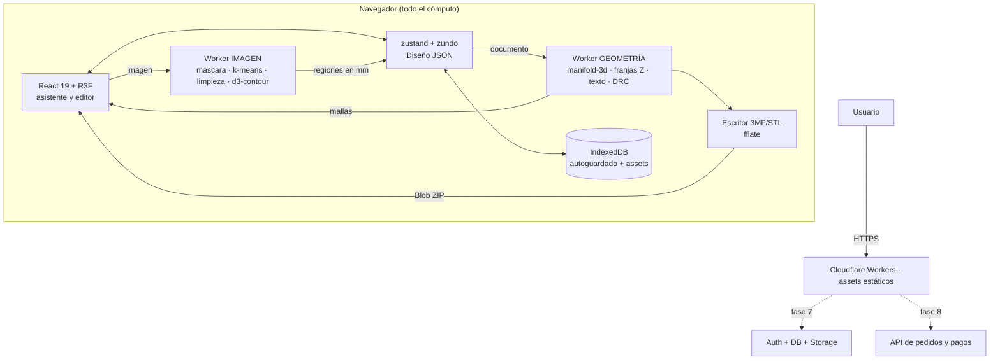

# Plan B · Desarrollo con el riesgo primero

> **Rol:** arquitecto de software. **Fecha:** 2026-09-11.
> **Insumos:** `docs/01-stack-tecnologico.md`, `docs/02-costos-servicios.md`, `docs/research/audit-01-pipeline.md`, `docs/research/audit-02-3mf-impresion.md`, `docs/research/audit-03-licencias-competencia.md`.
> **Qué es este documento:** el plan de ejecución. No repite la investigación; la convierte en orden de trabajo. Cada decisión de arquitectura está precedida por una prueba que la valida o la tira abajo.
> **Qué NO es:** no es asesoramiento legal ni una estimación contractual. Los días son de trabajo efectivo de **una sola persona**, sin interrupciones.

---

## Índice

0. [La apuesta central](#0-la-apuesta-central)
1. [Supuestos declarados](#1-supuestos-declarados)
2. [Mapa de riesgos: dónde puede morir el proyecto](#2-mapa-de-riesgos-dónde-puede-morir-el-proyecto)
3. [Hito 0: los spikes que van antes de todo](#3-hito-0-los-spikes-que-van-antes-de-todo)
4. [Alcance del MVP y definición de "listo"](#4-alcance-del-mvp-y-definición-de-listo)
5. [Flujo de usuario, pantalla por pantalla](#5-flujo-de-usuario-pantalla-por-pantalla)
6. [Arquitectura](#6-arquitectura)
7. [Estructura de carpetas y módulos](#7-estructura-de-carpetas-y-módulos)
8. [El pipeline de conversión, paso a paso](#8-el-pipeline-de-conversión-paso-a-paso)
9. [El editor 2.5D](#9-el-editor-25d)
10. [Exportación](#10-exportación)
11. [Modelo de datos y costuras de escalamiento](#11-modelo-de-datos-y-costuras-de-escalamiento)
12. [Fases e hitos](#12-fases-e-hitos)
13. [Plan de pruebas](#13-plan-de-pruebas)
14. [Costos por fase](#14-costos-por-fase)
15. [Registro de riesgos con mitigación y plan B](#15-registro-de-riesgos-con-mitigación-y-plan-b)
16. [Decisiones discutibles que tomé](#16-decisiones-discutibles-que-tomé)

---

## 0. La apuesta central

**Este proyecto no muere por falta de features. Muere el día en que alguien descarga un archivo, lo abre en su slicer y no funciona.**

Todo lo demás — el editor, la landing, la máscara de fondo, el modo lote — se puede construir despacio, mal y de nuevo. La cadena "3MF válido → slicer que lo entiende → pieza impresa que no tiene costuras ni se rompe por la argolla" es la única parte que no admite iteración barata: se valida con una impresora real o no se valida.

Por eso este plan invierte el orden habitual:

| Orden habitual | Orden de este plan |
|---|---|
| 1. Interfaz linda | 1. **Un 3MF hecho a mano que abre en Bambu Studio y sale impreso** |
| 2. Pipeline | 2. Pipeline medido contra un banco de imágenes reales |
| 3. Export | 3. Vertical mínimo feo pero completo (subir → descargar) |
| 4. "Ah, no abre en el slicer" | 4. Recién ahí, interfaz, máscara y editor |

**Las cuatro apuestas concretas:**

1. **Se imprime antes de programar la web.** El Hito 0 termina con tres piezas patrón físicas sobre la mesa. Si no se imprimen, el resto del plan no arranca.
2. **Cada pieza riesgosa vive detrás de un puerto** (una interfaz TS de 3 a 5 métodos). El trazador, el cuantizador, la máscara, el escritor 3MF y el almacenamiento se pueden reemplazar sin tocar nada más. Eso está diseñado en §6.4, no improvisado.
3. **El diferenciador #1 (impresoras de un solo extrusor) entra antes que el editor.** Vale más, cuesta menos y usa la misma maquinaria del 3MF que hay que escribir igual.
4. **Cero servidor durante todo el MVP.** No por dogma de costos, sino porque no alojar nada elimina de un plumazo el agente DMCA, el notice & takedown y la moderación (audit 03 §5). Es la decisión legal más barata del proyecto.

---

## 1. Supuestos declarados

Los digo antes de empezar porque si alguno es falso, cambian partes del plan.

| # | Supuesto | Si es falso… |
|---|---|---|
| S1 | **Hay acceso a una impresora 3D real**, propia, de un amigo, de un maker space o de un servicio local, y a por lo menos 3 colores de PLA. | El Hito 0 se degrada a "validación por rebanado" (§3, plan B de H0.3) y el riesgo de impresión queda abierto hasta el lanzamiento. **Hay que resolverlo la primera semana, no al final.** |
| S2 | Hay acceso a **Bambu Studio, OrcaSlicer y PrusaSlicer instalados** (los tres son gratis y corren en Windows 11). | Sin esto no hay proyecto. No hay plan B. |
| S3 | Hay un **celular Android de gama media y, si se puede, un iPhone** para probar. | El riesgo de memoria en iOS (audit 01 §4.4) queda sin medir; mitigación: no cargar OpenCV.js nunca por defecto y listo. |
| S4 | Se trabaja **de a una persona**, entre 4 y 6 horas útiles por día. Los "días" del §12 son días de trabajo, no días de calendario. A 5 días por semana, los 61 días del MVP son **unas 12 semanas**. | Ajustar proporcionalmente. |
| S5 | El objetivo comercial inmediato es **validar y juntar usuarios**, no facturar. La monetización arranca en fase 6+ (modo lote). | Si hay que facturar ya, se adelanta el modo lote (H6) y se atrasa el editor completo (H4). |
| S6 | **La resolución de trabajo queda sin decidir hasta el Hito 0.** Las dos auditorías se contradicen: audit 01 recomienda 0,10 mm/px, audit 02 recomienda 0,20 mm/px (corrección C11). Arranco con **0,15 mm/px** y lo calibro con medición en H0.5. | Ver §8.1. |
| S7 | El usuario final típico tiene **una impresora de un solo extrusor** (mayoría en LatAm, audit 03 §3.2) o un AMS/CFS de 4 slots. No se soportan toolchangers ni multi-material exótico. | Ninguna consecuencia: el modo apilado los cubre igual. |

---

## 2. Mapa de riesgos: dónde puede morir el proyecto

Ordenados por "probabilidad × costo de descubrirlo tarde". La columna que importa es la última: **cuándo se descubre**.

| # | Riesgo mortal | Prob. | Impacto | Spike que lo mata | Se descubre en |
|---|---|---|---|---|---|
| **R1** | **El 3MF no abre bien en el slicer.** Formato propietario, tres variantes, el metadato `Application` decide todo, PrusaSlicer exige orden topológico de componentes, Bambu 2.5 tiene el diálogo roto (#9666). | Alta | **Mortal** | **H0.1 + H0.2** | **Día 2** |
| **R2** | **La pieza impresa no sirve:** costuras entre colores, argolla que se rompe, detalle que desaparece, purga desproporcionada. | Alta | **Mortal** | **H0.3** (impresión real) | **Día 4** |
| **R3** | **El recorte de fondo sin IA decepciona** en fotos reales y el usuario se va en el paso 2. | Alta | Alto | **H0.5** (banco de 20 imágenes, tasa de éxito medida) | **Día 8** |
| **R4** | **Costuras invisibles en pantalla** por RDP aplicado por separado a cada color (audit 01 §3.3, "el riesgo más subestimado"). | Alta | Alto | **H0.6** + test de invariante de áreas | **Día 9** |
| **R5** | **Fugas de memoria WASM.** Manifold no tiene GC; 200 ediciones y crash. | Media-alta | Alto | **H0.6** (test de 500 operaciones) | **Día 9** |
| **R6** | **iOS Safari mata la pestaña** por memoria, sin error capturable. | Media | Alto | **H0.6** (si hay iPhone) | **Día 9** |
| **R7** | **Trampa de licencia** que obliga a liberar el código o a sacar una pieza. Incluye el agujero de `@imgly` (SPDX no lo delata) y `libheif`/`heic2any` (LGPL). | Baja (si se sigue la lista) | Mortal | **H0.7** (CI de licencias con lista negra por nombre) | **Día 10** |
| **R8** | **El editor tipo Tinkercad se come el cronograma.** Es el riesgo de plazo #1 según las tres fuentes. | Alta | Medio | Acotarlo por diseño (§9) y ponerlo en H4, después de que el producto ya sirva | Continuo |
| **R9** | **Un competidor ya lo hace gratis.** Once herramientas relevadas; convertir es commodity. | Certeza | Medio | No es un spike: es la elección de diferenciadores (§4) | Ya pasó |
| **R10** | **Rendimiento en celular** hace inusable el editor. | Media | Medio | **H0.6** (benchmark en Android real) | Día 9 |
| **R11** | El slicer **pisa los presets del usuario** al abrir el 3MF (issue #7797) y el usuario nos culpa. | Media | Bajo-medio | **H0.2** (checklist) | Día 2 |

**Los 7 primeros riesgos se cierran en los 10 días del Hito 0.** Ese es todo el argumento de este plan.

---

## 3. Hito 0: los spikes que van antes de todo

**Regla del Hito 0: ni una línea de React, ni un componente, ni una pantalla.** Son scripts de Node y HTML sueltos. El único código que sobrevive al Hito 0 es el escritor 3MF y el pipeline headless; el resto es descartable a propósito.

Se trabaja en `spikes/` (carpeta hermana de `src/`, fuera del build de producción).

---

### H0.1 · Escritor 3MF perfil Bambu/Orca con geometría hecha a mano

**Objetivo:** un archivo `.3mf` de 2 colores generado desde Node que Bambu Studio abra sin diálogos, con los dos colores ya en los slots 1 y 2.

**Tareas concretas:**

1. `spikes/01-3mf/geometria.ts`: dos cajas de 20×20×2,4 mm y 20×20×0,6 mm apiladas en Z, escritas a mano como `Float32Array` de vértices y `Uint32Array` de índices. Sin Manifold, sin pipeline, sin nada. Es una constante.
2. `spikes/01-3mf/escribir-bambu.ts`: implementa los 5 archivos exactos del audit 02 §4 paso 1 con `fflate.zipSync`:
   - `[Content_Types].xml`, `_rels/.rels`
   - `3D/3dmodel.model` con `<metadata name="Application">BambuStudio-02.05.00.00</metadata>`, un `<object>` malla por color, un `<object>` ensamblado con `<components>`, un solo `<item>` en el `<build>` con la traslación al centro de cama (128 128 0).
   - `Metadata/model_settings.config` con `<part id subtype="normal_part">` + `extruder` por parte.
   - `Metadata/project_settings.config` mínimo (las 14 claves del audit 02 §4, nada más).
3. **Nada de `requiredextensions="p"`.** Nada de `<basematerials>`. Nada de `displaycolor`. (audit 02 §1.1 y §3, limitación 4.)
4. Ordenar los `<object>` con **Kahn**: hijos antes que padres (audit 01 §5, hallazgo 2). Son 15 líneas; leer `manifold-3d/lib/export-3mf.js` como referencia.
5. `spikes/01-3mf/verificar.ts`: re-importar con `three/addons/loaders/3MFLoader.js` y contar vértices y objetos.

**Criterio de aceptación (verificable, con captura de pantalla):**
- [ ] Bambu Studio última versión abre el archivo **sin ningún diálogo** ("Standard 3MF Import Color" no aparece).
- [ ] No aparece el mensaje *"The 3mf is not from Bambu Lab, load geometry data only"*.
- [ ] La parte 1 queda en el filamento 1 y la parte 2 en el filamento 2, **sin tocar nada**.
- [ ] El objeto está en la placa, centrado, con la escala correcta (20 mm medidos con la herramienta de medición del slicer).
- [ ] OrcaSlicer última estable abre el mismo archivo con el mismo resultado.
- [ ] El árbol de objetos muestra **un objeto con dos partes**, no dos objetos sueltos.

**Plan B si falla:** quitar `project_settings.config` y reintentar (es el candidato más probable a romper cosas por pisar presets). Si sigue fallando, comparar byte a byte contra un 3MF exportado por el propio Bambu Studio con la misma geometría — es el oráculo definitivo y se consigue en 2 minutos.

**Esfuerzo: 2 días.**

---

### H0.2 · Verificación en slicers reales y checklist de compatibilidad

**Objetivo:** convertir "funciona" en una lista de casillas repetible que se va a correr en cada release de slicer para siempre.

**Tareas:**
1. `docs/compatibilidad.md` con la tabla: slicer · versión · fecha de prueba · resultado por casilla.
2. Correr la checklist del audit 02 §7 punto 4 en Bambu Studio (última **y** una 2.4.x), OrcaSlicer y PrusaSlicer.
3. Anotar explícitamente si el import **pisa los presets** del usuario (issue #7797) para poder avisarlo en la UI.

**Criterio de aceptación:** `docs/compatibilidad.md` completo con las 6 casillas por slicer y las versiones exactas. Esta tabla se publica después como página `/compatibilidad`.

**Esfuerzo: 0,5 días.**

---

### H0.3 · Impresión real de las tres piezas patrón

**El spike más importante del proyecto.** Sin esto no se sabe nada.

**Las tres piezas** (geometría hecha a mano en `spikes/03-impresion/`):

| Pieza | Qué es | Qué valida |
|---|---|---|
| **P1 · Regla de detalle** | Placa de 60×30×2,4 mm, color A. Encima, barras del color B de 0,4 / 0,6 / 0,8 / 1,0 / 1,5 / 2,0 mm de ancho × 20 mm de largo × 0,6 mm de alto, separadas 2 mm. Además, un par de barras **compartiendo borde** con una zona del color B (para ver costuras). | El **ancho mínimo real** de detalle. Las **costuras** entre colores. Si 0,8 mm es el umbral correcto o hay que subirlo. |
| **P2 · Llavero completo** | 50 mm de lado mayor, 4 colores, una isla de 1 mm², contorno de 1,5 mm, argolla Ø4,2 mm con anillo de 3 mm, espesor total 3,0 mm. | Argolla, contorno, islas, purga real, colores. **Se cuelga de un llavero y se tira** (test de rotura). |
| **P3 · Apilado / cambio manual** | El mismo P2 pero en franjas Z de 0,6 mm, 3 colores, con los `M600` en `custom_gcode_per_layer.xml`. | Que el slicer **tome los cambios de color** del XML. Que el resultado en terrazas sea aceptable visualmente. |

**Tareas:**
1. Modelar las tres a mano (constantes en TS, mismo método que H0.1).
2. Generar los 3MF con el escritor de H0.1 (+ el XML de capas para P3).
3. Rebanar y **mirar la vista previa capa por capa** buscando huecos entre colores antes de imprimir.
4. Imprimir. Fotografiar. Medir con calibre.
5. Anotar en `docs/impresion-patron.md`: gramaje de la pieza, gramaje de la torre de purga, tiempo, nº de cambios de filamento.

**Criterio de aceptación:**
- [ ] En P1, las barras de **0,8 mm salen completas y parejas**. (Si no, el default `anchoMinimoDetalle` sube y hay que recalibrar.)
- [ ] En P1, **no hay línea del color de la base** entre dos zonas de color que comparten borde. Se mira con lupa y a contraluz.
- [ ] En P2, la argolla **aguanta 5 kg de tirón** (una botella de 5 L colgada) sin fisurarse.
- [ ] En P2, la isla de 1 mm² se imprimió y se ve.
- [ ] En P3, el slicer **insertó las pausas solo**, sin que el usuario las agregue a mano.
- [ ] Se registró el **gramaje de purga real** de P2 para poder mostrarlo en la UI después.

**Plan B si no hay impresora (supuesto S1 falso):**
- Mínimo aceptable: rebanar en Bambu Studio y **revisar la vista previa capa por capa** de las tres piezas, más el gramaje que reporta el slicer. Cubre las costuras y la purga, **no cubre** la resistencia de la argolla ni el detalle mínimo real.
- Alternativa: mandar a imprimir las 3 piezas a un servicio local (~US$10–20 en LatAm). Es el mejor dinero que se gasta en este proyecto.
- **Lo que no se puede hacer es saltear este hito y seguir.** Si se saltea, hay que marcar R2 como "abierto" en el registro de riesgos y no prometer nada sobre imprimibilidad en la web hasta cerrarlo.

**Esfuerzo: 1 día de trabajo** (+ 6–10 horas de impresora en paralelo).

---

### H0.4 · Perfil PrusaSlicer

**Objetivo:** el segundo formato, que no comparte nada con el primero.

**Tareas:**
1. `spikes/01-3mf/escribir-prusa.ts`: **una sola malla** con los triángulos de todos los colores concatenados en orden de slot, llevando `triOffset` y `vtxOffset` (pseudocódigo exacto en audit 02 §4 paso 2).
2. `Metadata/Slic3r_PE_model.config` con un `<volume firstid lastid>` por color, `volume_type=ModelPart`, `matrix` identidad y `extruder`.
3. `xmlns:slic3rpe` + `<metadata name="slic3rpe:Version3mf">1</metadata>` en el `.model`.
4. **No incluir** `model_settings.config` ni `project_settings.config`.
5. `Metadata/Prusa_Slicer_custom_gcode_per_print_z.xml` para el modo apilado (ojo: nombre distinto al de Bambu, y `bed_idx` es nuevo de 2026 — escribir las dos variantes y ver cuál toma).

**Criterio de aceptación:**
- [ ] PrusaSlicer última versión abre el archivo como **un objeto con N partes**, cada una con su extrusor asignado.
- [ ] PrusaSlicer de la versión anterior hace lo mismo (por la reestructuración 2026).
- [ ] Test automático: `firstid`/`lastid` contiguos, sin huecos, y el último `lastid` = total de triángulos − 1.

**Plan B:** si el perfil Prusa da guerra, se degrada a **STL por color + instrucciones** solo para Prusa (audit 02 §5, B1: los tres slicers ofrecen "importar como un objeto con varias partes"). Cuesta 3 clics al usuario y no bloquea el lanzamiento. **No retrasar el MVP por Prusa.**

**Esfuerzo: 1,5 días.**

---

### H0.5 · Pipeline headless contra un banco de imágenes reales

**Objetivo:** medir, no estimar. Todos los tiempos del audit 01 §4.2 son estimaciones del propio auditor y él mismo lo dice.

**Tareas:**
1. Armar `tests/golden/imagenes/` con **20 imágenes**: 5 logos (PNG con alfa y sin), 5 dibujos planos, 5 fotos de mascota (fondo simple, fondo complejo), 3 capturas/stickers, 2 casos deliberadamente horribles (foto oscura, fondo del mismo color que el sujeto).
2. `spikes/05-pipeline/correr.ts`: pipeline completo **sin UI y sin DOM**, de archivo a polígonos en mm, con `performance.mark()` por etapa. Corre en Node con `canvas` o en una página HTML suelta con un `<input type=file>` y `console.table`.
3. Implementar de una: flood fill desde bordes, mediana 3×3, k-means++ en OKLab sobre muestra de 30k, filtro de moda, componentes conexos, apertura morfológica, `d3-contour` con padding de 1 px y corrección de −0,5 px, RDP con `simplify-js`.
4. **Medir**: tiempo por etapa en desktop, notebook y Android; nº de regiones; nº de vértices; si la máscara "salió bien" a ojo (sí/no/con retoque).
5. **Calibrar la resolución**: correr las 20 imágenes a 0,10 / 0,15 / 0,20 / 0,25 mm/px y comparar la desviación máxima del contorno contra la corrida de 0,05 mm/px. Decidir el default con el número, no con la opinión.

**Criterio de aceptación:**
- [ ] Tabla de tiempos reales por etapa en los 3 equipos, publicada en `docs/benchmarks.md`.
- [ ] **Total < 2 s en desktop y < 5 s en Android gama media**, con la resolución elegida.
- [ ] **Tasa de éxito "a la primera" ≥ 85% en logos y dibujos** (17 de 20 del subconjunto). Si baja de ahí, el preset "Logo" está mal calibrado.
- [ ] Para fotos, se anota la tasa sin mentirse. Si es < 50%, el preset "Foto" **arranca directamente en el modo "clickeá qué clusters son fondo"** (audit 01 §1.4) y el flood fill ni se ofrece.
- [ ] Decisión de `mmPorPixel` escrita en `src/pipeline/defaults.ts` con el número que la justifica en un comentario.

**Plan B:** si el pipeline clásico no llega al 85% ni en logos, el problema es la implementación, no el enfoque (MakerTools3D y 3d-editor.com lo hacen con lo mismo). Se revisa el orden: alfa → chroma key → flood fill multi-semilla desde las 4 esquinas por separado → umbral adaptativo.

**Esfuerzo: 3 días.**

---

### H0.6 · Manifold en Worker: costuras, fugas y celular

**Objetivo:** cerrar R4, R5, R6 y R10 de una sola vez.

**Tareas:**
1. `spikes/06-manifold/`: cargar `manifold-3d` en un Web Worker de módulo, sin COOP/COEP (**verificado que no hacen falta**, audit 01 §4.3 — y poner esas cabeceras rompe recursos cross-origin gratis).
2. Implementar el helper obligatorio `withScope(fn)` que trackea y borra todo objeto WASM creado adentro. **Es la primera función del proyecto que se escribe y la única forma permitida de crear objetos de Manifold.** Regla de lint que prohíbe el uso directo de los constructores fuera de `src/geometry/manifold.ts`.
3. Implementar la **cadena de resta por prioridad con ε = 0,05 mm** (audit 01 §3.3): cada región crece 0,05 mm con `offset(+0.05,'Miter')` y después `region_i = region_i − ∪(region_j)` para todo `j` de mayor prioridad.
4. Test de invariante: `área(unión de colores) == área(silueta)` con tolerancia de 0,001 mm².
5. Test de fugas: 500 ciclos de "crear regiones → restar → extruir → getMesh → borrar", comparando `HEAP8.byteLength` al inicio y al final.
6. Benchmark en Android real y, si hay, en iPhone: pipeline completo + render three.js, mirando si la pestaña sobrevive.

**Criterio de aceptación:**
- [ ] El test de áreas pasa en las 20 imágenes del banco.
- [ ] Tras 500 operaciones, el heap de WASM **no crece más de 5 MB**.
- [ ] El pipeline completo + preview 3D corre en el Android de prueba sin recargar la pestaña, 10 veces seguidas.
- [ ] Se verifica que `manifold.status()` devuelve `NoError` y `volume() > 0` en todas las piezas de las 20 imágenes.

**Plan B:** si Manifold da problemas de memoria irrecuperables, el fallback es `clipper2-ts` (BSL-1.0, TS puro, sin WASM, sin fugas) para el 2D, más `THREE.ExtrudeGeometry` para la extrusión. Se pierde la garantía de manifoldness y hay que validar con `lib3mf` en CI. Es peor, pero existe y está detrás del mismo puerto `Geom2D`.

**Esfuerzo: 1,5 días.**

---

### H0.7 · CI de licencias y esqueleto del repo

**Objetivo:** que la trampa de licencia sea imposible por construcción, no por memoria.

**Tareas:**
1. `pnpm create vite` + TypeScript estricto + ESLint + Prettier + Vitest. Repo privado en GitHub.
2. `scripts/check-licenses.mjs`:
   - Lista blanca SPDX: `MIT`, `ISC`, `BSD-2-Clause`, `BSD-3-Clause`, `Apache-2.0`, `BSL-1.0`, `0BSD`, `Unlicense`, `CC0-1.0`, `MIT OR Apache-2.0`, `(MIT OR GPL-3.0-or-later)`.
   - **Lista negra por nombre de paquete** (esto es lo que el SPDX no atrapa, audit 03 §1.4): `@imgly/*`, `potrace`, `esm-potrace-wasm`, `marchingsquares`, `openscad-wasm`, `heic2any`, `libheif-js`, `libheif-web`.
   - Cualquier licencia `UNKNOWN` / `Custom` / `SEE LICENSE IN…` **rompe el build**.
   - Corre sobre **transitivas**, no solo directas.
3. `scripts/gen-licenses.mjs` → genera `dist/LICENSES.txt` en cada build, servido en `/licencias`.
4. `.github/workflows/ci.yml` con `typecheck → lint → check-licenses → test → build`.
5. Registrar el dominio `.com` en Cloudflare Registrar. **Antes del 1-nov-2026** para congelar US$10,44 en lugar de US$11,15 (doc 02 §8.1).

**Criterio de aceptación:**
- [ ] `pnpm run check-licenses` rompe si se instala `potrace` a propósito (probarlo de verdad).
- [ ] `dist/LICENSES.txt` se genera y tiene los avisos de `three`, `manifold-3d`, `d3-contour`, `simplify-js` y el NOTICE de Apache-2.0.
- [ ] CI verde en GitHub.

**Esfuerzo: 0,5 días.**

---

### Resumen del Hito 0

| Spike | Días | Riesgo que cierra |
|---|---|---|
| H0.1 Escritor 3MF Bambu/Orca | 2,0 | R1 |
| H0.2 Verificación en slicers | 0,5 | R1, R11 |
| H0.3 **Impresión real** | 1,0 | R2 |
| H0.4 Perfil Prusa | 1,5 | R1 |
| H0.5 Pipeline headless medido | 3,0 | R3 |
| H0.6 Manifold: costuras, fugas, celular | 1,5 | R4, R5, R6, R10 |
| H0.7 CI de licencias | 0,5 | R7 |
| **Total** | **10 días** | **7 de los 11 riesgos** |

**Puerta de salida del Hito 0:** si H0.1+H0.2 fallan y ni siquiera un 3MF hecho a mano abre bien en Bambu Studio, **el producto cambia**: se vuelve "STL por color + instrucciones claras", que es más pobre pero sigue siendo útil, y todo el calendario se recorta. Esa decisión se toma el día 3, no el día 50.

---

## 4. Alcance del MVP y definición de "listo"

### 4.1 Lo que ENTRA (lista cerrada)

**Conversión**
- Subir PNG, JPG, WebP y SVG por drag & drop o selector. Máximo 25 MB.
- 3 presets de entrada: **Logo/Dibujo**, **Foto**, **Silueta (1 color)**.
- Quitar fondo: canal alfa · flood fill desde bordes con tolerancia en vivo · **varita mágica** (click, Shift+click suma, Alt+click resta) · **pincel borrar/restaurar** con zoom y pan · deshacer propio de la máscara.
- Para el preset Foto: **clasificación por cluster** (cuantizar primero, clickear qué clusters son fondo).
- Cuantización a 2–6 colores con k-means++ en OKLab.
- Paleta de filamentos editable, con mapeo ΔE2000 y aviso de colisión.
- Fusionar, fijar y reordenar colores.
- Limpieza: filtro de moda, islas menores al área mínima, apertura/cierre morfológico.
- Vectorización con `d3-contour` + RDP + cadena de resta con ε.
- Silueta, contorno, argolla y agujero.

**Modos de impresión**
- **Modo a ras / AMS**: base + incrustaciones de color.
- **Modo apilado / cambio manual**: franjas Z + `M600` + lista legible de cambios. **Es el diferenciador #1 y entra en el MVP.**

**Editor mínimo** (6 herramientas, §9.1)
- Seleccionar y mover en XY, rotar en Z, escalar en XY, con snap.
- Argolla: posición, diámetro, pestaña.
- Texto: fuentes OFL incluidas, altura, color, relieve.
- Color y altura por pieza (panel de capas).
- Duplicar, eliminar, bloquear, ocultar.
- Deshacer/rehacer (100 pasos).

**Validación (DRC)**
- Ancho de detalle menor al mínimo, resaltado en rojo sobre el modelo.
- Islas menores al área mínima.
- Anillo de la argolla menor a 2 mm (**bloqueante**).
- Alturas que no son múltiplo exacto de la altura de capa.
- Colores flotando sin soporte (modo apilado).
- Nº de colores mayor que los slots configurados.
- Mallas no manifold o de volumen cero.
- Mallas no disjuntas (`intersect()` de a pares).

**Exportación**
- Un ZIP con: `*_bambu-orca.3mf`, `*_prusa.3mf`, `stl/` por color e `INSTRUCCIONES.txt`.
- Estimación de filamento **y de purga** en la pantalla de descarga.

**Producto**
- Español (rioplatense neutro) e inglés.
- Autoguardado en IndexedDB, "descargar proyecto (.json)" y "abrir proyecto".
- Páginas: `/terminos`, `/privacidad`, `/licencias`, `/compatibilidad`.
- Analítica sin cookies (Cloudflare Web Analytics) y Sentry configurado **para no mandar nunca la imagen ni nada derivado**.

### 4.2 Lo que NO entra (y por qué)

| Fuera del MVP | Por qué |
|---|---|
| **Cuentas, login, "mis diseños" en la nube, galería** | Dispara el agente DMCA, notice & takedown y moderación (audit 03 §5). Fase 7. |
| **Vender llaveros impresos** | Te convierte en fabricante, sin safe harbor. Fase 8. |
| **Cualquier IA** | Requisito explícito del proyecto, y audit 01 §1.5 lo desaconseja igual. |
| **HEIC** | `libheif-js` y `heic2any` son **LGPL-3.0** (audit 01 §4.4). Se detecta el fallo de decodificación y se muestra "convertí la foto a JPG o PNG". Una línea de código, cero riesgo. |
| **Perfil "3MF genérico" con `basematerials`** | **Ninguno de los tres slicers lo lee.** Verificado por grep del código fuente (audit 02 §1.1). Sería trabajo puro con cero usuarios. |
| **OBJ + MTL y GLB** | Import inconsistente en slicers; GLB solo sirve para preview. |
| **Pintado por caras (`mmu_segmentation` / `paint_color`)** | Formato binario propietario y versionado; PrusaSlicer rechaza versiones nuevas (audit 02 §2). |
| **`three-bvh-csg`** | No corre en Web Worker y no garantiza salida manifold; su propio README recomienda Manifold (audit 01 §5). |
| **Dithering** | Genera miles de islas de 0,1 mm y purga infinita. Ni se expone en la UI (audit 01 §2.2). |
| **Modo relieve / heightmap / litofanía** | Otro producto. Confunde el mensaje. |
| **Importar STL, CAD 3D libre, biseles y filetes** | Rompe el modelo 2.5D, que es lo que hace el proyecto factible. |
| **Modo lote (N nombres en una placa)** | Es el diferenciador #3 y es el que más plata hace, pero necesita el editor terminado. **Fase 6, primero después del MVP.** |
| **Doble cara e impresión boca abajo** | Sin fuente oficial y con reportes en contra (audit 03, C-8). Modo experimental futuro. |
| **Colaboración, Yjs, compartir por link** | Fase 7+. |
| **GrabCut / OpenCV.js** | **Entra como botón "recorte avanzado" con carga diferida y aviso de 3,5 MB, o no entra.** Nunca por defecto. Si H0.5 muestra que la clasificación por cluster alcanza, **no entra al MVP**. |

### 4.3 Definición de "listo" (DoD del MVP)

El MVP está listo cuando **todas** estas casillas están marcadas. No antes, y no hace falta nada más.

- [ ] **5 personas que no conocen el proyecto** suben un logo propio y descargan un ZIP en **menos de 3 minutos**, sin ayuda, sin leer nada. (Test con 5 personas reales, grabado o anotado.)
- [ ] El `.3mf` de Bambu abre en la **versión actual de Bambu Studio y de OrcaSlicer** sin diálogos y con los N colores en los N slots. Registrado en `/compatibilidad`.
- [ ] El `.3mf` de Prusa abre en PrusaSlicer como objeto multi-parte con extrusores asignados. (O, si se activó el plan B, el ZIP trae los STL y las instrucciones para Prusa.)
- [ ] **Las 3 piezas patrón están impresas, fotografiadas y aprobadas** (H0.3), más **al menos 2 llaveros generados por el producto terminado**.
- [ ] Pipeline completo **< 2 s en desktop y < 5 s en Android gama media**.
- [ ] CI verde: `typecheck`, `lint`, `check-licenses`, 20 golden, invariantes de 3MF, test de fugas, e2e de Playwright.
- [ ] **Cero dependencias fuera de la lista blanca**, transitivas incluidas.
- [ ] Bundle inicial **< 1,2 MB gzip** sin contar OpenCV.js (que no se carga nunca por defecto).
- [ ] Las 4 páginas legales publicadas y el aviso de propiedad intelectual visible **en el propio cargador**, no escondido en los términos.
- [ ] El modo "un solo extrusor" produce un archivo que el slicer abre **con las pausas ya puestas**.
- [ ] Autoguardado: se cierra la pestaña a la mitad, se vuelve a abrir y el diseño está.

---

## 5. Flujo de usuario, pantalla por pantalla

**Principio rector:** el usuario tiene que poder llegar a la descarga **sin tocar ningún parámetro**. Todo lo demás es opcional y está en un panel que arranca cerrado.

El camino es un asistente de 3 pasos + editor opcional + descarga. Rutas reales de la SPA.

---

### P0 · `/` — Landing y cargador

- Una frase: *"Convertí tu logo o dibujo en un llavero listo para imprimir, aunque tengas una impresora de un solo color. Editalo como quieras. Todo en tu navegador, sin cuenta y sin subir la foto."* (audit 03 §3.3)
- **Dropzone grande**. Acepta arrastrar, pegar del portapapeles (Ctrl+V) y el selector.
- Debajo del dropzone, **3 imágenes de ejemplo clickeables** ("probá con esta") — una de cada preset. Bajan la fricción más que cualquier texto.
- Franja corta: *"qué imágenes funcionan mejor: alto contraste, pocos colores, sin líneas más finas que 1 mm"*, con 3 miniaturas "sí / no".
- **Aviso de IP dentro del cargador**, en gris pero legible: *"Subí solo imágenes propias o con permiso. Convertirlas no te da derechos sobre personajes, logos o marcas de terceros."* (audit 03 §5, punto 4).
- Si el archivo es HEIC: *"Las fotos de iPhone en formato HEIC no se pueden abrir acá. Compartila como JPG o sacale una captura."*

**Selector de impresora, arriba de todo y en 4 botones grandes:** `Bambu / AMS` · `Prusa / MMU` · `Un solo color (cambio manual)` · `No sé`. Se puede cambiar después. Esta elección maneja el default de `modoColor` y qué archivo se resalta en la descarga.

---

### P1 · `/nuevo/recorte` — Sacar el fondo

Split view: imagen original a la izquierda, resultado con la máscara pintada a la derecha (o una sola vista con toggle en móvil).

- **Se entra con el recorte ya hecho automáticamente.** El usuario ve un resultado, no una pantalla vacía.
- Selector de preset: `Logo/Dibujo` · `Foto` · `Silueta`. Cambiarlo recalcula todo.
- **Slider de tolerancia** con recálculo en vivo (debounce 80 ms) y la máscara pintada en color flúor.
- Herramientas en una barra vertical: **varita**, **pincel borrar**, **pincel restaurar**, **zoom/pan**. Tamaño de pincel con `[` y `]` y con la rueda + Alt.
- **Deshacer/rehacer de la máscara** (Ctrl+Z), separado del historial del documento.
- Botón secundario **"Recorte avanzado"** → confirma con *"esto descarga 3,5 MB la primera vez"* → carga OpenCV.js y habilita rectángulo de GrabCut + trazos objeto/fondo.
- En el preset **Foto**, la pantalla cambia: en vez de la máscara continua, aparece el preview ya posterizado y el usuario **clickea qué clusters son fondo** (audit 01 §1.4). Es más rápido y nunca deja halo.
- La erosión anti-halo de 1 px es **automática y no se expone**.

---

### P2 · `/nuevo/colores` — Elegir los colores

- El preview del llavero ya armado, en 3D, girable.
- **Tira de colores** abajo: un chip por color, con su filamento asignado.
  - Click en un chip → elegir otro filamento de la paleta.
  - Arrastrar un chip sobre otro → **fusionar colores**.
  - Reordenar arrastrando → cambia el orden de los slots (default: de más claro a más oscuro, que reduce la purga).
  - Candado en un chip → **fijar** ese color para que k-means trabaje sobre el resto.
- Slider **"cantidad de colores": 2 a 6**. Con un cartelito si se pasa de los slots declarados en P0: *"tenés 4 slots y 5 colores: ¿los fusionamos o usamos cambio manual?"* con los dos botones.
- Aviso de colisión: *"el rojo y el bordó te van a quedar iguales con estos filamentos"* con botón "fusionar".
- Si el modo es **un solo extrusor**, acá aparece la previsualización en terrazas y la advertencia de máximo 3 cambios.

---

### P3 · `/nuevo/llavero` — Forma, argolla y espesor

- Slider **tamaño** (lado mayor), 25–80 mm, default 50. Con la medida en mm visible.
- **3 presets de espesor** en botones: `Delgado 1,6 mm` · `Estándar 3,0 mm` · `Reforzado 4,0 mm`.
- **Argolla**: 4 opciones en dibujitos — `Cadena de bolitas Ø3,7` · `Argolla estándar Ø4,2` · `Argolla gruesa Ø5,2` · `Sin agujero`. Más arrastrar el agujero sobre el preview para moverlo.
- **Contorno**: on/off + ancho (default 1,5 mm).
- Panel `Avanzado` (cerrado): altura de capa, mm/px, espesor base y de color por separado, tolerancia RDP, área mínima de isla, ancho mínimo de detalle, Ø exacto del agujero, prioridad de colores.
- **Panel de validación en vivo (DRC)** en el costado: lista de advertencias, cada una clickeable para resaltar el problema en el modelo 3D. Los errores bloqueantes son rojos; el botón de descarga queda deshabilitado hasta resolverlos.

---

### P4 · `/editor` — El editor (opcional)

Se llega con el botón **"Editar"**, presente desde P2. El usuario común nunca entra acá.

- Lienzo 3D al centro, con `GizmoViewcube` arriba a la derecha y toggle **2D cenital / 3D**.
- Panel izquierdo: **lista de piezas** (capas), con color, altura, visible, bloqueada.
- Panel derecho: propiedades de lo seleccionado (X, Y, rotación, escala, color, Z, altura).
- Barra superior: herramientas (§9.1), deshacer/rehacer, "vista explotada" (separa las capas en Z para ver costuras).
- Atajos de teclado estándar (Ctrl+Z, Ctrl+D, Supr, G/R/S estilo Blender opcional).

---

### P5 · `/descargar` — La descarga

La pantalla más importante después de la conversión. **Acá se juega la credibilidad.**

- **Un botón grande: "Descargar llavero (ZIP)"**.
- Arriba, el recordatorio de qué impresora eligió y cuál de los archivos es el suyo, **resaltado**, sin esconder los otros.
- Ficha honesta de lo que va a pasar:
  - *Tamaño: 50 × 38 × 3,0 mm*
  - *Filamento estimado: ~4,8 g*
  - **Purga estimada: ~28 g en 9 cambios de color** — *tip: imprimí 6 llaveros juntos y la purga se reparte*. (Ningún competidor muestra esto; audit 02 §9 punto 8.)
  - *Tiempo estimado: ~35 min*
- Bloque **"Cómo imprimirlo"** con 4 pasos, según la impresora elegida, y la advertencia: *"si Bambu Studio te pregunta algo al abrir, elegí importar solo la geometría"* (issue #7797).
- En modo apilado, la **lista de cambios**: *"Capa 12 (Z = 2,4 mm): cambiá a rojo"*, copiable e incluida en el TXT.
- Link chiquito a `/compatibilidad`.

---

## 6. Arquitectura

### 6.1 La decisión de fondo: todo en el navegador, cero servidor

| Qué | Dónde corre | Por qué |
|---|---|---|
| SPA (React) | Navegador | — |
| Decodificación, máscara, cuantización, limpieza, trazado | **Web Worker "imagen"** | No congela la UI; `OffscreenCanvas` y `createImageBitmap` están disponibles en Workers desde 2021–2023 |
| Booleanas 2D, franjas Z, extrusión, texto, DRC | **Web Worker "geometría"** (Manifold WASM) | Idem, y aísla las fugas de memoria WASM en un hilo que se puede reiniciar |
| Escritura de 3MF/STL y ZIP | Worker de geometría | `fflate` es rápido y el resultado sale como `Blob` transferible |
| Render 3D | Hilo principal (three.js + R3F) | WebGL vive en el hilo principal |
| Persistencia | **IndexedDB** del navegador | Sin cuentas, sin servidor, sin DMCA |
| Hosting | **Cloudflare Workers (static assets)** | Estáticos gratis e ilimitados, **uso comercial permitido**, WASM pesado sin costo de ancho de banda (doc 02 §2) |
| Servidor | **Ninguno en el MVP** | — |

**Lo que NO se hace, explícitamente:**
- **No se ponen las cabeceras COOP/COEP.** Ni Manifold ni OpenCV.js usan `SharedArrayBuffer` (verificado, 0 ocurrencias en ambos bundles, audit 01 §4.3). Ponerlas "por las dudas" rompe la carga de recursos cross-origin sin CORP. `public/_headers` queda sin ellas, con un comentario explicando por qué.
- **No se usa Laravel/PHP** aunque Laragon esté instalado. Motivo: un backend PHP siempre encendido cuesta plata y mantenimiento desde el día 1, y **no aporta nada** mientras el cómputo es del cliente y no hay cuentas. Laragon queda para un eventual panel de administración de la fase tienda. El código del editor y del pipeline es idéntico en los dos mundos: si algún día se monta sobre Laravel + Inertia, se monta sin reescribir `pipeline/`, `geometry/`, `export/` ni `editor/`. Esa portabilidad es una consecuencia directa de §6.4.

### 6.2 Stack elegido

| Capa | Elección | Versión | Justificación en una línea |
|---|---|---|---|
| Build | **Vite 8** + TypeScript estricto + pnpm | 8.3 | Workers de módulo y WASM nativos, sin configuración |
| UI | **React 19** + React Router 8 + Tailwind 4 + shadcn/ui | 19.3 | Ecosistema 3D más grande; el editor es 100% cliente, SSR no aporta |
| 3D | **three r186 + @react-three/fiber 9 + @react-three/drei 10** | — | `TransformControls`, `Grid`, `GizmoViewcube`, `CameraControls` vienen hechos |
| Raycast | `three-mesh-bvh` | 0.9 | Selección rápida con muchas piezas |
| Geometría 2D/3D | **manifold-3d 3.5.3** (Apache-2.0) | — | Un solo WASM de 204 KB gz para offset, booleanas 2D/3D y extrusión, con **salida manifold garantizada**; `CrossSection` cubre todo el 2D |
| Fallback geometría | `clipper2-ts` (BSL-1.0) | 2.0 | TS puro, sin WASM, sin fugas; detrás del mismo puerto |
| Contornos | **d3-contour** (ISC) | 4.0.2 | Marching squares con agujeros, 48 KB, licencia limpia |
| Simplificación | `simplify-js` (BSD-2) | 1.2.4 | RDP en 7 KB |
| Color | **`ml-kmeans`** (k-means++) + **`culori`** (OKLab, ΔE2000) | — | `image-q` **no tiene k-means**; solo se usaría para Wu como fallback |
| Texto | **opentype.js 2.0** | — | TTF/OTF → contornos → `CrossSection` → mismo pipeline que todo lo demás |
| Estado | **zustand 5 + zundo 2** | — | Historial liviano de un documento JSON serializable |
| Workers | Workers de módulo + **comlink** | 4.4 | RPC transparente, transferibles |
| ZIP | **fflate** | 0.8.3 | 8 KB contra los 100 KB de jszip |
| Recorte avanzado | `@techstark/opencv-js` **con carga diferida** | 5.0 | 3,75 MB gz: nunca por defecto |
| Tests | **Vitest** + **Playwright** + `@lib3mf-rs/lib3mf-wasm` | — | Golden del pipeline, e2e, validación del core 3MF |
| Hosting | **Cloudflare Workers static assets** + Workers Builds | — | Único hosting gratis que permite uso comercial y no cobra ancho de banda |

**Todas las licencias verificadas y en la lista blanca** (audit 03 §1.1: 22 de 22 correctas).

### 6.3 Diagrama



### 6.4 Cómo se aísla cada pieza riesgosa: los seis puertos

**Esta es la parte del plan que hace que las decisiones sean reversibles.** Cada pieza que puede fallar, envejecer o cambiar de licencia vive detrás de una interfaz de 3 a 5 métodos. El resto del código nunca importa la librería directamente.

```ts
// src/pipeline/puertos.ts — el contrato, sin ninguna dependencia externa

/** 1. Quitar el fondo. Hoy: flood fill propio. Mañana: GrabCut, o un modelo ONNX opcional. */
export interface Matte {
  readonly id: 'floodfill' | 'alfa' | 'grabcut' | 'clusters';
  calcular(img: ImagenTrabajo, opts: OpcionesMatte): Promise<Mascara>;
  refinar(m: Mascara, trazo: Trazo): Promise<Mascara>;   // pincel / varita
}

/** 2. Reducir a N colores. Hoy: k-means++ OKLab. Fallback: Wu de image-q. */
export interface Quantizer {
  readonly id: 'kmeans-oklab' | 'wu';
  cuantizar(px: Uint8ClampedArray, n: number, fijos: Lab[]): Promise<Cuantizacion>;
}

/** 3. Máscara binaria → polígonos en mm. Hoy: d3-contour + RDP. Mañana: VTracer --target web. */
export interface Tracer {
  readonly id: 'd3-contour' | 'vtracer';
  trazar(mask: GrillaBinaria, mmPorPixel: number, tolMm: number): Promise<Contorno[]>;
}

/** 4. Operaciones 2D. Hoy: manifold-3d CrossSection. Fallback: clipper2-ts. */
export interface Geom2D {
  readonly id: 'manifold' | 'clipper2';
  desdePoligonos(c: Contorno[], regla: 'EvenOdd' | 'NonZero'): Region;
  union(r: Region[]): Region;
  restar(a: Region, b: Region): Region;
  offset(r: Region, mm: number, junta: 'Round' | 'Miter'): Region;
  area(r: Region): number;
  extruir(r: Region, altura: number, z: number): Malla;
  liberar(...o: unknown[]): void;
}

/** 5. Escribir un archivo para un slicer. Un implementador por perfil. */
export interface PerfilExport {
  readonly id: 'bambu-orca' | 'prusa' | 'stl-zip';
  readonly nombreArchivo: (base: string) => string;
  escribir(e: ExportPayload): Promise<Uint8Array>;
}

/** 6. Guardar diseños. Hoy: IndexedDB. Mañana: Supabase/D1 sin tocar el editor. */
export interface Almacen {
  guardar(d: Diseno, thumb: Blob): Promise<string>;   // devuelve el id
  cargar(id: string): Promise<Diseno | null>;
  listar(): Promise<ResumenDiseno[]>;
  borrar(id: string): Promise<void>;
}
```

**Reglas que hacen que esto no se degrade:**
1. **Ningún archivo fuera de `src/pipeline/**/`, `src/geometry/**/` y `src/export/**/` importa `manifold-3d`, `d3-contour`, `image-q`, `culori`, `opencv-js` ni `fflate`.** Se hace cumplir con una regla de ESLint `no-restricted-imports` por carpeta, no con buena voluntad.
2. **`src/pipeline/` no toca el DOM.** Ni `document`, ni `window`, ni `canvas`. Recibe `ImageData` y devuelve polígonos. Eso lo hace testeable en Node con Vitest y portable a un servidor si alguna vez hace falta.
3. **Los implementadores se eligen en un solo lugar**, `src/pipeline/registro.ts`, que devuelve el puerto activo según capacidades del dispositivo y feature flags.
4. **Todo objeto de Manifold nace y muere dentro de `withScope()`**. Fuera de ahí, lint error.

---

## 7. Estructura de carpetas y módulos

```
3dllaveros/
├─ docs/
│  ├─ 01-stack-tecnologico.md, 02-costos-servicios.md
│  ├─ research/            (auditorías + este plan)
│  ├─ compatibilidad.md    (H0.2 · se publica como /compatibilidad)
│  ├─ benchmarks.md        (H0.5 · tiempos medidos por equipo)
│  └─ impresion-patron.md  (H0.3 · fotos, medidas, gramajes)
├─ spikes/                 (Hito 0 · NO entra al build de producción)
│  ├─ 01-3mf/  05-pipeline/  06-manifold/
├─ public/
│  ├─ fonts/               (solo OFL: Inter, Nunito, Bebas Neue, Lobster)
│  ├─ ejemplos/            (3 imágenes de muestra de la landing)
│  └─ _headers             (SIN COOP/COEP · con el comentario del porqué)
├─ src/
│  ├─ app/                 rutas, layout, landing, páginas legales
│  │  ├─ rutas.tsx
│  │  ├─ Landing.tsx  PasoRecorte.tsx  PasoColores.tsx  PasoLlavero.tsx  Descarga.tsx
│  │  └─ legal/            Terminos.tsx  Privacidad.tsx  Licencias.tsx  Compatibilidad.tsx
│  ├─ ui/                  componentes shadcn, i18n (es/en), toasts, dropzone
│  ├─ pipeline/            ⚠ TS PURO · sin DOM · testeable en Node
│  │  ├─ puertos.ts        las 6 interfaces del §6.4
│  │  ├─ tipos.ts          ImagenTrabajo, Mascara, Cuantizacion, Contorno, Region
│  │  ├─ defaults.ts       ⭐ TODOS los números del proyecto, en un solo archivo
│  │  ├─ registro.ts       elige el implementador de cada puerto
│  │  ├─ index.ts          convertir(entrada, params) → Diseno · LA única entrada pública
│  │  ├─ decodificar.ts    createImageBitmap, EXIF automático, downscale en 2 pasos
│  │  ├─ mascara/          floodfill.ts · varita.ts · pincel.ts · defringe.ts
│  │  │                    clusters.ts (preset Foto) · grabcut.adapter.ts (diferido)
│  │  ├─ color/            kmeans-oklab.ts · paleta.ts · filamentos.json · colisiones.ts
│  │  ├─ limpieza/         moda.ts · componentes.ts · morfologia.ts
│  │  ├─ trazado/          d3contour.tracer.ts (padding + corrección de ½ px) · rdp.ts
│  │  └─ construir2d.ts    prioridad · cadena de resta con ε · silueta · contorno · argolla
│  ├─ geometry/
│  │  ├─ manifold.ts       carga del WASM + withScope() ⭐ único lugar que crea objetos WASM
│  │  ├─ clipper2.ts       implementación alternativa de Geom2D
│  │  ├─ franjas.ts        descomposición en franjas Z (modos a ras y apilado)
│  │  ├─ texto.ts          opentype.js → contornos → CrossSection
│  │  ├─ formas.ts         rect redondeado, círculo, estrella, corazón
│  │  ├─ drc.ts            las 12 validaciones del §4.1
│  │  └─ cache.ts          hash(geometría+transform) → Region ya calculada
│  ├─ export/
│  │  ├─ tipos.ts          PiezaExport, ExportPayload
│  │  ├─ comun.ts          XML por Array.join, escape, matriz 4×3, orden de Kahn
│  │  ├─ perfiles/         bambu-orca.ts · prusa.ts · stl-zip.ts
│  │  ├─ gcode-capas.ts    custom_gcode_per_layer.xml y Prusa_Slicer_custom_gcode_per_print_z.xml
│  │  ├─ instrucciones.ts  genera INSTRUCCIONES.txt en es/en
│  │  ├─ estimar.ts        gramaje de pieza y de purga
│  │  └─ empaquetar.ts     arma el ZIP final con fflate
│  ├─ editor/
│  │  ├─ Escena.tsx  Camara.tsx  Gizmos.tsx  Piso.tsx  VistaExplotada.tsx
│  │  ├─ paneles/    ListaPiezas.tsx  Propiedades.tsx  Paleta.tsx  PanelDRC.tsx
│  │  ├─ herramientas/  mover.ts  rotar.ts  escalar.ts  argolla.ts  texto.ts
│  │  └─ atajos.ts
│  ├─ store/
│  │  ├─ documento.ts      zustand + zundo (el Diseño) ⭐ lo único que entra al historial
│  │  ├─ ui.ts             selección, cámara, herramienta activa (fuera del historial)
│  │  ├─ mascara.ts        historial propio de la máscara (anillo RLE de 20 pasos)
│  │  └─ migraciones.ts    v1 → v2 → … del JSON del documento
│  ├─ workers/
│  │  ├─ imagen.worker.ts     expone el pipeline por comlink
│  │  └─ geometria.worker.ts  expone geometry + export por comlink
│  └─ plataforma/
│     ├─ almacen.idb.ts    implementación de Almacen sobre IndexedDB
│     ├─ capacidades.ts    deviceMemory, hardwareConcurrency → perfil móvil/desktop
│     ├─ flags.ts          feature flags
│     └─ telemetria.ts     eventos anónimos · NUNCA manda la imagen
├─ tests/
│  ├─ golden/imagenes/     las 20 del banco
│  ├─ golden/esperado/     métricas por imagen (no píxeles)
│  ├─ fixtures-3mf/        3 diseños fijos + hashes de sus XML
│  └─ e2e/                 Playwright
├─ scripts/  check-licenses.mjs · gen-licenses.mjs · validar-3mf.mjs
├─ wrangler.jsonc
└─ .github/workflows/ci.yml
```

### Responsabilidad de cada módulo, en una línea

| Módulo | Responsabilidad | Qué NO hace |
|---|---|---|
| `app/` | Rutas, pantallas del asistente, páginas legales | Nada de geometría ni de imagen |
| `ui/` | Componentes y traducciones | Nada de dominio |
| `pipeline/` | **Imagen → regiones de color en mm.** TS puro | No toca el DOM, no sabe de three.js, no sabe de 3MF |
| `geometry/` | **Documento 2.5D → mallas.** Franjas Z, texto, formas, DRC | No sabe de React ni de archivos |
| `export/` | **Mallas → bytes.** Los tres perfiles y el ZIP | No hace geometría: recibe mallas ya listas y disjuntas |
| `editor/` | Vista 3D y manipulación | No calcula geometría: le pide al worker |
| `store/` | El documento, el historial y la UI | No persiste: usa el puerto `Almacen` |
| `workers/` | Aislamiento de hilos y RPC | Solo re-exporta; no tiene lógica propia |
| `plataforma/` | Todo lo que depende del navegador o del entorno | No tiene reglas de negocio |

---

## 8. El pipeline de conversión, paso a paso

Entrada: un `File`. Salida: un `Diseno` (§11.1). Todo dentro del worker de imagen, con `performance.mark()` por etapa.

### 8.1 Los 11 pasos, con parámetros

| # | Paso | Qué hace | Librería | Default | ¿Lo ve el usuario? |
|---|---|---|---|---|---|
| 1 | **Decodificar** | `createImageBitmap` (aplica orientación EXIF **solo**), downscale en 2 pasos con `resizeQuality:'high'`. Rechaza > 25 MB antes de decodificar. Si es SVG, va por `SVGLoader` y se saltea a 7. | nativo | `mmPorPixel 0,15` · tope 900 px desktop / 640 px móvil · máx 25 MB | **Avanzado** (mm/px). El tope de px es oculto |
| 2 | **Máscara de fondo** | Si hay alfa útil → `alfa > 128`. Si no → flood fill desde los 4 bordes con tolerancia ΔOKLab. Preset Foto → clasificación por cluster. | propio | `toleranciaFloodFill 10` · `umbralAlfa 128` | **Sí**: slider en vivo + varita + pincel |
| 3 | **Defringe** | Erosión de 1 px de la máscara. Elimina el halo de antialias que se convertiría en un 5º color alrededor de la silueta. | propio | `erosionAntiHalo 1 px` | **Oculto** (siempre activo) |
| 4 | **Prefiltro** | Mediana 3×3 (Logo) o 5×5 (Foto). Mata el ruido JPEG antes de cuantizar. | propio | radio 1 (Logo) / 2 (Foto) | **Avanzado** |
| 5 | **Cuantizar** | k-means++ en **OKLab** sobre muestra aleatoria de 30k px, luego asignación de todos los píxeles con **euclídea** (nunca ΔE2000 por píxel). | `ml-kmeans` + `culori` | `N = 4` · muestra 30.000 · 20 iteraciones · corte 1e-4 · espacio OKLab | **Sí**: solo el N (2–6) |
| 6 | **Mapear a filamentos** | Los **N centroides** (no los píxeles) se mapean a la paleta real con **ΔE2000**. Aviso si dos caen a menos de ΔE 5. | `culori` | activado · orden claro→oscuro | **Sí**: la tira de colores |
| 7 | **Limpiar** | Filtro de moda 3×3 · componentes conexos: islas < A_min se funden con el vecino dominante · apertura y cierre morfológico con r = ancho mínimo / 2. | propio | `areaMinimaIsla 1,0 mm²` · `anchoMinimoDetalle 0,8 mm` (r = 0,4) | **Avanzado** |
| 8 | **Trazar** | Grilla padeada con **1 px de fondo** en todo el borde → `d3-contour` umbral 0,5 → **restar 0,5 px** a cada coordenada → pasar a mm. | `d3-contour` | umbral 0,5 · padding 1 px · corrección −0,5 px | **Oculto** |
| 9 | **Simplificar** | RDP por color. | `simplify-js` | `toleranciaRDP 0,05 mm` · `maxVerticesPorRegion 2.000` | **Avanzado** |
| 10 | **Construir 2D** | Prioridad por área (o del usuario) → `offset(+0,05 mm,'Miter')` en cada región → **cadena de resta**: `región_i = región_i − ∪(región_j)` para todo j de mayor prioridad → silueta = unión → contorno = `silueta.offset(+1,5)` → unir argolla → restar agujero. | `manifold-3d` | `epsilonSolapeCapas 0,05 mm` · `offsetContorno 1,5 mm` · `diametroAgujero 4,2 mm` · `margenAgujero 3,0 mm` · fillet r = 2,0 mm | **Sí**: contorno y argolla. El ε es **oculto** |
| 11 | **Franjas Z y extrusión** | Modo a ras: base 2,4 mm + colores 0,6 mm encima. Modo apilado: una franja Z por color, cada franja incluye el área de todos los colores de rango ≥ k. | `manifold-3d` | `alturaBase 2,4` · `alturaColor 0,6` · total 3,0 · franja apilado 0,6 · máx 3 cambios | **Sí**: los 3 presets de espesor |

> **El paso 10 es el que evita las costuras.** Si se traza y se simplifica cada color por separado y se los deja así, los bordes compartidos dejan de coincidir y aparecen micro-huecos de 0,01–0,05 mm que en pantalla no se ven y en la impresión sí (audit 01 §3.3). La cadena de resta con ε los elimina por construcción, porque la resta la hace el kernel de Clipper adentro de Manifold y los bordes quedan matemáticamente idénticos. **El test de `área(unión) == área(silueta)` es lo que impide que esto se rompa en silencio.**

### 8.2 Los tres presets de entrada

| Preset | Fondo | Prefiltro | N | Área mín. isla | Para qué |
|---|---|---|---|---|---|
| **Logo / Dibujo** (default) | Alfa si existe; si no, flood fill tol. 8 | Mediana r=1 | 3 | 0,5 mm² | Logos, vectores rasterizados, stickers |
| **Foto** | **Clasificación por cluster** + pincel | Mediana r=2 | 4 | 1,5 mm² | Mascotas, personas, objetos |
| **Silueta (1 color)** | Umbral adaptativo Bradley-Roth | Mediana r=1 | 2 | 1,0 mm² | Dibujos a lápiz, firmas, escaneos |

### 8.3 Qué ve el usuario y qué no — la regla

| Nivel | Criterio | Parámetros |
|---|---|---|
| **Visible siempre** | Cambia el resultado de forma que el usuario **puede juzgar mirando** | Preset de imagen · tolerancia de fondo · N de colores · paleta y orden de filamentos · tamaño (lado mayor) · preset de espesor · tipo de argolla · contorno on/off y ancho · modo de impresora |
| **Avanzado (panel cerrado)** | Cambia el resultado pero requiere saber de impresión 3D | mm/px · altura de capa · espesor de base y de color por separado · tolerancia RDP · área mínima de isla · ancho mínimo de detalle · Ø exacto del agujero · prioridad de colores · iteraciones de GrabCut |
| **Oculto (constante en `defaults.ts`)** | Si el usuario lo toca, solo puede empeorar el resultado | `dithering='nearest'` · `epsilonSolapeCapas` · corrección de ½ px · padding de grilla · erosión anti-halo · muestra e iteraciones de k-means · espacio de color · topes de píxeles · `maxVerticesPorRegion` · debounce · orden de Kahn · el metadato `Application` |

> **`src/pipeline/defaults.ts` es un archivo único con todos los números del proyecto y un comentario por cada uno diciendo de dónde salió.** Eso permite recalibrar con el banco de imágenes sin tocar una sola línea de lógica, y permite que H0.5 y H0.3 devuelvan números que se aplican cambiando una constante.
